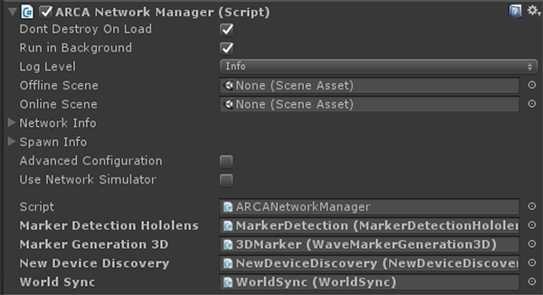
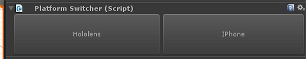

SpectatorView
=============

What is SpectatorView for?
------------
- Filming HD Holograms: Using SpectatorView we can film holograms at screen resolution, meaning full HD, apply antialiasing and even shadows.
- Streaming Live: Stream live HD holographic experiences to an AppleTV directly from your iPhone, completely lag-free!
- Inviting Guests: Let non-HoloLens users experience holograms directly from their phones or tablets.

Current Features
------------
- Network auto-discovery for adding phones to the session.
- Automatic session handling, so users are added to the correct session.
- Spatial synchronization of Holograms, so everyone sees holograms in the exact same place.
- iOS support (ARKit enabled devices).
- Multiple iOS guests
- Recording of Video + Holograms + Ambient sound + Hologram Sounds.
- Share sheet so you can Save the Video, email it, or share it with other supporting apps.

Licenses
--------
- OpenCV - (3-clause BSD License) https://opencv.org/license.html
- Unity ARKit - (MIT License) https://bitbucket.org/Unity-Technologies/unity-arkit-plugin/src/3691df77caca2095d632c5e72ff4ffa68ced111f/LICENSES/MIT_LICENSE?at=default&fileviewer=file-view-default

Requirements
------------
- SpectatorView plugin and required OpenCV binaries, which can be found here: https://github.com/Microsoft/MixedRealityToolkit/tree/master/SpectatorViewPlugin, listed here:
    - opencv_aruco341.dll
    - opencv_calib3d341.dll
    - opencv_core341.dll
    - opencv_features2d341.dll
    - opencv_flann341.dll
    - opencv_imgproc341.dll
    - zlib1.dll
    - SpectatorViewPlugin.dll
- UnityARKitPlugin
    - This can be downloaded from the asset store here: https://assetstore.unity.com/packages/essentials/tutorial-projects/unity-arkit-plugin-92515
- SpectatorView uses UNET for its network discovery and spatial syncronizing.  This means all interactivity during the application needs to be synced between the devices.
- Unity 2017.2.1p2 or later
- Hardware
    - A HoloLens
    - Windows PC running Windows 10
    - ARKit compatible device (iPhone 6s onwards
    / iPad Pro 2016 onwards
    / iPad 2017 onwards) -
    running iOS 11 or above
    - Mac with xcode 9.2 onwards
- Apple developer account, free or paid ( https://developer.apple.com/ )
- Microsoft Visual Studio 2017

Building the SpectatorView Native Plugin
----------------------------------------
- See: https://github.com/Microsoft/MixedRealityToolkit/blob/master/SpectatorViewPlugin/README.md

 
Project Setup
-------------
- Prepare your scene
    - Ensure all visable gameobjects, within your scene, are contained under a world root gameobject.
    

- Add the SpectatorView prefab (Assets/SpectatorView/Prefabs/SpectatorView.prefab) into your scene.
- Add the SpectatorViewNetworking prefab (Assets/SpectatorView/Prefabs/SpectatorViewNetworking.prefab) into your scene.
- Select the SpectatorViewNetworking gameobject and on the SpectatorViewNetworingManager component, there's a few things you can link up. If left untouched this component will search for necessary scripts at runtime.
    - Marker Detection Hololens -> SpectatorView/Hololens/MarkerDetection
    - Marker Generation 3D -> SpectatorView/IPhone/SyncMarker/3DMarker
    

Building for the Different Platforms
------------------------------------
- When building for iOS ensure to remove the GLTF component of MRTK as this is not yet compatibile with this platform. 
- At the top level of the SpectatorView prefab there is a component called 'Platform Switcher'.

- Select the platform you want to build for.
- If selecting 'Hololens' you should see all gameobjects beneath the iPhone gameobject in the SpectatorView prefab become inactive and all the gameobjects under 'Hololens' become active.
- This can take a little while as depending on the platform you choose the HoloToolkit is being added or removed from the project.
- Ensure you build all versions of the application using the same Unity editor instance (do not close Unity between builds), this is due to an unresolved issue with Unity.

Running your Application
------------------------
- Once you have a built and deployed a version of you application on the iPhone and on the HoloLens you should be able to connect them.
- Ensure that both devices are on the same WIFI network.
- Start the application on the both devices, in no specific order.
- The process of starting the application on the iPhone should trigger the Hololens camera to turn on and begin taking pictures.
- As soon as iPhone app starts, it will look for surfaces like floors or tables.
- When surfaces are found you should see a marker similar to this one:

    
- Show this marker to the Hololens.
- Once the marker has been detected by the Hololens it should disappear and both devices should be connected and spatially syncronized. 

Video Capture
-------------
- To capture and save a video from the iPhone, tap and hold the screen for 1 second.  This should open the recording menu.
- Tap the red record button, this should start a countdown before begining to record the screen.
- To finish recording tap and hold the screen for another 1 second and tap the stop button.
- Click the preview button (blue button), to watch the recorded video.
- Open the sharesheet and click save to camera roll.

Networking your Application 
---------------------------
- SpectatorView uses UNET for its networking and manages all host-client connections for you.
- Any app specific data has to be synced and implemented by you, using e.g. SyncVars, NetworkTransform, NetworkBehaviour.
- For more information and tutorials on Unity Networking please visit https://unity3d.com/learn/tutorials/s/multiplayer-networking

Example Scene
-------------
- An example scene can be found in HoloToolkit-Examples\SpectatorView\Scenes\SpectatorViewExample.unity

Troubleshooting
---------------
- The Unity Editor won't connect to a session hosted by a HoloLens device
    - This could be the windows firewall.
    - Goto Windows Firwall options.
    - Allow an app or feature through Windows Firewall.
    - For all instances of Unity Editor in the list tick, Domain, Private and Public.
    - Then go back to Windows Firewall options.
    - Click Advanced settings.
    - Click Inbound Rules.
    - All instances of Unity Editor should have a green tick.
    - For any instances of Unity Editor that don't have a green tick:
        - Double click it.
        - In the action dialog select Allow the connection.
        - Click OK.
    - Restart the Unity Editor.

- At runtime the iPhone screen says "Locating Floor..." but does not display an AR marker.
    - The iPhone is looking for a horizontal surface so try pointing the iPhone camera towards the floor or a table. This will help ARKit find surfaces necessary to spatially sync with HoloLens.

- HoloLens camera does not turn on automatically when iPhone tries to join.
    - Make sure both HoloLens and iPhone are running on the same Wi-Fi network.

- When launching an SpectatorView application on a mobile device, other hololens running other SpectatorView apps turn on their camera
    - Goto the NewDeviceDiscovery component and change the both the Broadcast Key and Broadcast port to two unique values.  Goto SpectatorViewDiscovery and change the Broadcast Key and Broadcast port to another set of unique numbers.

- The HoloLens won't connect with the mac Unity Editor
    - This is a known issue which could be linked to the Unity version.  Building to the iPhone should still work and connect as normal.

- The HoloLens camera turns on but is not able to scan the marker.
    - Ensure that you build all versions of the application using the same Unity Editor instance (do not close Unity between builds).  This is due to an unknown issue with Unity.

