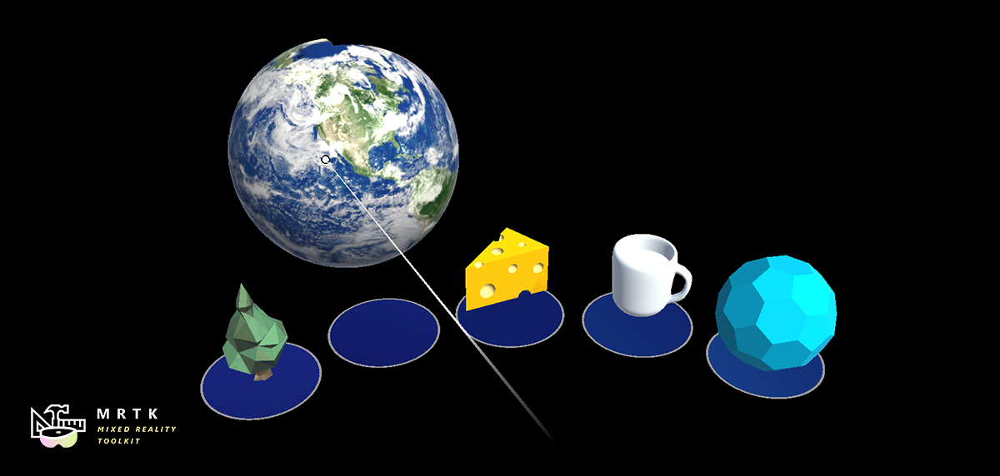

# Dock

This control enables moving objects in and out of predetermined positions, to create palettes, shelves and navigation bars.

## Features

- Supports any number of dock positions and layouts (works great with [`GridObjectCollection`](xref:Microsoft.MixedReality.Toolkit.Utilities.GridObjectCollection))
- Docked objects automatically move away to make space for new objects
- Objects scale to fit the docked space, then resize to their original position when dragged out.

## Getting started with Dock

- Create a GameObject with the Dock component and add some children GameObjects to it.
- Add the DockPosition component to each of the children.
- Add the Dockable component to any number of objects in the scene to allow them to be docked. They must have the [`ObjectManipulator`](xref:Microsoft.MixedReality.Toolkit.UI.ObjectManipulator) component and a Collider as well.
- *Optional:* use a [`GridObjectCollection`](xref:Microsoft.MixedReality.Toolkit.Utilities.GridObjectCollection) to the Dock to automatically lay out the DockPositions.

### Prerequisites

- Every dockable object must have a collider with an [`ObjectManipulator`](xref:Microsoft.MixedReality.Toolkit.UI.ObjectManipulator) or [`ManipulationHandler`](xref:Microsoft.MixedReality.Toolkit.UI.ManipulationHandler).
- If you want an object to start Docked when the scene loads, assign it to any DockPosition's docked object property.

## How it works

The Dockable component builds upon manipulation events to allow dragged objects to be docked and undocked in specific positions. The placement is determined by the closest overlapping triggered DockPosition to the dragged object, so both objects need to have Colliders for the trigger to activate.
