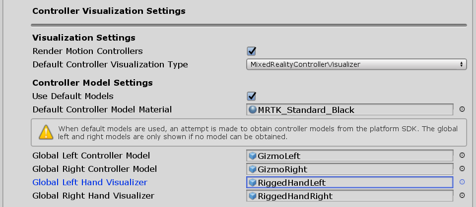
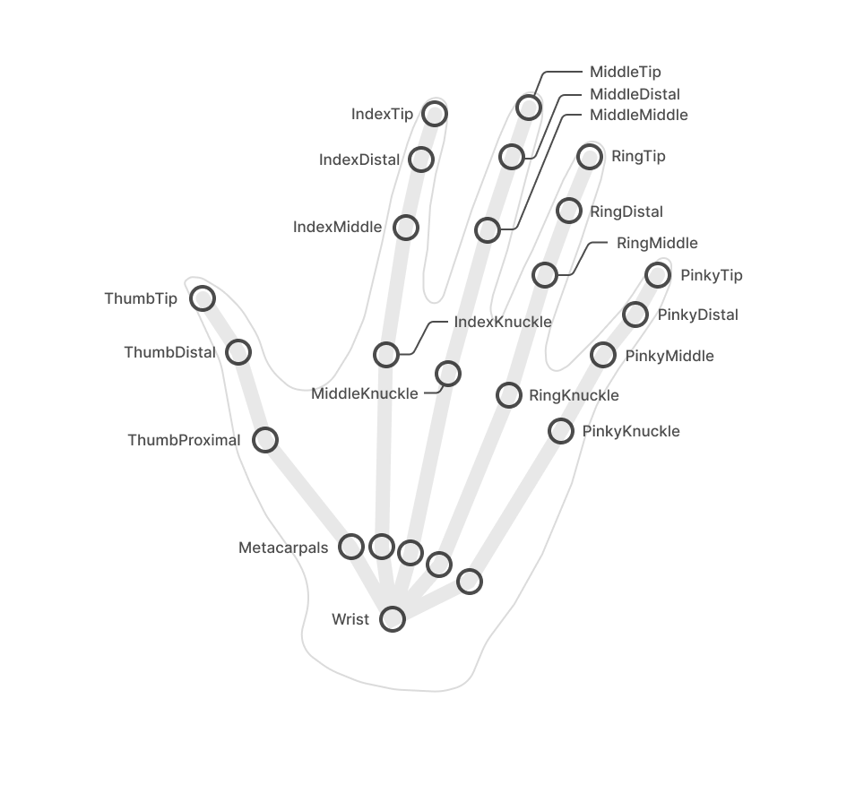
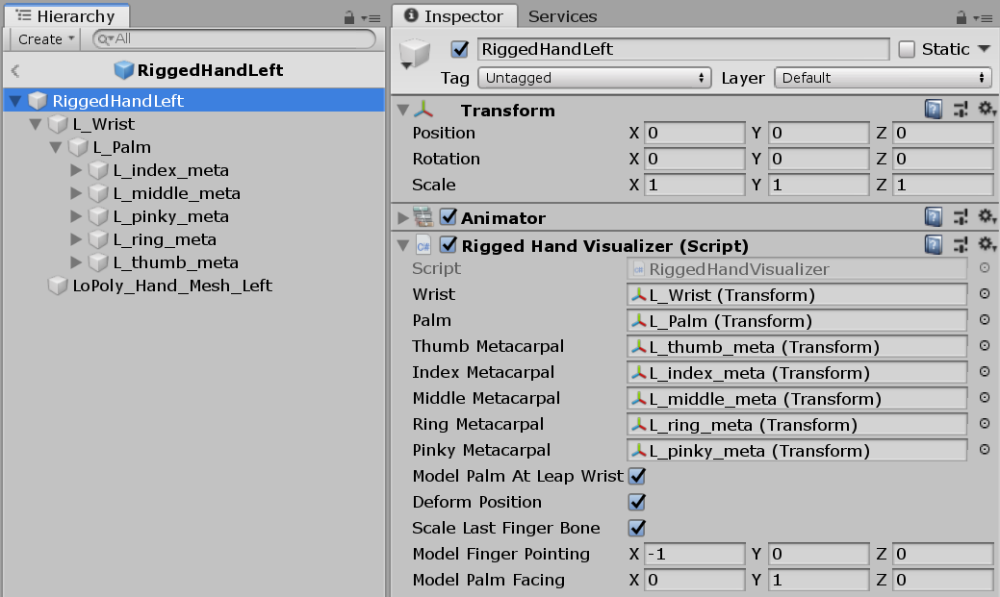

# RiggedHandVisualizer

The RiggedHandVisualizer can be used to control a SkinnedMesh to visualize the hands. This works on HoloLens 2 with detected hands and in Editor with inputsimulation or with UltraLeap sensor. 

## Windows Mixed Reality headset with attached Ultraleap sensor

## Unity Editor InputSimulation

## Example scene
You can find and example in the **RiggedHandVisualizer** scene under:
[MixedRealityToolkit.Examples/Experimental/RiggedHandVisualizer/Scenes](../../../Examples/Experimental/RiggedHandVisualizer/Scenes)

## Configuring the RiggedHandVisualizer
To enable the use of rigged hands visualization navigate in the MixedRealityToolkit configuration tree to

**MixedRealityToolkit > Controllers > Input > Controller Visualization Settings > Global Left Hand Visualizer**  

Set it to use a prefab with the skinned mesh and RiggedHandVisualizer component.  Do the same for the right hand.
RiggedHandLeft and RiggedHandRight prefabs are included in the MRTK as defaults, but you can also configure your own skinned mesh models.

## Setting up a custom rigged mesh

-Create a rigged hand mesh with a bone hierarchy that consists of 5 joints per bone 
-Matching orientation 

