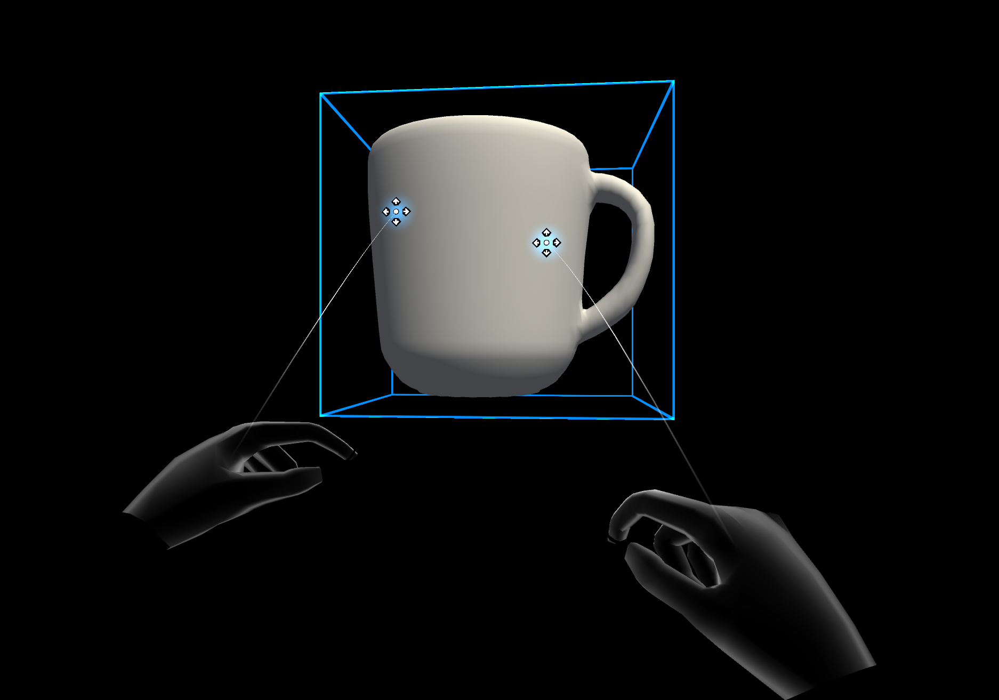

# RiggedHandVisualizer

The RiggedHandVisualizer can be used to control a SkinnedMesh to visualize the hands.
This can be more efficient than using the triangle based visualization because it does not have to reconstruct the hand mesh every frame. 
An added advantage is that this will also work in the Unity editor.

## Example scene
You can find and example in the **RiggedHandVisualizer** scene under:
[MixedRealityToolkit.Examples/Experimental/RiggedHandVisualizer/Scenes](https://github.com/microsoft/MixedRealityToolkit-Unity/blob/mrtk_development/Assets/MRTK/Examples/Experimental/RiggedHandVisualizer/Scenes)

## Features
- Feature parity with the LeapMotion hand visualization

## Configuring the RiggedHandVisualizer
- Create a GameObject with the Dock component and add some children GameObjects to it.

## Fields
- Images 

## Setting up a custom rigged mesh

-Create a rigged hand mesh with a bone hierarchy that consists of 5 joints per bone 
-Matching orientation 
