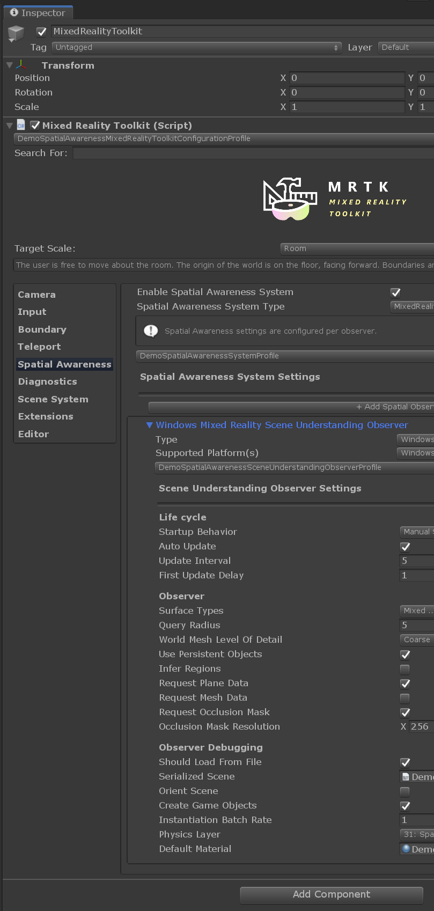

# Unity Scene Understanding Demo

This is an experminental prelease that integrates Scene Understanding (SU) as a MRTK service.

SU - in a nutshell, will return semantic representation of scene entities as well as their geometric forms on HoloLens 2.

## Goals and Features
* In-editor workflow for developing with .bytes files
* Demo scene with UX for...
* Debug view of scene objects and options
* Script interacting with event system (which is the primary way prototypes will interact with the system, think OnObjectAdded, OnObjectUpdated etc.) 
* Capture of .bytes on device to close loop for in-editor workflow (work with your room, not just the example provided)

# Microsoft docs

https://docs.microsoft.com/en-us/windows/mixed-reality/scene-understanding

https://docs.microsoft.com/en-us/windows/mixed-reality/scene-understanding-sdk

# Prerequisites

git clone https://github.com/pinkwerks/MixedRealityToolkit-Unity.git

Install NuGetForUnity unitypackage from here
https://github.com/GlitchEnzo/NuGetForUnity/releases

Ensure build settings are set to UWP

# Unity demo scene

DemoSpatialAwareness.unity

## General layout

Select the 'MixedRealityTookit' game object and check the inspector.

These options will allow you to configure the observer on play. 

If you press play at this point the example serialized scene data will be loaded and displayed in the editor (assuming the observer is configured to show 'debug' objects)

These 'debug' options are meant to demonstrate some of the features of the SU DLL. It is intended that most consumers of SU will write their own scripts that subscribe to SU events, and do whatever they want with the info. In addition many observer options may be set at runtime.

The provided DemoSpatialAwarenessController.cs offers examples of these things.

