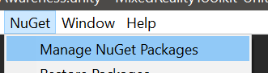

# MRTK Scene Understanding Demo

This is an __experminental__ prelease that integrates [Scene Understanding](https://docs.microsoft.com/en-us/windows/mixed-reality/scene-understanding) (SU) as a MRTK.

SU - in a nutshell, will return a semantic representation of scene entities as well as their geometric forms on __HoloLens 2__.

## Goals and features of the demo
* Demo scene with visualization of Scene Objects with options for configuring the observer
* Example script that excersises the event system demonstrating common tasks
* Save device room data for offline development
* In-editor workflow for developing with previously saved room data (.bytes files)
* For the first time, access to the highest possible resolution of the world mesh!

## Observer overview

When asked, the SU observer will return Scene Objects with attributes useful for mixed world development. What is returned is dependent on the configuration of the observer when fetched. For instance, if you want the occlusion mask, the observer must be configured to generate quads.

It is expected the majority of "real" applications will never show the underlying data in raw form.

## Background and development notes

These links cover the underlying technology the Spatial Awareness service is using behind the scenes.

https://docs.microsoft.com/en-us/windows/mixed-reality/scene-understanding

https://docs.microsoft.com/en-us/windows/mixed-reality/scene-understanding-sdk

The Scene Understanding observer inherits from older spatial awareness concepts so the implementation is and odd fit in places.

Eventually this system should replace the existing SpatialAwareness observer.

Scene Understanding is a __platform specific__ technology. Spatial Awareness is meant to cover _platform agnostic_ capabilities. With few data points, it's likely we don't have the proper abstraction yet. 

## Prerequisites

Install NuGetForUnity unitypackage from here
https://github.com/GlitchEnzo/NuGetForUnity/releases

Once NuGetForUnity is installed open NuGetForUnity, search then install these packages:
- Sceneunderstanding
- Microsoft.Windows.MixedReality.DotNetWinRT

VCRTForwarders should be automatically pulled in as a dependency.

Ensure build settings are set to UWP

### Install roadmap

MSBuild will be replacing this processin the future which will eliminate the NuGetForUnity dependency.

## Demonstration and debugging SU

### Unity demo scene

`DemoSpatialAwareness.unity`

#### Configuring the observer service

Select the 'MixedRealityTookit' game object and check the inspector.

These options will allow you to configure the observer on play. 

If you press play at this point the example serialized scene data will be loaded and displayed in the editor (assuming the observer is configured to show 'debug' objects)

These 'debug' options are meant to demonstrate some of the features of the SU DLL. It is intended that most consumers of SU will write their own scripts that subscribe to SU events, and do whatever they want with the info. In addition many observer options may be set at runtime.

The provided DemoSpatialAwarenessController.cs offers examples of these things.

### Example script

The example script _DemoSpatialAwarenessController.cs_, demonstrates the major concepts in working with the SU service.

* Subscribing to SU events
* Handling SU events
* Finding the nearest platform
* Instantiating a prefab and placing it in an open spot

The script uses MRKT UI to toggle service features on the controller.

Turning on "Instantiate Prefabs", will demonstrate creating objects that size to fit themselves to all Scene Objects, gathered neatly under a parent object.

### Built app notes

You may build and deploy to HoloLens in the standard way. Once running, you'll be presented with a number of buttons to play with the features.

The "Place" button will make a prefab appear on the nearest platform. (which may be behind you!) You should hear a spatial sound when this occurs to help you find it.

Note, their are some pit falls in making queries to the observer. Misconfiguration of a fetch request result in your event payload not containing the data you expected. For example, if you don't request quads, then you won't see the occlusion mask textures. Like wise, you wont see the world mesh if you don't request meshes. The `DemoSpatialAwarenessController` script takes care of some of these dependencies, but not all.

As this effort in in EXPERIMENTAL things are likely to change. Feedback requested at https://github.com/microsoft/MixedRealityToolkit-Unity/pull/7458

Saved .bytes files can be accessed through the device portal at `User Folders/LocalAppData/.../LocalState/PREFIX_yyyyMMdd_hhmmss.bytes`. You can use these `bytes` for your workflow in edtor by specifying them in the observer profile.

