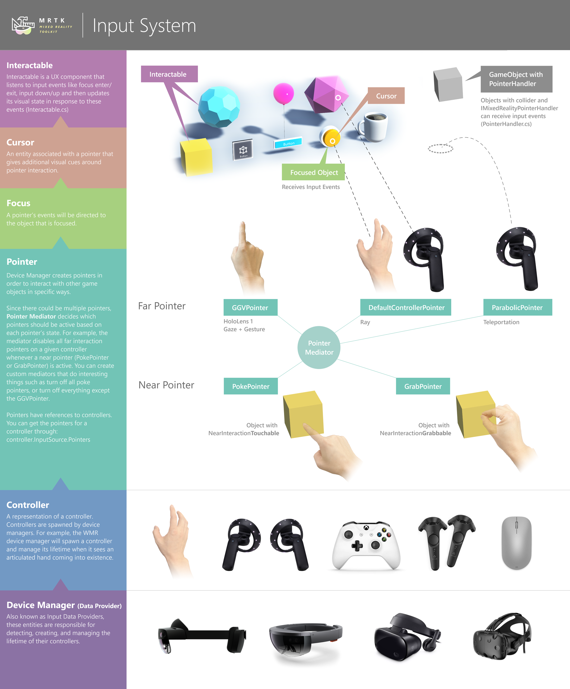

# Input System

The input system is one of the largest systems out of all the features offered by the MRTK.
So many things within the toolkit build on top of it (pointers, focus, prefabs). The code within the input
system is what allows for natural interactions like grab and rotate across platforms.

The input system has some of its own terminology that are worth defining:

- **Data providers**

    The input settings in the input profile have references to entities known as data providers - another word
    that describes these are device managers. These are components whose job is to extend the MRTK input system
    by interfacing with a specific underlying system. An example of a provider is the Windows Mixed Reality provider,
    whose job it is to talk with the underlying Windows Mixed Reality APIs, and then translate the data from
    those APIs into MRTK-specific input concepts below. Another example would be the OpenVR provider (whose job it
    is to talk to Unity-abstracted version of OpenVR APIs and then translate that data into MRTK input concepts).

- **Controller**

    A representation of a physical controller (whether it’s a 6-degree-of-freedom controller, a HoloLens 1-style
    hand with gesture support, a fully articulated hand, a leap motion controller, etc.). Controllers are spawned
    by device managers (i.e. the WMR device manager will spawn a controller and manage its lifetime when it sees an
    articulated hand coming into existence).

- **Pointer**

    Controller use pointers to interact with game objects. For example, the near interaction pointer is 
    responsible to detecting when the hand (which is a controller) is close to objects that advertise 
    themselves as supporting ‘near interaction’. Other examples for pointers are teleportation or far
    pointers (i.e. the shell hand ray pointer) that use far raycasts to engage with content that is
    longer than arms length from the user.

    Pointers are created by the device manager, and then attached to an input source. To get all of the
    pointers for a controller, do: ```controller.InputSource.Pointers```

    Note that a controller can be associated with many different pointers at the same time – in order
    to ensure that this doesn’t devolve into chaos, there is a pointer mediator which controls which
    pointers are allowed to be active (for example, the mediator will disable far interaction pointers
    when near interaction is detected).

- **Focus**

    Pointer events are sent to objects in **focus**. Focus selection will vary by pointer type - a hand ray
    pointer will use raycasts, while a poke pointer will use spherecasts. An object must implement
    IMixedRealityFocusHandler to receive focus. It's possible to globally register an object to receive
    unfiltered pointer events, but this approach is not recommended.

    The component that updates which objects are in focus is the [FocusProvider](https://github.com/microsoft/MixedRealityToolkit-Unity/blob/mrtk_development/Assets/MixedRealityToolkit.Services/InputSystem/FocusProvider.cs)

- **Cursor** 

    An entity associated with a pointer that gives additional visual cues around pointer interaction. For example,
    the FingerCursor will render a ring around your finger, and may rotate that ring when your finger is close to
    ‘near interactable’ objects. A pointer can be associated with a single cursor at time.

- **Interaction and Manipulation**

    Objects can be tagged with an interaction or manipulation script (this may be Interactable.cs, or something like
    NearInteractionGrabbable.cs/ManipulationHandler.cs).
    
    For example, NearInteractionGrabbable and NearInteractionTouchable allow for certain pointers (especially
    near interaction pointers) to know which objects can be focused on.

    Interactable and ManipulationHandler, are examples of components that listen to pointer events to modify
    UI visuals or move/scale/rotate game objects.
     

The image below captures the high level build up (from bottom up) of the MRTK input stack:



