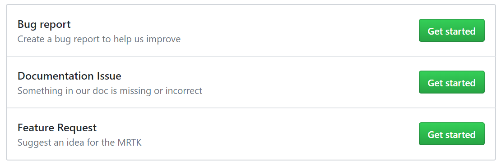

# Contributing

The Mixed Reality Toolkit (MRTK) welcomes contributions from the community. Whether it is for a minor change like fixing typos and small bug fixes, or a new feature or component.

For larger submissions, please refer to the [feature contribution guidelines / process](Feature_Contribution_Process.md) to ensure a smooth process and a good quality of code and documentation.

All changes be they small or large, need to adhere to the [MRTK coding standards](CodingGuidelines.md), so please ensure you are familiar with these while developing to avoid delays when the change is being reviewed.

If you have any questions, please reach out on [Stack Overflow](https://stackoverflow.com/questions/tagged/mrtk) or the [HoloDevelopers slack](https://holodevelopers.slack.com/). You can join the Slack community via the [automatic invitation sender](https://holodevelopersslack.azurewebsites.net/).

# Submission process
We provide several paths to enable developers to contribute to the Mixed Reality Toolkit, all starting with [creating a new Issue](https://github.com/Microsoft/MixedRealityToolkit-Unity/issues/new/choose).

From here you file:

- **Bug report** - Functionality issue with one of the Mixed Reality Toolkit components
- **Documentation issue** - Issue with the Mixed Reality Toolkit [documentation](https://microsoft.github.io/MixedRealityToolkit-Unity)
- **Feature request** - Proposal for a new Mixed Reality Toolkit feature

# Proposing Feature Requests

When requesting a new Mixed Reality Toolkit feature, you should document the customer benefit / problem to be solved.

This documentation can be as simple as a few sentences describing the problem and solution, or it can be a formal design specification.

Once submitted, your feature request will be reviewed and discussed on GitHub. We encourage open and constructive discussion of each feature proposal to ensure that the work is beneficial to a large segment of customers.

To avoid needing to rework the feature, it is generally recommended that development of the feature does not begin during the review phase. Many times, the community review process uncovers one or more issues that may require significant changes in the proposed implementation.

Please review the [Feature Contribution Process](Feature_Contribution_Process.md) for more details.

> [!NOTE]
> If you wish to work on something that already exists on our backlog, you can use that work item as your proposal. Be sure to also comment on the task notifying maintainers that you're working towards completing it.

# Beginning development

To get started, simply follow these steps:

1. Fork the repository. Click on the "Fork" button on the top right of the page and follow the flow.
1. Create a branch in your fork (off of the [mrtk_development](https://github.com/microsoft/mixedrealitytoolkit-unity/tree/mrtk_development) branch) to make it easier for you to isolate your fork.
    - For the legacy HoloToolkit use the [htk_development](https://github.com/Microsoft/MixedRealityToolkit-Unity/tree/htk_development) branch.
1. Instructions for writing and running tests are at [UnitTests](UnitTests.md).
1. Instructions for building and deploying MRTK are at [BuildAndDeploy](../BuildAndDeploy.md). 
1. Make **small and frequent** commits that include tests which could be a unity scene showing usage of your feature.
1. Make sure that all the tests continue to pass.
1. Follow the [Coding Guidelines](CodingGuidelines.md).
1. Ensure the code and feature(s) are documented as described in the [Documentation Guidelines](DocumentationGuide.md).
1. Ensure the code works as intended on all platforms. Please see [Release notes](../ReleaseNotes.md) for the list of supported platforms.
    - For Windows UWP projects, your code must be [WACK compliant](https://developer.microsoft.com/en-us/windows/develop/app-certification-kit). To do this, generate a Visual Studio solution, right click on project; *Store* > *Create App Packages*. Follow the prompts and run WACK tests. Make sure they all succeed.
1. Update the documentation with additional information as needed.

If you are new to to the Git workflow, [check out this introduction from Github](https://guides.github.com/activities/hello-world/).

# Pull request

Please ensure all PR's are small and concise, DO NOT include other files / changes not related to the subject of the PR.

If you haven't contributed to a Microsoft project before, you may be asked to sign a [contribution license agreement](https://cla.microsoft.com/). 
A comment in the PR will let you know if you do.

> [!IMPORTANT]
> If you are a Microsoft employee and are not a member of the [Microsoft organization on GitHub](https://github.com/Microsoft), please link your Microsoft and GitHub accounts on corpnet by visiting [Open Source at Microsoft](https://opensource.microsoft.com/) before you start your pull request. There's some process stuff you'll need to do ahead of time.

When you are ready:
* Start a GitHub pull request to merge your topic branch targeting the [mrtk_development](https://github.com/microsoft/mixedrealitytoolkit-unity/tree/mrtk_development) branch.
* Ensure you fill in all details required by the Pull Request template, ensuring you reference any Issue / Feature Request or Task the PR relates to.
* Validate that you are only checking in files / changes related to the PR.
* Check your documentation is up to date and included (unless submitted in a previous PR).
* If adding a new feature, check that tests are included to validate the feature (see [UnitTests](UnitTests.md)).
* If fixing a bug, please write a test to catch the bug. This is to make sure your fix does not regress in the future.

The project maintainers will review your changes. We aim to review all changes within three business days. Please address any review comments, push to your topic branch, and post a comment letting us know that there's new stuff to review.

> [!NOTE]
> All PR's submitted to the project will also be vetted according to the [MRTK coding standards guide](CodingGuidelines.md), so please review these before submitting your PR to ensure a smooth process.
