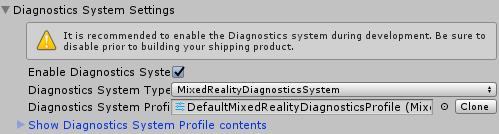

# 診断システム (Diagnostic System)

Mixed Reality Toolkit 診断システムは、アプリケーションの問題の分析を可能にするツールです。

診断システムの最初のリリースには、アプリケーションの使用中にパフォーマンスの問題を分析するためのビジュアルプロファイラ (Visual Profiler) が含まれています。

## はじめに

> [!IMPORTANT]
> 診断システムは、製品開発サイクル全体を通じて有効にすることを_**強く**_、最終バージョンをビルドしてリリースする前の最後の変更として無効にすることをお勧めします。

1. [有効にする](#診断を有効に) 診断システム
2. [設定する](#診断の設定オプション) 診断オプション
3. [ビルドとデプロイ](#ビルドとデプロイ)

### 診断を有効に

診断システムは、MixedRealityToolkit オブジェクト (または別のサービスレジストラコンポーネント (service registrar component)) コンポーネントによって管理されます。

次の手順では、MixedRealityToolkit オブジェクトの使用を想定しています。他のサービスレジストラに必要な手順は異なる場合があります。

1. Hierarchy で MixedRealityToolkit オブジェクトを選択します。

2. Inspector を [Diagnostics System] セクションに移動し、[Enable] にチェックを入れます。

3. 診断システムの実行を選択する

> [!NOTE]
> デフォルトのプロファイル (DefaultMixedRealityToolkitConfigurationProfiel) を使うユーザーは、事前に設定された診断システム MixedRealityDiagnosticsSystem オブジェクトを使用します。

### 診断の設定オプション

診断システムは、設定プロファイルを使用して、表示するコンポーネントを指定し、その設定を構成します。使用可能なコンポーネント設定の詳細については、[診断システムの設定](../../Documentation/Diagnostics/ConfiguringDiagnostics.md)を参照してください。

### ビルドとデプロイ

診断システムを必要なオプションで設定すると、プロジェクトをターゲットプラットフォームにビルド、デプロイできます。

> [!NOTE]
> ビルドとデプロイの手順を必要とせずにアプリケーションを開発しながら Unity の Play モードを使用することは可能ですが、ターゲットハードウェアとプラットフォーム上で実行されているコンパイル済みアプリケーションを使用して診断システムの結果を評価することが重要です。
> ビジュアルプロファイラ (Visual Profiler) などのパフォーマンス診断では、エディター内から実行されたときに実際のアプリケーション のパフォーマンスが正確に反映されない場合があります。

## 参考に

- Diagnostics API documentation
- [Configuring the Diagnostics System](ConfiguringDiagnostics.md)
- [Using the Visual Profiler](UsingVisualProfiler.md)
