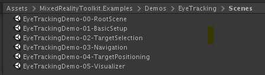
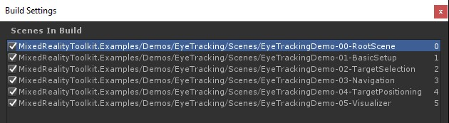

# Eye tracking examples in MRTK
This page covers how to get quickly started with using eye tracking in MRTK by building on our provided [MRTK eye tracking examples](https://github.com/Microsoft/MixedRealityToolkit-Unity/tree/mrtk_release/Assets/MixedRealityToolkit.Examples/Demos/EyeTracking).
The samples let you experience one of our new magical input capabilities: **Eye tracking**! 
The demo includes a number of different use cases ranging from implicit eye-based activations to how to seamlessly combine information about what you are looking at with **voice** and **hand** input. 
This enables users to quickly and effortlessly select and move holographic content across their view simply by looking at a target and saying _'Select'_ or performing a hand gesture. 
The demos also include an example for eye-gaze-directed scroll, pan and zoom of text and images on a slate. 
Finally, an example is provided for recording and visualizing the user's visual attention on a 2D slate.
In the following, we will go into more detail what each of the different samples in the [MRTK eye tracking example package](https://github.com/Microsoft/MixedRealityToolkit-Unity/tree/mrtk_release/Assets/MixedRealityToolkit.Examples/Demos/EyeTracking) includes:

We will start with a quick overview of what the individual eye tracking demo scenes are about.
The MRTK eye tracking demo scenes are [loaded additively](https://docs.unity3d.com/ScriptReference/SceneManagement.LoadSceneMode.Additive.html) which we will explain below how to set up.

## Overview of the eye tracking demo samples

### [**Eye-Supported Target Selection**](EyeTracking_TargetSelection.md)

This tutorial showcases the ease of accessing eye gaze data to select targets. 
It includes an example for subtle yet powerful feedback to provide confidence to the user that a target is focused while not being overwhelming.
In addition, there is a simple example of smart notifications that automatically disappear after being read. 

**Summary**: Fast and effortless target selections using a combination of eyes, voice and hand input.

 

### [**Eye-Supported Navigation**](EyeTracking_Navigation.md)

Imagine you are reading some information on a distant display or your e-reader and when you reach the end of the displayed text, the text automatically scrolls up to reveal more content. 
Or how about magically zooming directly toward where you were looking at? 
These are some of the examples showcased in this tutorial about eye-supported navigation.
In addition, there is an example for hands-free rotation of 3D holograms by making them automatically rotate based on your current focus. 

**Summary**: Scroll, pan, zoom, 3D rotation using a combination of eyes, voice and hand input.

 

### [**Eye-Supported Positioning**](EyeTracking_Positioning.md)

This tutorial shows an input scenario called [Put-That-There](https://youtu.be/CbIn8p4_4CQ) dating back to research from the MIT Media Lab in the early 1980's with eye, hand and voice input.
The idea is simple: Benefit from your eyes for fast target selection and positioning. 
Simply look at a hologram and say _'put this'_, look over where you want to place it and say _'there!'_. 
For more precisely positioning your hologram, you can use additional input from your hands, voice or controllers. 

**Summary**: Positioning holograms using eyes, voice and hand input (*drag-and-drop*). Eye-supported sliders using eyes + hands. 

 

### **Visualization of Visual Attention**

Information about where users look at is an immensely powerful tool to assess usability of a design and to identify problems in efficient work streams. 
This tutorial discusses different eye tracking visualizations and how they fit different needs. 
We provide basic examples for logging and loading eye tracking data and examples for how to visualize them. 

**Summary**: Two-dimensional attention map (heatmaps) on slates. Recording & replaying eye tracking data.

 

## Setting up the MRTK eye tracking samples

### Prerequisites

Note that using the eye tracking samples on device requires a HoloLens 2
and a sample app package that is built with the "Gaze Input" capability
on the package's AppXManifest.

In order to use these eye tracking samples on device, make sure to follow
[these steps](EyeTracking_BasicSetup.md#testing-your-unity-app-on-a-hololens-2)
prior to building the app in Visual Studio.

### 1. Load EyeTrackingDemo-00-RootScene.unity
The *EyeTrackingDemo-00-RootScene* is the base (_root_) scene that has all the core MRTK components included.
This is the scene that you need to load first and from which you will run the eye tracking demos. 
It comes with a graphical scene menu that allows you to easily switch between the different eye tracking samples which will be [loaded additively](https://docs.unity3d.com/ScriptReference/SceneManagement.LoadSceneMode.Additive.html).

The root scene includes a few core components that will persist across the additively loaded scenes, such as the MRTK configured profiles and scene camera. 
The _MixedRealityBasicSceneSetup_ (see screenshot below) includes a script that will automatically load the referenced scene on startup. 
By default this is _EyeTrackingDemo-02-TargetSelection_.  

### 2. Adding scenes to the Build menu
To load additive scenes during runtime, you must add these scenes to your _Build Settings -> Scenes in Build_ menu first.
It is important that the root scene is shown as the first scene in the list:

### 3. Play the eye tracking samples in the Unity Editor
After adding the eye tracking scenes to the Build Settings and loading the _EyeTrackingDemo-00-RootScene_, there is one last thing you may want to check: Is the _'OnLoadStartScene'_ script that is attached to the _MixedRealityBasicSceneSetup_ GameObject enabled? This is to let the root scene know which demo scene to load first.

Let's roll! Hit _"Play"_!
You should see several gems appear and should see the scene menu at the top.

You should notice a small semitransparent circle at the center of your game view. 
This acts as an indicator (cursor) of your _simulated eye gaze_: 
Simply press down the _right mouse button_ and move the mouse to change its position. 
When the cursor is hovering over the gems, you will notice that it will snap to the center of the currently looked at gem. 
This is a great way to test if events are triggered as expected when _"looking"_ at a target. 
Please beware that the _simulated eye gaze_ via mouse control is a rather poor supplement to our rapid and unintentional eye movements. 
It is great for testing the basic functionality though before iterating on the design by deploying it to the HoloLens 2 device.
Coming back to our eye tracking sample scene: The gem rotates as long as being looked at and can be destroyed by "looking" at it and ...
- Pressing _Enter_ (which simulates saying "select")
- Saying _"select"_ into your microphone
- While pressing _Space_ to show the simulated hand input, click the left mouse button to perform a simulated pinch

We describe in more detail how you can achieve these interactions in our [**Eye-Supported Target Selection**](EyeTracking_TargetSelection.md) tutorial.

When moving the cursor up to the top menu bar in the scene, you will notice that the currently hovered item will highlight subtly. 
You can select the currently highlighted item by using one of the above described commit methods (e.g., pressing _Enter_).
This way you can switch between the different eye tracking sample scenes.

### 4. How to test specific sub scenes
When working on a specific scenario, you may not want to go through the scene menu every time.
Instead you may want to be able to start out directly from the scene that you are currently working on when pressing the _Play_ button. 
No problem! Here is what you can do:
1. Load the _root_ scene
2. In the _root_ scene, disable the _'OnLoadStartScene'_ script 
3. _Drag and drop_ one of the eye tracking test scenes that are described below (or any other scene) into your _Hierarchy_ view as shown in the screenshot below. 

4. Press _Play_

Please note that loading the sub scene like this is not persistent: 
This means that if you deploy your app to the HoloLens 2 device, it will only load the root scene (assuming it appears at the top of your Build Settings). 
Also, when you share your project with others, the sub scenes are not automatically loaded. 

 

Now that you know how to get the MRTK eye tracking example scenes to work, let's continue with diving deeper into how to select holograms with your eyes: [Eye-supported target selection](EyeTracking_TargetSelection.md).

---
[Back to "Eye tracking in the MixedRealityToolkit"](EyeTracking_Main.md)
