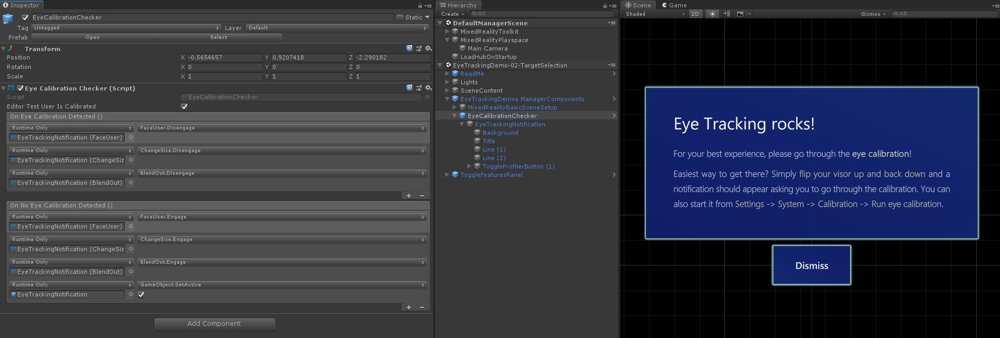

## To be or not to be eye calibrated

If eye tracking is a fundamental part of your app experience, you may wish to ensure that the user's eye calibration is valid.
The main reason for it to be invalid is that the user has chosen to skip the eye tracking calibration when putting on the device. 

This page covers the following:
- Describes how to detect that a user is eye calibrated
- Provides a sample for how to trigger a user notification to instruct the user to go through the eye calibration
   - Automatically dismiss notification if eye calibration becomes valid
   - Manually dismiss notification if user chooses to continue without calibration

### How to detect the eye calibration state 

The [MixedRealityToolkit.InputSystem.EyeGazeProvider](EyeTracking_EyeGazeProvider.md) provides a ```bool?``` property called ```IsEyeGazeValid```.
It returns null if no information from the eye tracker is available yet.
Once data has been received, it will either return true or false to indicate that the user's eye tracking calibration is valid or invalid.

### Sample eye calibration notification - Step-by-step

1. Open the [MRTK eye tracking example package](https://github.com/Microsoft/MixedRealityToolkit-Unity/tree/mrtk_release/Assets/MixedRealityToolkit.Examples/Demos/EyeTracking)

2. Load _EyeTrackingDemo-00-RootScene.unity_ scene

3. Check out _EyeCalibrationChecker_:
   - In this scene, we have already a sample for detecting whether the current user is calibrated under the *_EyeCalibrationChecker_ game object*. 
It simply parents a few text meshes and has some additional triggers for blending the notification in and out.
This includes slowly increasing its size and opacity on activation. 
Once the notification is dismissed, it will slowly decrease its size and fade out.

   - Attached to the *_EyeCalibrationChecker_ game object* is the [EyeCalibrationChecker](xref:Microsoft.MixedReality.Toolkit.Examples.Demos.EyeTracking.EyeCalibrationChecker) script which exposes two Unity Events:
      - OnEyeCalibrationDetected()
      - OnNoEyeCalibrationDetected()

   - These events will only trigger if the calibration status changes. Hence, if a user chooses to dismiss the notification, the notification will not show up again until
      - The app gets restarted
      - A valid user has been detected and then a new uncalibrated user has put the device on

   - For testing whether the animations and events are triggered correctly, the EyeCalibrationChecker script possesses a ```bool editorTestUserIsCalibrated``` flag. For example, when the app is running in the Unity Editor you can test, whether the notification automatically pops up once the calibration status changes from true to false and whether it automatically dismisses the notification again once the status changes from false to true.


```csharp
   ...
        
        void Update()
        {
      // Get the latest calibration state from the EyeGazeProvider
      bool? calibrationStatus = InputSystem?.EyeGazeProvider?.IsEyeCalibrationValid;

      ... 

      if (calibrationStatus != null)
      {
         if (prevCalibrationStatus != calibrationStatus)
         {
            if (calibrationStatus == false)
            {
               OnNoEyeCalibrationDetected.Invoke();
            }
         else
         {
            OnEyeCalibrationDetected.Invoke();
         }
         
         prevCalibrationStatus = calibrationStatus;
      }
   }

   private bool? prevCalibrationStatus = null;        
        
   private IMixedRealityInputSystem inputSystem = null;

        /// <summary>
        /// The active instance of the input system.
        /// </summary>
        private IMixedRealityInputSystem InputSystem
        {
            get
            {
                if (inputSystem == null)
                {
                    MixedRealityServiceRegistry.TryGetService<IMixedRealityInputSystem>(out inputSystem);
                }
                return inputSystem;
            }
        }
```

---
[Back to "Eye tracking in the MixedRealityToolkit"](EyeTracking_Main.md)
