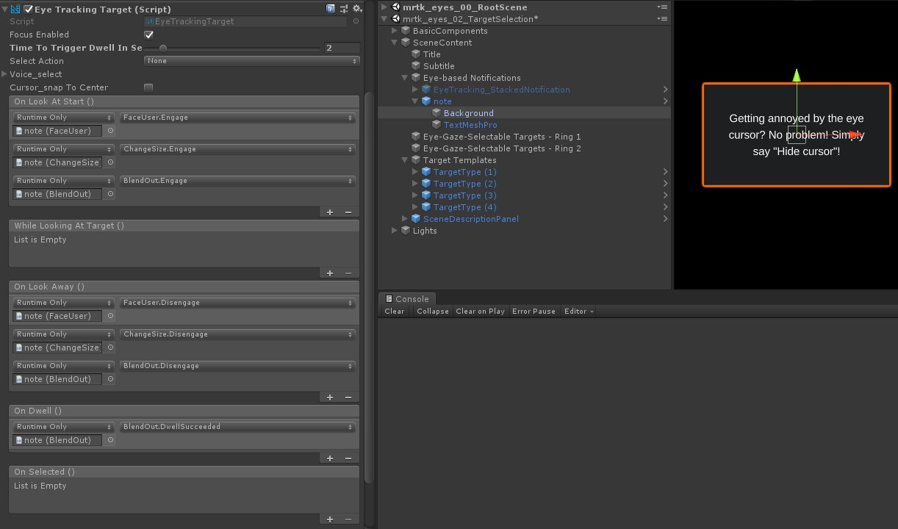
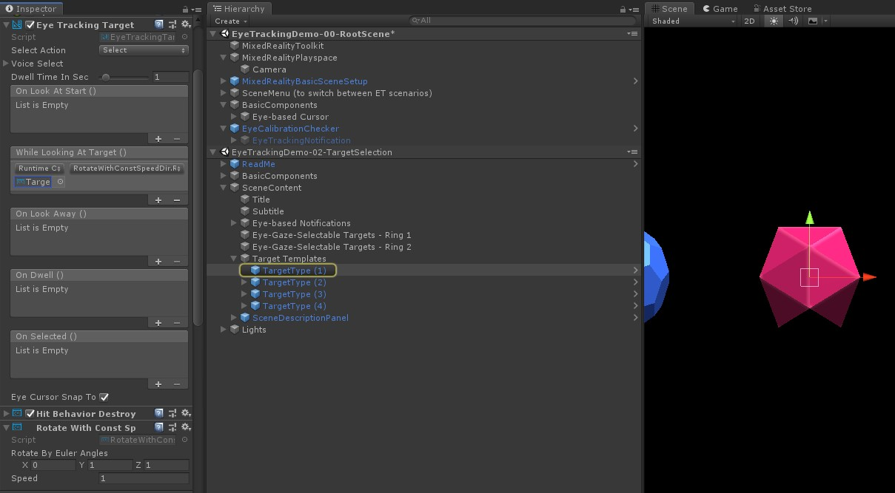

# Eye-supported target selection

This page discusses different options for accessing eye gaze data and eye gaze specific events to select targets in MRTK. Eye tracking allows for fast and effortless target selections using a combination of information about what a user is looking at with additional inputs such as _hand tracking_ and _voice commands_:

- Look & Say _"Select"_ (default voice command)
- Look & Say _"Explode"_ or _"Pop"_ (custom voice commands)
- Look & Bluetooth button
- Look & Pinch (i.e., hold up your hand in front of you and bring your thumb and index finger together)
    - Please note that for this to work, the [hand rays need to be disabled](EyeTracking_EyesAndHands.md#how-to-disable-the-hand-ray)

To select holographic content using eye gaze, there are several options:

[**1. Use the primary focus pointer:**](#1-use-generic-focus-and-pointer-handlers)

This can be understood as your prioritized cursor.
By default, if the hands are in view, then this would be hand rays.
If no hands are in view, then the prioritized pointer would be head or eye gaze.
Thus, please note that based on the current design head or eye gaze is suppressed as a cursor input if hand rays are used.

For example:

A user wants to select a distant holographic button.
As a developer, you want to provide a flexible solution that allows the user to achieve this tasks in various conditions:

- Walk up to the button and poke it
- Look at it from a distance and say "select"
- Target the button using a hand ray and performing a pinch
In this case, the most flexible solution is to use the primary focus handler as it will notify you whenever the currently prioritized primary focus pointer triggers an event. Please note that if hand rays are enabled, the head or eye gaze focus pointer are disabled as soon as the hands come into view.

> [!IMPORTANT]
> Please note that if hand rays are enabled, the head or eye gaze focus pointer are disabled as soon as the hands come into view. If you want to support a [_'look and pinch'_ interaction, you need to disable the hand ray](EyeTracking_EyesAndHands.md#how-to-disable-the-hand-ray). In our eye tracking sample scenes, we have disabled the hand ray to allow for showcasing richer interactions using eyes + hand motions - see for example [Eye-Supported Positioning](EyeTracking_Positioning.md).

[**2. Use both eye focus and hand rays at the same time:**](#2-independent-eye-gaze-specific-eyetrackingtarget)

There might be instances where you want to be more specific which type of focus pointers can trigger certain events and allow for simultaneously using multiple far interaction techniques.

For example:
In your app, a user can use far hand rays to manipulate some holographic mechanical setup - e.g., grab and hold some distant holographic engine parts and hold them in place. While doing so, the user has to go through a number of instructions and record her/his progress by marking off some check boxes. If the user has her/his hands _not busy_, it would be instinctual to simply touch the check box or select it using a hand ray. However, if the user has her/his hands busy, as in our case holding some holographic engine parts in place, you want to enable the user to seamlessly scroll through the instructions using their eye gaze and to simply look at a check box and say "check it!".

To enable this, you need to use eye-specific EyeTrackingTarget script that is independent from the core MRTK FocusHandlers and will be discussed further below.

## 1. Use generic focus and pointer handlers

If eye tracking is set up correctly (see [Basic MRTK setup to use eye tracking](EyeTracking_BasicSetup.md)), enabling users to select holograms using their eyes is the same as for any other focus input (e.g., head gaze or hand ray).This provides the great advantage of a flexible way to interact with your holograms by defining the main focus type in your MRTK Input Pointer Profile depending on your user's needs, while leaving your code untouched. This allows for switching between head or eye gaze without changing a line of code or replace hand rays with eye targeting for far interactions.

### Focusing on a hologram

To detect when a hologram is focused, use the _'IMixedRealityFocusHandler'_ interface that provides you with two interface members: _OnFocusEnter_ and _OnFocusExit_.

Here is a simple example from [ColorTap.cs](xref:Microsoft.MixedReality.Toolkit.Examples.Demos.EyeTracking.ColorTap) to change a hologram's color when being looked at.

```csharp
    public class ColorTap : MonoBehaviour, IMixedRealityFocusHandler
    {
        void IMixedRealityFocusHandler.OnFocusEnter(FocusEventData eventData)
        {
            material.color = color_OnHover;
        }

        void IMixedRealityFocusHandler.OnFocusExit(FocusEventData eventData)
        {
            material.color = color_IdleState;
        }
        ...
    }
```

### Selecting a focused hologram 

To select a focused hologram, use _PointerHandler_ to listen for input events to confirm a selection. 
For example, adding the _IMixedRealityPointerHandler_ will make them react to simple pointer input. 
The _IMixedRealityPointerHandler_ interface requires implementing the following three interface members: 
_OnPointerUp_, _OnPointerDown_, and _OnPointerClicked_.

In the example below, we change the color of a hologram by looking at it and pinching or saying "select".
The required action to trigger the event is defined by `eventData.MixedRealityInputAction == selectAction` whereby we can set the type of `selectAction` in the Unity Editor - by default it's the "Select" action. The types of available [MixedRealityInputActions](https://microsoft.github.io/MixedRealityToolkit-Unity/Documentation/Input/InputActions.html) can be configured in the MRTK Profile via _MRTK Configuration Profile_ -> _Input_ -> _Input Actions_.

```csharp
   public class ColorTap : MonoBehaviour, IMixedRealityFocusHandler, IMixedRealityPointerHandler
    {
        // Allow for editing the type of select action in the Unity Editor.
        [SerializeField]
        private MixedRealityInputAction selectAction = MixedRealityInputAction.None; 
        ...

        void IMixedRealityPointerHandler.OnPointerUp(MixedRealityPointerEventData eventData)
        {
            if (eventData.MixedRealityInputAction == selectAction)
            {
                material.color = color_OnHover;
            }
        }

        void IMixedRealityPointerHandler.OnPointerDown(MixedRealityPointerEventData eventData)
        {
            if (eventData.MixedRealityInputAction == selectAction)
            {
                material.color = color_OnSelect;
            }
        }

        void IMixedRealityPointerHandler.OnPointerClicked(MixedRealityPointerEventData eventData) { }
    }
```

### Eye-gaze-specific BaseEyeFocusHandler

Given that eye gaze can be very different to other pointer inputs, you may want to make sure to only react to the focus input if it is _eye gaze_ and it is currently the primary input pointer.
For this purpose, you would use the [`BaseEyeFocusHandler`](xref:Microsoft.MixedReality.Toolkit.Input.BaseEyeFocusHandler) which is specific to eye tracking and which derives from the [`BaseFocusHandler`](xref:Microsoft.MixedReality.Toolkit.Input.BaseFocusHandler).
As mentioned before, it will only trigger if eye gaze targeting is currently the primary pointer input (i.e., no hand ray is active). For more information, see [How to support eye gaze + hand gestures](EyeTracking_EyesAndHands.md).

Here is an example from [EyeTrackingDemo-03-Navigation.unity](https://github.com/Microsoft/MixedRealityToolkit-Unity/blob/mrtk_release/Assets/MixedRealityToolkit.Examples/Demos/EyeTracking/Scenes/EyeTrackingDemo-03-Navigation.unity
).
In this demo, there are two 3D holograms that will turn depending on which part of the object is looked at: 
If the user looks at the left side of the hologram, then that part will slowly move towards the front facing the user.
If the right side is looked at, then that part will slowly move to the front. 
This is a behavior that you may not want to have active at all times and also something that you may not want to accidentally trigger by a hand ray or head gaze. 
Having the [`OnLookAtRotateByEyeGaze`](xref:Microsoft.MixedReality.Toolkit.Examples.Demos.EyeTracking.OnLookAtRotateByEyeGaze)
attached, a GameObject will rotate while being looked at.

```csharp
    public class OnLookAtRotateByEyeGaze : BaseEyeFocusHandler
    {
        ...
        
        protected override void OnEyeFocusStay()
        {
            // Update target rotation
            RotateHitTarget();
        }
        
        ...
        
        ///
        /// This function computes the rotation of the target to move the currently 
        /// looked at aspect slowly to the front. 
        ///
        private void RotateHitTarget()
        {
            // Example for querying the hit position of the eye gaze ray using EyeGazeProvider
            Vector3 TargetToHit = (this.gameObject.transform.position - InputSystem.EyeGazeProvider.HitPosition).normalized;
                       
            ...
        }
    }
```

Check the API documentation for a complete list of available events of the [`BaseEyeFocusHandler`](xref:Microsoft.MixedReality.Toolkit.Input.BaseEyeFocusHandler):
- **OnEyeFocusStart:** Triggered once the eye gaze ray *starts* intersecting with this target's collider.
- **OnEyeFocusStay:** Triggered *while* the eye gaze ray is intersecting with this target's collider.
- **OnEyeFocusStop:** Triggered once the eye gaze ray *stops* intersecting with this target's collider.
- **OnEyeFocusDwell:** Triggered once the eye gaze ray has intersected with this target's collider for a specified amount of time.
    

## 2. Independent eye-gaze-specific EyeTrackingTarget

Finally, we provide you with a solution that let's you treat eye-based input completely independent from other focus pointers via the [`EyeTrackingTarget`](xref:Microsoft.MixedReality.Toolkit.Input.EyeTrackingTarget) script.

This has three _advantages_:

- You can make sure that the hologram is only reacting to the user's eye gaze.
- This is independent from the currently active primary input. Hence, you can process multiple inputs at once - for example, combining fast eye targeting with hand gestures.
- Several Unity events have already been set up to make it fast and convenient to handle and reuse existing behaviors from within the Unity Editor or via code.

There are also some _disadvantages:_

- More effort to handle separate inputs individually.
- No elegant degradation: It only supports eye targeting. If eye tracking is not working, you require some additional fallback.
 

Similar to the _BaseFocusHandler_, the _EyeTrackingTarget_ comes ready with several eye-gaze-specific Unity events that you can conveniently listen to either via the Unity Editor (see example below) or by using _AddListener()_ in code:

- OnLookAtStart()
- WhileLookingAtTarget()
- OnLookAway()
- OnDwell()
- OnSelected()

In the following, we walk you through a few examples for how to use _EyeTrackingTarget_.

### Example #1: Eye-supported smart notifications

In [EyeTrackingDemo-02-TargetSelection.unity](https://github.com/Microsoft/MixedRealityToolkit-Unity/blob/mrtk_release/Assets/MixedRealityToolkit.Examples/Demos/EyeTracking/Scenes/EyeTrackingDemo-02-TargetSelection.unity), 
you can find an example for _'smart attentive notifications'_ that react to your eye gaze. 
These are 3D text boxes that can be placed in the scene and that will smoothly enlarge and turn toward the user when being looked at to ease legibility. While the user is reading the notification, the information keeps getting displayed crisp and clear. After reading it and looking away from the notification, the notification will automatically be dismissed and fades out. To achieve all this, there are a few generic behavior scripts that are not specific to eye tracking at all, such as:

- [`FaceUser`](xref:Microsoft.MixedReality.Toolkit.Examples.Demos.EyeTracking.FaceUser)
- [`ChangeSize`](xref:Microsoft.MixedReality.Toolkit.Examples.Demos.EyeTracking.ChangeSize)
- [`BlendOut`](xref:Microsoft.MixedReality.Toolkit.Examples.Demos.EyeTracking.BlendOut)

The advantage of this approach is that the same scripts can be reused by various events. For example, a hologram may start facing the user based on a voice commands or after pressing a virtual button. To trigger these events, you can simply reference the methods that should be executed in the [`EyeTrackingTarget`](xref:Microsoft.MixedReality.Toolkit.Input.EyeTrackingTarget) script that is attached to your GameObject. 

For the example of the _'smart attentive notifications'_, the following happens:

- **OnLookAtStart()**: The notification starts to...
    - *FaceUser.Engage:* ... turn toward the user.
    - *ChangeSize.Engage:* ... increase in size _(up to a specified maximum scale)_.
    - *BlendOut.Engage:* ... starts to blend in more _(after being at a more subtle idle state)_.  


- **OnDwell()**: Informs the _BlendOut_ script that the notification has been looked at sufficiently.


- **OnLookAway()**: The notification starts to...
    - *FaceUser.Disengage:* ... turn back to its original orientation.
    - *ChangeSize.Disengage:* ... decrease back to its original size.
    - *BlendOut.Disengage:* ... starts to blend out - If _OnDwell()_ was triggered, blend out completely and destroy, otherwise back to its idle state.

**Design consideration:**
The key to an enjoyable experience here is to carefully tune the speed of any of these behaviors to avoid causing discomfort by reacting to the user’s eye gaze too quickly all the time.
Otherwise this can quickly feel extremely overwhelming.



### Example #2: Holographic gem rotates slowly when looking at it

Similar to Example #1, we can easily create a hover feedback for our holographic gems in [EyeTrackingDemo-02-TargetSelection.unity](https://github.com/Microsoft/MixedRealityToolkit-Unity/blob/mrtk_release/Assets/MixedRealityToolkit.Examples/Demos/EyeTracking/Scenes/EyeTrackingDemo-02-TargetSelection.unity) scene that will slowly rotate in a constant direction and at a constant speed (in contrast to the rotation example from above) when being looked at. All you need is to trigger the rotation of the holographic gem from the _EyeTrackingTarget_'s _WhileLookingAtTarget()_ event. Here are a few more details:

1. Create a generic script that includes a public function to rotate the GameObject it is attached to. Below is an example from _RotateWithConstSpeedDir.cs_ where we can tweak the rotation direction and speed from the Unity Editor.

```csharp
using UnityEngine;

namespace Microsoft.MixedReality.Toolkit.Examples.Demos.EyeTracking
{
    /// <summary>
    /// The associated GameObject will rotate when RotateTarget() is called based on a given direction and speed.
    /// </summary>
    public class RotateWithConstSpeedDir : MonoBehaviour
    {
        [Tooltip("Euler angles by which the object should be rotated by.")]
        [SerializeField]
        private Vector3 RotateByEulerAngles = Vector3.zero;

        [Tooltip("Rotation speed factor.")]
        [SerializeField]
        private float speed = 1f;

        /// <summary>
        /// Rotate game object based on specified rotation speed and Euler angles.
        /// </summary>
        public void RotateTarget()
        {
            transform.eulerAngles = transform.eulerAngles + RotateByEulerAngles * speed;
        }
    }
}
```

2. Add the [`EyeTrackingTarget`](xref:Microsoft.MixedReality.Toolkit.Input.EyeTrackingTarget) script to your target GameObject and reference the _RotateTarget()_ function in the UnityEvent trigger as shown the screenshot below:



### Example #3: Pop those gems aka _multimodal eye-gaze-supported target selection_

In the previous example, we have shown how easy it is to detect whether a target is looked at and how to trigger a reaction to that. Next, let's make the gems explode using the _OnSelected()_ event from the [`EyeTrackingTarget`](xref:Microsoft.MixedReality.Toolkit.Input.EyeTrackingTarget). The interesting part is *how* the selection is triggered. The [`EyeTrackingTarget`](xref:Microsoft.MixedReality.Toolkit.Input.EyeTrackingTarget)
allows for quickly assigning different ways to invoke a selection:

- _Pinch gesture_: Setting the 'Select Action' to 'Select' uses the default hand gesture to trigger the selection. 
This means that the user can simply raise their hand and pinch their thumb and index finger together to confirm the selection.

- Say _"Select"_: Use the default voice command _"Select"_ for selecting a hologram.

- Say _"Explode"_ or _"Pop"_: To use custom voice commands, you need to follow two steps:
    1. Set up a custom action such as _"DestroyTarget"_
        - Navigate to _MRTK -> Input -> Input Actions_
        - Click "Add a new action"

    2. Set up the voice commands that trigger this action such as _"Explode"_ or _"Pop"_
        - Navigate to _MRTK -> Input -> Speech_
        - Click "Add a new speech command"
            - Associate the action you just created
            - Assign a _KeyCode_ to allow for triggering the action via a button press


When a gem is selected it will explode, making a sound and disappear. This is handled by the [`HitBehaviorDestroyOnSelect`](xref:Microsoft.MixedReality.Toolkit.Examples.Demos.EyeTracking.HitBehaviorDestroyOnSelect) script. You have two options:
- **In the Unity Editor:**
You could simply link the script that is attached to each of our gem templates to the OnSelected() Unity event in the Unity Editor.

- **In code:**
If you don't want to drag and drop GameObjects around, you can also simply add a event listener directly to your script.  
Here's an example from how we did it in the [`HitBehaviorDestroyOnSelect`](xref:Microsoft.MixedReality.Toolkit.Examples.Demos.EyeTracking.HitBehaviorDestroyOnSelect) script:

```csharp
/// <summary>
/// Destroys the game object when selected and optionally plays a sound or animation when destroyed.
/// </summary>
[RequireComponent(typeof(EyeTrackingTarget))] // This helps to ensure that the EyeTrackingTarget is attached
public class HitBehaviorDestroyOnSelect : MonoBehaviour
{
    ...
    private EyeTrackingTarget myEyeTrackingTarget = null;

    private void Start()
    {
        myEyeTrackingTarget = this.GetComponent<EyeTrackingTarget>();

        if (myEyeTrackingTarget != null)
        {
            myEyeTrackingTarget.OnSelected.AddListener(TargetSelected);
        }
    }

    ...

    ///
    /// This is called once the EyeTrackingTarget detected a selection.
    ///
    public void TargetSelected()
    {
        // Play some animation
        // Play some audio effect
        // Handle destroying the target appropriately
    }
}
```

### Example #4: Use hand rays and eye gaze input together!
Hand rays take priority over head and eye gaze targeting. This means, if hand rays are enabled, the moment the hands come into view, the hand ray will act as the primary pointer. 
However, there might be situations in which you want to use hand rays while still detecting whether a user is looking at a certain hologram. Easy! Essentially you require two steps:

**1. Enable the hand ray:** 
To enable the hand ray, go to _Mixed Reality Toolkit -> Input -> Pointers_. 
In the _EyeTrackingDemo-00-RootScene_ where the Mixed Reality Toolkit is configured once for all of the eye tracking demo scenes, you should see the _EyeTrackingDemoPointerProfile_. 
You can either create a new _Input Profile_ from scratch or adapt the current eye tracking one:
- **From scratch:** 
In the _Pointers_ tab, select the _DefaultMixedRealityInputPointerProfile_ from the context menu. 
This is the default pointer profile that already has the hand ray enabled! 
To change the default cursor (an opaque white dot), simply clone the profile and create your own custom pointer profile. 
Then replace _DefaultCursor_ with _EyeGazeCursor_ under _Gaze Cursor Prefab_.  
    
- **Based on the existing _EyeTrackingDemoPointerProfile_:** 
Double-click the _EyeTrackingDemoPointerProfile_ and add the following entry under _Pointer Options_: 
    - **Controller Type:** 'Articulated Hand', 'Windows Mixed Reality'
    - **Handedness:** Any
    - **Pointer Prefab:** DefaultControllerPointer


**2. Detect that a hologram is looked at:** 
Use the [`EyeTrackingTarget`](xref:Microsoft.MixedReality.Toolkit.Input.EyeTrackingTarget) script to enable detecting that a hologram is looked at as described above. You can also take a look at the `FollowEyeGaze` sample script for inspiration as this is showing a hologram following your eye gaze (e.g., a cursor) whether hand rays are enabled or not. 


Now, when you start the eye tracking demo scenes, you should see a ray coming from your hands.
For example, in the eye tracking target selection demo, the semi-transparent circle is still following your eye gaze and the gems respond to whether they are looked at or not, while the top scene menu buttons use the primary input pointer (your hands) instead. 


---
[Back to "Eye tracking in the MixedRealityToolkit"](EyeTracking_Main.md)
