# Mixed Reality Toolkit プロファイル設定ガイド

Mixed Reality Toolkit は、ツールキットを管理するために必要な設定を可能な限り集中化しています (ランタイムの「モノ」は除く)。

**このガイドは、ツールキットで現在使用できる、設定プロファイル画面の簡単なチュートリアルです。**

## Mixed Reality Toolkit の主な設定プロファイル (Congifuration Profile)

シーンの _MixedRealityToolkit_ GameObject にアタッチされている主な設定プロファイル (Congifuration Profile) は、ツールキットの最初のエントリーポイントです。

> [!NOTE]
> Mixed Reality Toolkit は、プロジェクトの共通のスタートポイントを常に持たせるように、デフォルトの設定画面を「ロック」しています。そして、プロジェクトの進捗に合わせて独自の設定を定義することをお勧めします。MRTK の設定はプレイモード中は編集できません。

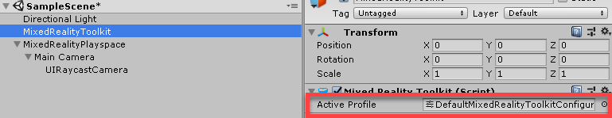

Mixed Reality Toolkit のすべての「デフォルト」プロファイルは、Assets\MixedRealityToolkit.SDK\Profiles フォルダ内の SDK プロジェクトにあります。

> [!IMPORTANT]
> デフォルトの HoloLens 2 の設定プロファイルは、HoloLens 2 用に最適化されています。 [Profiles](Profiles/Profiles.md) をご確認ください。

メインの Mixed Reality Toolkit 設定プロファイルを開くと、Inspector (インスペクター)に次の画面が表示されます。

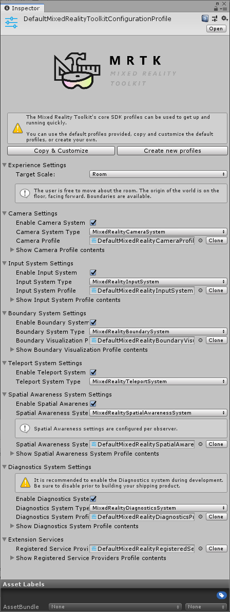

シーン内で MixedRealityToolkit を使用せずに MixedRealityToolkitConfigurationProfile アセットを選択すると、MRTK がシーンを自動的に設定するかどうかを確認するメッセージが表示されます。これはオプションですが、すべての設定画面にアクセスするには、シーン内にアクティブな MixedRealityToolkit オブジェクトが存在する必要があります。

これにより、プロジェクトの現在アクティブなランタイム設定が保存されます。

> [!NOTE]
> ほとんどのプロファイルは、InputActions 設定を除き、実行時に変更できます（後述）。プロファイルは、新しい設定/ランタイム環境に自動的に適応します。

ここから、MRTK のすべての設定プロファイルに移動できます。

* [エクスペリエンスの設定 (Experience settings)](#experience)
* [カメラの設定 (Camera settings)](#camera)
* [入力システムの設定 (Input system settings)](#inputsystem)
* [境界 (Boundary) 可視化の設定](#boundary)
* [テレポーテーション システム (Teleportation system) の選択](#teleportation)
* [空間認識 (Spatial Awareness) の設定](#spatialawareness)
* [診断 (Diagnostics) の設定](#diagnostic)
* [シーン システム (Scene system) の設定](#scenesystem)
* [その他のサービスの設定](#services)
* [入力アクション (Input actions) の設定](#inputactions)
* [Input Action Rules プロフィル](#inputactionrules)
* [Pointers の設定](#pointer)
* [ジェスチャ (Gestures) の設定](#gestures)
* [音声コマンド (Speech Commands)](#speech)
* [コントローラーマッピング (Controller mapping) の設定](#mapping)
* [コントローラーの可視化の設定](#visualization)
* [Service Inspectors](#inspectors)

これらの設定プロファイルについては、以下の関連セクションで詳しく説明します。

---
<a name="experience"/>

## エクスペリエンスの設定 (Experience settings)

Mixed Reality Toolkit のメイン設定ページにあるこの項目では、プロジェクトの Mixed Reality 環境のデフォルトの操作が定義されます。

---
<a name="camera"/>

## カメラの設定 (Camera settings)

カメラ設定では、Mixed Reality プロジェクトのカメラの設定方法を定義し、一般的なクリッピング (clipping) 、クオリティ、透明度 (transparency) の設定を定義します。

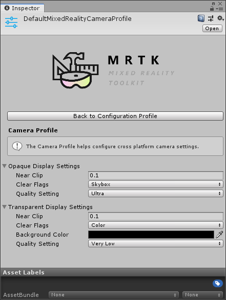

---
<a name="inputsystem"/>

## 入力システムの設定 (Input system settings)

Mixed Reality プロジェクトは、すべての入力イベントを取り扱うための堅牢で十分に熟練した入力システムを提供しており、これはデフォルトで選択されています。

MRTK が提供する入力システムの背後にはその他のいくつかのシステムがあり、マルチプラットフォーム / Mixed Reality フレームワークの複雑さを抽象化するために、複雑な絡み合わせを駆動させ、管理するのを補助します。

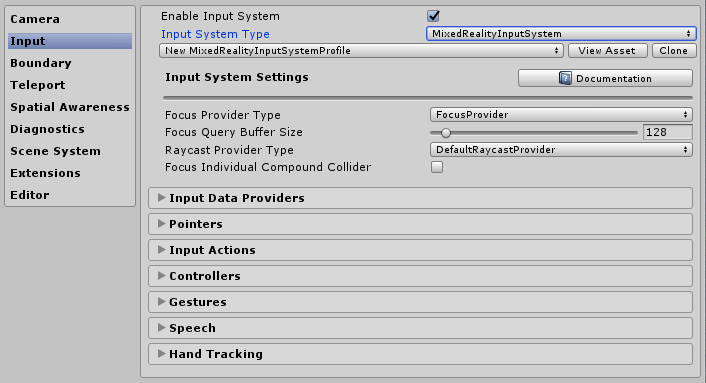

個々のプロファイルの詳細は以下のとおりです。

* Focus Settings
* [Input actions settings](#inputactions)
* [Input actions rules](#inputactionrules)
* [Pointer configuration](#pointer)
* [Gestures configuration](#gestures)
* [Speech commands](#speech)
* [Controller mapping configuration](#mapping)
* [Controller visualization settings](#visualization)

---
<a name="boundary"/>

## 境界 (Boundary) 可視化の設定

境界 (Boundary) システムは、元となるプラットフォームの境界/ガーディアン システムから取得した境界を解釈します。境界ビジュアライザー (Boundary visualizer) 設定を使用すると、シーン内で記録された境界をユーザーの位置に対して自動的に表示できます。境界線は、ユーザーがシーン内でテレポートする場所に基づいて反応/更新も行われます。

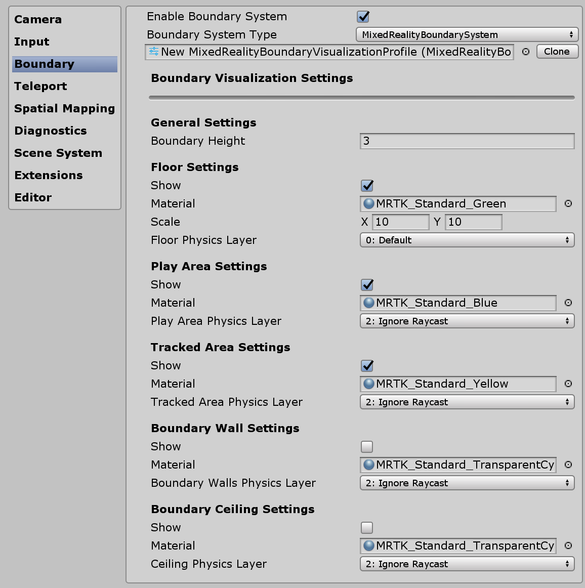

---
<a name="teleportation"/>

## テレポーテーション システム (Teleportation system) の選択

Mixed Reality プロジェクトは、プロジェクトでのテレポーテーション イベントを管理するための完全な機能を備えたテレポーテーション システムを提供しており、これはデフォルトで選択されています。

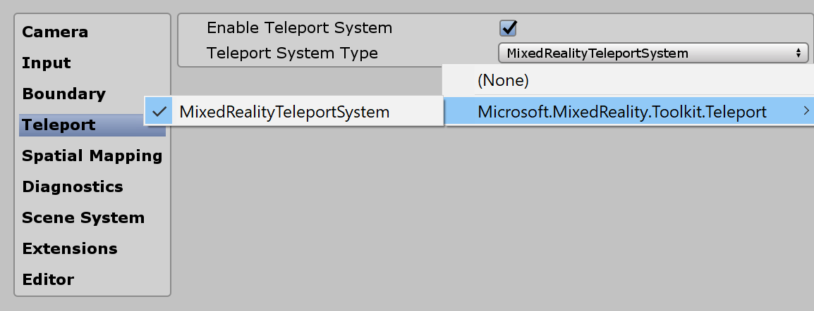

---
<a name="spatialawareness"/>

## 空間認識 (Spatial Awareness) の設定

Mixed Reality プロジェクトは、デフォルトで選択されたプロジェクト内の空間スキャン システムを操作するための再構築された空間認識システムを提供します。
[MRTK 空間認識システム](Architecture/SpatialAwareness.html)の裏にあるアーキテクチャはこちらで表示できます。

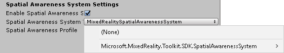

Mixed Reality Toolkit の空間認識設定を使用すると、アプリケーションの起動時に自動的に行うか、プログラムで後で行うかにかかわらず、
システムの起動方法を調整したり、視野の範囲を設定することができます。

また、メッシュとサーフェスの設定を行い、プロジェクトが周囲の環境をどのように認識するかをさらにカスタマイズすることもできます。

これは、スキャンされた環境を提供できるデバイスにのみ適用されます。

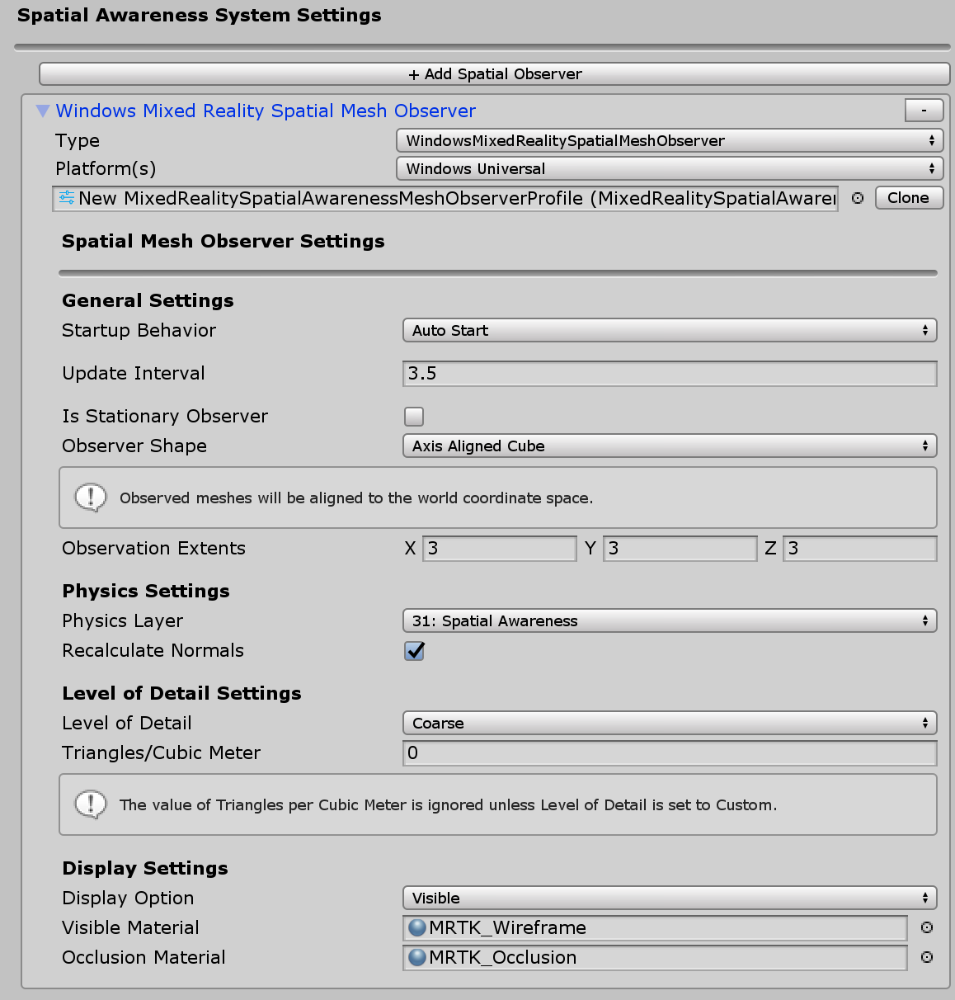

---
<a name="diagnostic"/>

## 診断 (Diagnostics) の設定

オプションですが、MRTK に非常に便利な機能は、プラグイン診断機能です。これにより、シーンへのデバッグログのスタイルが表示されます。

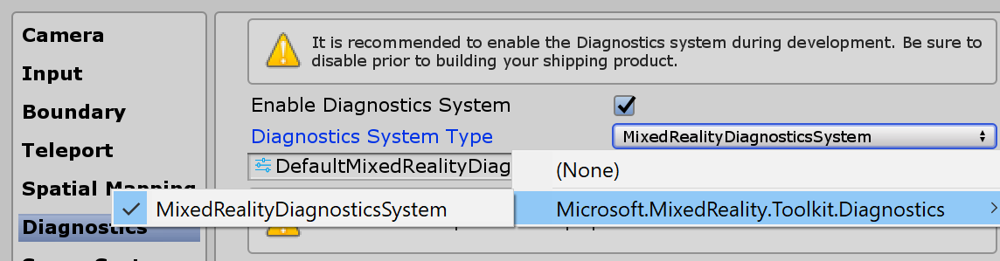

診断プロファイルには、シーン内の表示パネルを有効/無効にする便利なスイッチオン/オフなど、プロジェクトの実行中に監視するいくつかの簡単なシステムが提供されます。

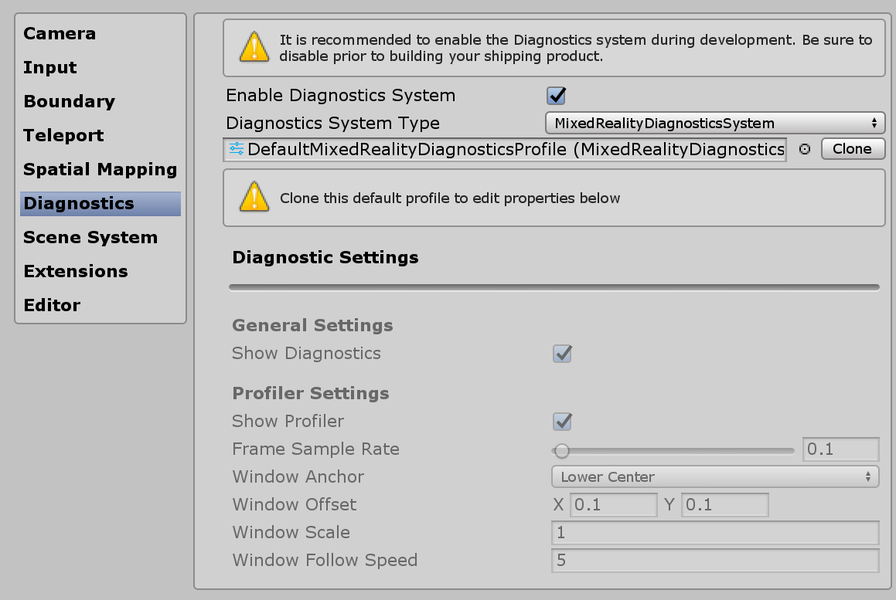

---
<a name="scenesystem"/>

## シーン システム (Scene system) の設定

MRTK は、複雑なシーンのロード/アンロードの管理に役立つオプションを提供します。シーン システムがプロジェクトに適しているかどうかを判断するには、[シーン システムの開始ガイド](SceneSystem/SceneSystemGettingStarted.html)を参照してください。

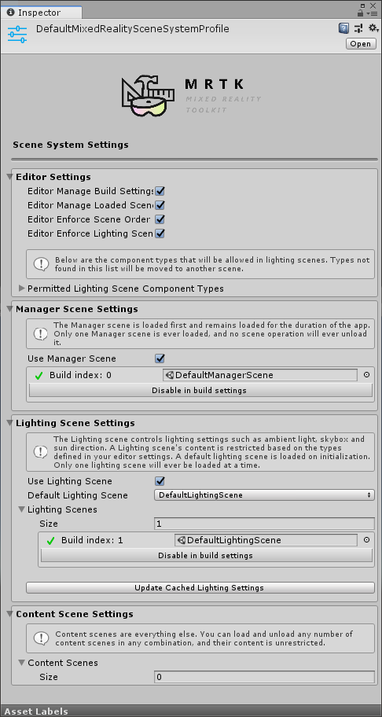

---
<a name="services"/>

## その他のサービスの設定

Mixed Reality Toolkit のより高度な領域の1つは、フレームワークと任意の「サービス」の登録を可能にする[サービスロケータパターン](https://en.wikipedia.org/wiki/Service_locator_pattern)の実装です。これにより、フレームワークに新しい機能/システムを簡単に拡張でき、プロジェクトはこれらの機能を利用して独自のランタイムコンポーネントも登録できます。

[Stephen Hodgson の Mixed Reality フレームワークに関する記事](https://medium.com/@stephen_hodgson/the-mixed-reality-framework-6fdb5c11feb2)で、基礎となるフレームワークとその実装についての詳細を読むことができます。

登録済みのサービスは、MonoBehaviour または不格好なシングルトン パターンを実装するオーバーヘッドとコストなしで、すべての Unity イベントを最大限に活用できます。これにより、フォアグラウンド（foreground）プロセスとバックグラウンド (background) プロセス (スポーン システム、ランタイム ゲーム ロジックなど)の両方を実行するためのシーン オーバーヘッドのない純粋な C# コンポーネントを使用できます。

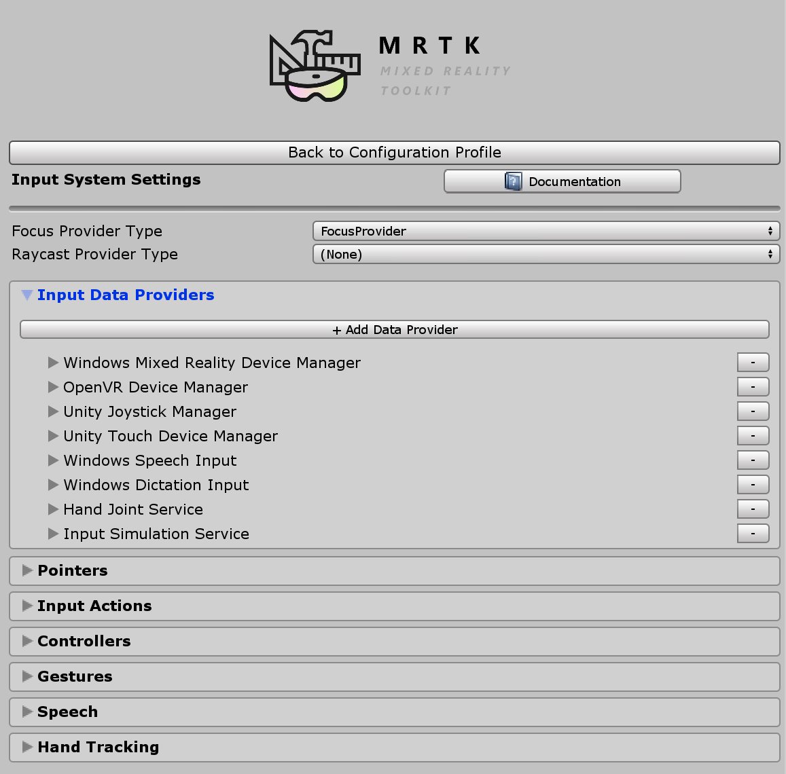

---
<a name="inputactions"/>

## 入力アクション (Input actions) の設定

入力アクションを使用すると、ランタイムプロジェクトからの物理的なインタラクションや入力を抽象化することができます。すべての物理入力 (コントローラー/手/マウス等) は、ランタイムプロジェクトで使用するための論理入力アクションに変換されます。これにより、入力元に関係なく、プロジェクトはシーン内でこれらのアクションを「実行する操作」または「対象とインタラクションする」として実装するだけでできます。

新しい入力アクションを作成するには、[Add a new Action] ボタンをクリックし、その内容にわかりやすいテキスト名を入力します。次に、アクションの軸 (データの１種類) のみを選択するか、物理コントローラーの場合は、それがアタッチできる物理入力タイプを選択するだけです。

| 軸拘束 | データ型 | 説明 | 使用例 |
| :--- | :--- | :--- | :--- |
| なし | データなし | 空のアクションまたはイベントに使用 | イベント トリガー |
| 未加工 (予約済み) | object | 将来の使用のために予約済み| N/A |
| デジタル | bool | boolean 値のオンまたはオフ型データ  | コントローラー ボタン |
| 単一軸 | float | 単一の精度データ値  | トリガなど、範囲の入力  |
| デュアル軸  | Vector2 | 複数軸のデュアル浮動小数点型日付  | Dpad またはサムスティック |
| 3 つの Dof 位置 | Vector3 | 3つの浮動軸からの位置タイプデータ | 3D 位置スタイルのみコントローラー  |
| 3 つの Dof 回転 | Quaternion | 4つの浮動軸を持つ回転のみの入力 | 3度スタイルのコントローラー、例えば Oculus Go コントローラー |
| Six Dof | Mixed Reality Pose (Vector3, Quaternion) | Vector3 コンポーネントと Quaternion コンポーネントの両方を使用した位置と回転スタイルの入力 | モーション コントローラーまたは Pointer |

入力アクションを利用するイベントは物理コントローラーに限定されず、プロジェクト内で実行時に新しいアクションを生成できます。

> [!NOTE]
> 入力アクションは、実行時に編集できない数少ないコンポーネントの 1 つであり、設計時のみ変更できます。このプロファイルは、各アクションに対して生成された ID に対するフレームワーク (およびプロジェクト) の依存関係により、プロジェクトの実行中に入れ替えをしないでください。

---
<a name="inputactionrules"/>

## Input Action Rules プロフィル

Input Action Rules を使用すると、1 つの入力アクションに対して発生したイベントを、そのデータ値に基づいて別のアクションに自動的に変換できます。これらはフレームワーク内でシームレスに管理され、パフォーマンスコストは発生しません。

たとえば、単一のデュアル軸入力イベントを DPad から 4 つの対応する "DPad Up" / "DPad Down" / "Dpad Left" / "Dpad Right" アクションに変換します (下の図に示すように)。

これは、独自のコードで行うこともできます。しかし、これは非常に一般的なパターンであったので、フレームワークはこれを外から変更できるメカニズムを提供します。

Input Action Rules は、使用可能な入力軸のいずれかに対して設定できます。ただし、1つの軸タイプからの入力アクションは、同じ軸タイプの別の入力アクションに変換できます。デュアル軸アクションを別のデュアル軸アクションにマップできますが、デジタルアクションまたはアクションなしにはマップできません。

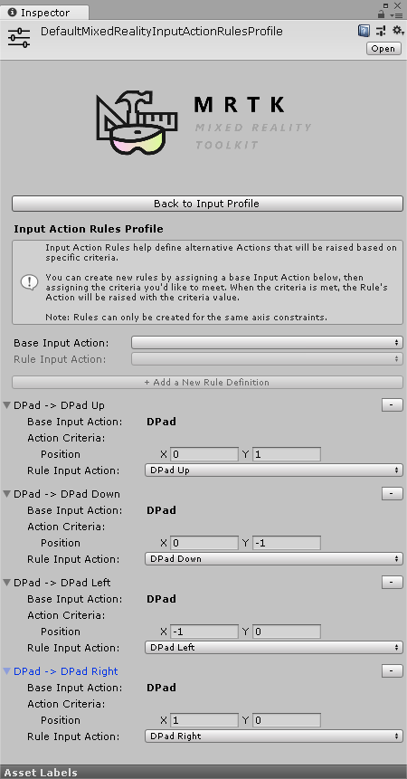

---
<a name="pointer"/>

## Pointers の設定

入力の向きとヒットテストの両方を、シーン内の任意のオブジェクト (コライダがアタッチされている、または UI コンポーネント) に対して行います。Pointers は、デフォルトでは、コントローラー、ヘッドセット(視線/フォーカス)、マウス/タッチ入力用に自動的に設定されます。

Pointers は、Mixed Reality Toolkit によって提供される多くのラインコンポーネントの 1 つを使用してアクティブシーン内で可視化することも、 MRTK IMixedRealityPointer インターフェイスを実装している場合は独自の要素を使用して可視化することもできます。

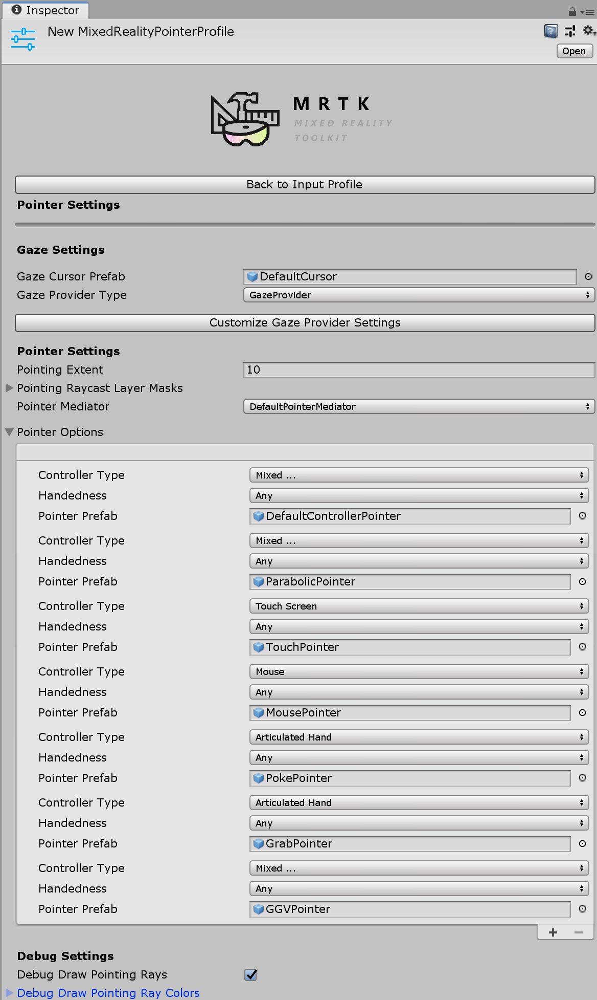

* Pointing Extent: 注視を含むすべてのポインターのグローバル ポインティング範囲を決定。
* Pointing Raycast Layer Masks: レイキャストに対してどのレイキャストを行うレイヤーを決定します。
* Debug Draw Pointing Rays: レイキャストに使用されるレイを可視化するためのデバッグ ヘルパー。
* Debug Draw Pointing Rays Colors: 可視化に使用する一連の色。
* Gaze cursor prefab: 任意のシーンにグローバルな視線カーソルを簡単に指定できます。

必要に応じて、Gaze Provider にすばやく移り、Gaze の特定の値をオーバーライドするための追加のヘルパーボタンがあります。

---
<a name="gestures"/>

## ジェスチャ (Gestures) の設定

ジェスチャは、さまざまな SDK (HoloLens など) によって提供されるさまざまな「ジェスチャ」入力メソッドに入力アクションを割り当てることができるシステム固有の実装です。

> [!NOTE]
> 現在のジェスチャの実装は HoloLens 専用で、将来ツールキットに追加される他のシステムに対して拡張されます (日付は未定です)。

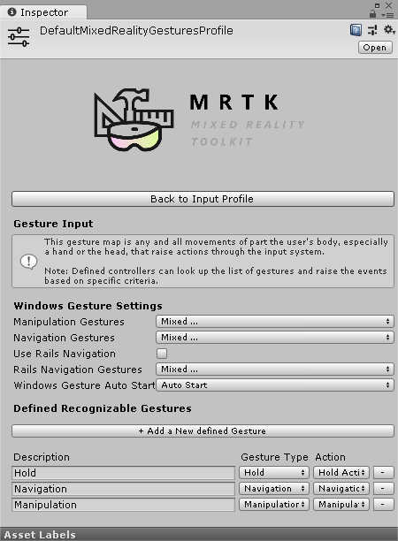

---
<a name="speech"/>

## 音声コマンド (Speech Commands)

ジェスチャと同様に、一部のランタイム プラットフォームでは、Unity プロジェクトで受信できるコマンドを生成する機能を備えたインテリジェントな "Speech to Text" 機能も提供します。この設定プロファイルを使用すると、登録済みの 「単語」を設定し、プロジェクトで受信できる入力アクションに変換できます。必要に応じて、キーボード アクションにアタッチすることもできます。

> [!IMPORTANT]
> このシステムは現在、HoloLens や Windows 10 デスクトップなどの Windows 10 プラットフォームで実行されている場合にのみ音声認識をサポートしており、将来 MRTK に追加される他のシステムでも拡張される予定です (日付はまだありません)。

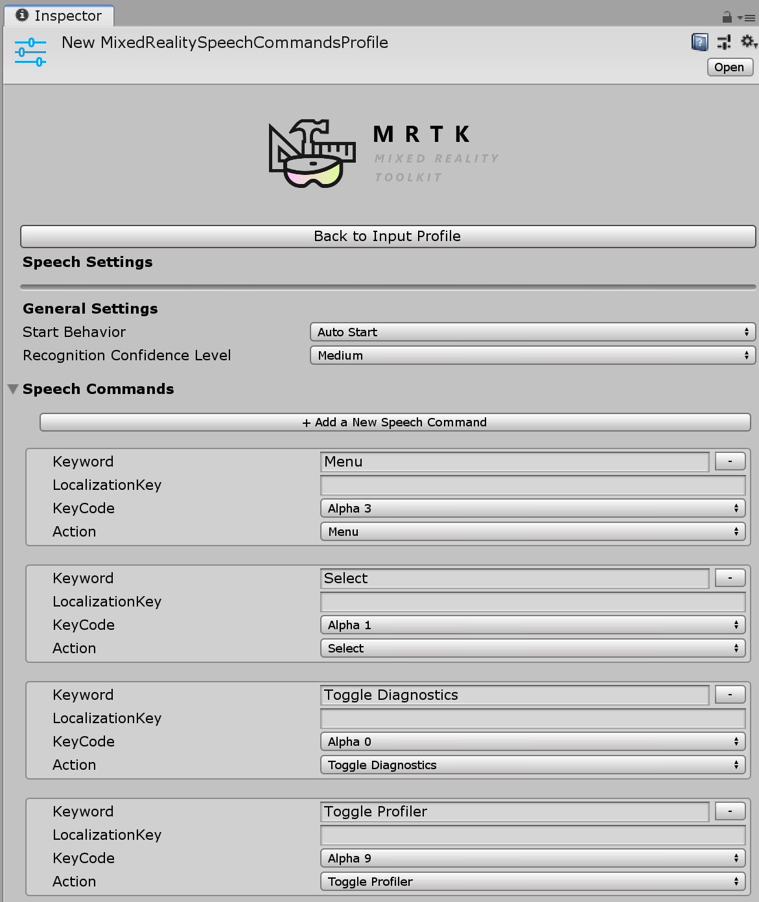

---
<a name="mapping"/>

## コントローラーマッピング (Controller mapping) の設定

Mixed Reality Toolkit の主要な設定画面の1つは、プロジェクトで使用できるさまざまな種類のコントローラーを設定およびマッピングする機能です。

以下の設定画面では、ツールキットで現在使われているコントローラーのいずれかを設定できます。

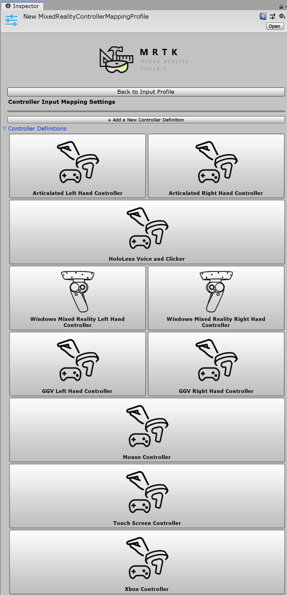

MRTK は、次のコントローラー/システムのデフォルト設定を提供します。

* マウス (3D 空間マウスのサポートを含む)
* タッチスクリーン
* Xbox コントローラー
* Windows Mixed Reality コントローラー
* HoloLens ジェスチャー
* HTC Vive ワンド コントローラー
* Oculus Touch コントローラー
* Oculus Remote コントローラー
* 汎用 OpenVR デバイス (上級ユーザーのみ)

あらかじめ構築されたコントローラー システムのいずれかの画像をクリックすると、対応するすべての入力に対して単一の入力アクションを設定できます (以下の Oculus Touch コントローラーの設定画面を参照)。

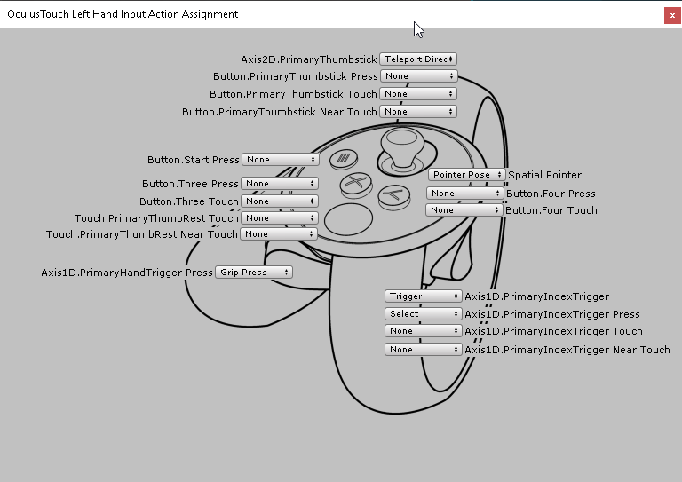

上記で識別されていない他の OpenVR または Unity 入力コントローラーを設定するための高度な画面もあります。

---
<a name="visualization"/>

## コントローラーの可視化の設定

コントローラー マッピングに加えて、シーン内でのコントローラーの表示方法をカスタマイズするための個別の設定プロファイルが用意されています。

これは、「Global」(特定のハンド用コントローラーのすべてのインスタンス) または個々のコントローラー タイプ/ハンドに固有の設定が可能です。

> [!IMPORTANT]
> MRTK は現在、Unity が提供されていない、数多くのネイティブ SDKのコントローラーのモデルの gLTF モデルをロード/レンダリングする機能をサポートしていません。これは、使用可能なときに追加されます。

シーン内のコントローラー リプレゼンテーションを物理コントローラーの位置からオフセットする必要がある場合は、コントローラー モデルのプレハブに対してオフセットを設定するだけです (例えば、コントローラー プレハブの変換位置をオフセット位置で設定します)。

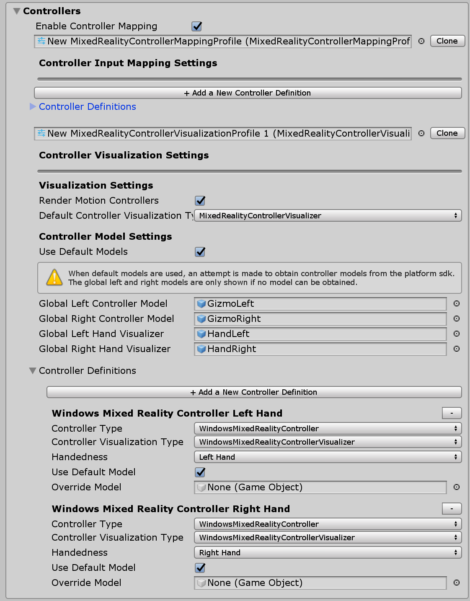

<a name="inspectors"/>

## Service Inspectors

サービス インスペクターは、シーン内オブジェクトを生成する、エディタ上のみの機能です。これらのオブジェクトを選択すると、ドキュメントリンクを提供する Inspector (インスペクター) が表示され、エディタの見た目を制御し、サービスの状態に関する情報が表示されます。

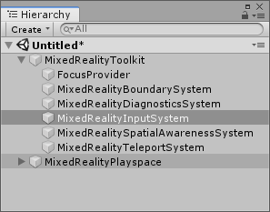

Configuration Profile の Editor Settings の Use Service Inspectors をオンにすると、サービスインスペクターを有効にできます。

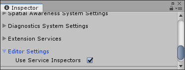 
サービス インスペクターを有効にする

