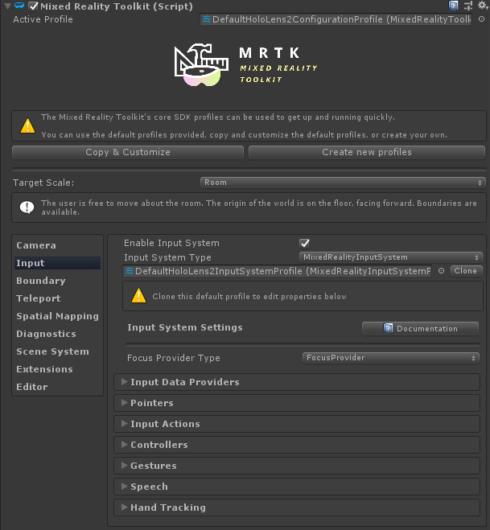

# Profiles

MRTK を設定する主な方法の一つは、foundation パッケージに含まれる多数の Profile を使用することです。
メインとなる MixedRealityToolkit オブジェクトは Profile を持っており、これは実装としては ScriptableObject で、他の ScriptableObject への参照を含みます。参照される各 ScriptableObject は MRTK の各機能を設定するようデザインされています。

例えば入力機能の設定はinput の[ Profile ](https://github.com/microsoft/MixedRealityToolkit-Unity/blob/mrtk_development/Assets/MixedRealityToolkit.SDK/Profiles/DefaultMixedRealityInputSystemProfile.asset)にまとめられています。 Profile の編集には Unity Editor のインスペクタを使用することをお勧めします。

 
Profile Inspector

> [!NOTE]
> 実行時に Profile が変更可能であるように意図されていますが、現在のところはこれは正しく動作しません- [参考](https://github.com/microsoft/MixedRealityToolkit-Unity/issues/4289)

## Default Profile

MRTK は様々なプラットフォームとシナリオをサポートするデフォルトの Profile を提供します。例えば、 [DefaultMixedRealityToolkitConfigurationProfile](https://github.com/microsoft/MixedRealityToolkit-Unity/blob/mrtk_development/Assets/MixedRealityToolkit.SDK/Profiles/DefaultMixedRealityToolkitConfigurationProfile.asset)
を選択すれば VR (OpenVR, WMR) と HoloLens(1, 2) 両方に対応したシナリオを試すことができます。これは幅広い用途のための Profile なので、特定のユースケースに最適化されてはいないことに注意してください。もし他のプラットフォーム向けに、より高パフォーマンスで特化した設定にしたければ、以下の他のプラットフォーム向けに調整された Profile を確認してください。

## HoloLens 2 Profile

MRTK は HoloLens2 上での開発・テストに最適化された Profile を提供します。 [DefaultHoloLens2ConfigurationProfile](https://github.com/microsoft/MixedRealityToolkit-Unity/blob/mrtk_development/Assets/MixedRealityToolkit.SDK/Profiles/HoloLens2/DefaultHoloLens2ConfigurationProfile.asset).
MixedRealityToolkit オブジェクトに Profile を設定するよう表示されたら、デフォルトではなくこちらを選択してください。

HoloLens2 向けとデフォルトの主な違いは以下の通りです。:

  - Boundary System が無効になっています( AR には Boundary ( VR のエリア境界線)がないため)
  - Teleport System が無効になっています(主に VR のコンセプトです)
  - Spatial Awareness System が無効になっています。
  Spatial Meshes は描画されませんが、 [この資料](../SpatialAwareness/SpatialAwarenessGettingStarted.md)に従ってオンにできます。
    Spatial Meshes はクライアントからのフィードバックによりデフォルトではオフになっています。最初は視覚的に興味深いのですが、見た目の紛らわしさやパフォーマンス上の理由から通常はオフにされています。
  - Eye racking provieder とその設定は有効になっています。
  - Eye simulation はデフォルトで有効になっています。
  - Hand mesh visualization は無効になっています(パフォーマンス上の理由により)
  - Camera の Profile は Unity の Editor Quality と Player Quality が同じになるように設定されます。(これは Opaque ディスプレイが高いクオリティになるように設定された、デフォルトの Camera の Profile とは異なります。この変更により Editor 上でのクオリティは下がりますが、実際のデバイスに描画される結果により近いものになります。)