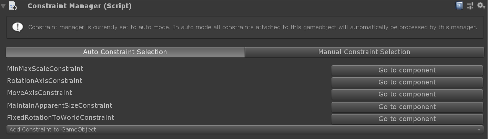
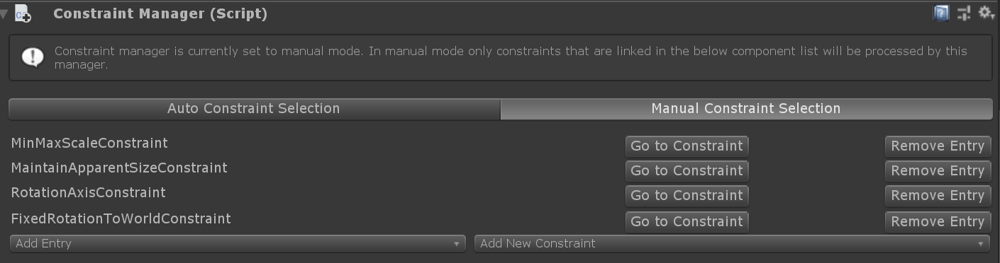

# Constraint manager

The constraint manager allows to apply a set of constraint components to a transform. Components of type [`TransformConstraint`](xref:Microsoft.MixedReality.Toolkit.UI.TransformConstraint) that are attached to the game object can be taken into consideration.
Per default, constraint manager will automatically collect all [constraint components](#transform-constraints) attached to the game object and apply them to processed transforms.
However users can opt for configuring the list of applied constraints manually and allowing only a subset of attached constraints to be applied.

Currently the following MRTK UX elements are supporting constraint manager:
- [Bounds control](README_BoundsControl.md)
- [Object manipulator](README_ObjectManipulator.md)

## Inspector properties and fields

Constraint manager can be operated in two modes: 
- Auto constraint selection
- Manual constraint selection

### Auto constraint selection

The default mode of constraint manager, auto constraint selection, will provide a list of all attached constraint components as well as [go to buttons](#go-to-component) and an [add constraint button](#add-constraint-to-game-object).

#### Add constraint to game object

This button allows a constraint component to be added directly from the constraint manager inspector. All constraint types in a project should be visible here. See [transform constraints](#transform-constraints) for more info.

#### Go to component

All constraints found on the object wil be listed here with a *Go to component* button. This button will cause the inspector to scroll to the selected constraint component so that it can be configured.

### Manual constraint selection

If constraint manager is set to manual mode, only constraints that are linked in the constraint list are processed and applied to the transform. The list displayed will only show the user selected constraints as well as [go to buttons](#go-to-component) or options to remove or add entries.
When enabling manual mode for the first time, constraint manager will populate the list will all available components as a starting point for selecting attached constraint components.

### Remove entry
This removes the entry from the manually selected list. Note that this option will not remove the constraint component from the game object. Constraint components always need to be removed manually to ensure not accidentally breaking any other component referring to this component.

### Add entry
Add entry will open a dropdown showing all available constraint components that are not in the manual list yet. By clicking on any of the entries that component will be added to the manual constraint selection.

### Add new constraint
This option will add a component of the selected type to the game object and add the newly created constraint component to the manual constraint list.

## Transform constraints

Constraints can be used to limit manipulation in some way. For example, some applications may require rotation, but also require that the object remain upright. In this case, a `RotationAxisConstraint` can be added to the object and used to limit rotation to y-axis rotation. MRTK provides a number of constraints, all of which are described below.

It is also possible to define new constraints and use them to create unique manipulation behaviour that may be needed for some applications. To do this, create a script that inherits from [`TransformConstraint`](xref:Microsoft.MixedReality.Toolkit.UI.TransformConstraint) and implement the abstract `ConstraintType` property and the abstract `ApplyConstraint` method. Upon adding a new constraint to the object, it should constrain manipulation in the way that was defined. This new constraint should also show in the constraint manager [auto selection](#auto-constraint-selection) or [add entry](#add-entry) dropdown in manual mode.

All of the constraints provided by MRTK share the following properties:

#### Hand Type

Specifies whether the constraint is used for one handed, two handed or both kinds of manipulation. Because this property is a flag, both options can be selected.

* *One handed*: Constraint will be used during one handed manipulation if selected.
* *Two handed*: Constraint will be used during two handed manipulation if selected.

#### Proximity Type

Specifies whether the constraint is used for near, far or both kinds of manipulation. Because this property is a flag, both options can be selected.

* *Near*: Constraint will be used during near manipulation if selected.
* *Far*: Constraint will be used during far manipulation if selected.

### FaceUserConstraint

When this constraint is attached to an object, rotation will be limited so that object will always face the user. This is useful for slates or panels. The properties for `FaceUserConstraint` are as follows:

#### Face away

Object faces away from the user if true.

### FixedDistanceConstraint

This constraint fixes the distance between the manipulated object and another object transform on manipulation start. This is useful for behaviour such as fixing the distance from the manipulated object to the head transform. The properties for `FixedDistanceConstraint` are as follows:

#### Constraint transform

This is the other transform that the manipulated object will have a fixed distance to. Defaults to the camera transform.

### FixedRotationToUserConstraint

This constraint fixes the relative rotation between the user and the manipulated object while it is being manipulated. This is useful for slates or panels as it ensures that the manipulated object always shows the same face to the user as it did at the start of manipulation. The `FixedRotationToUserConstraint` does not have any unique properties.

### FixedRotationToWorldConstraint

This constraint fixes the global rotation of the manipulated object while it is being manipulated. This can be useful in cases where no rotation should be imparted by manipulation. The `FixedRotationToWorldConstraint` does not have any unique properties:

### MaintainApparentSizeConstraint

When this constraint is attached to an object, no matter how far the object is from the user, it will maintain the same apparent size to the user (i.e. it will take up the same proportion of the user's field of view). This can be used to ensure that a slate or text panel remains readable while manipulating. The `MaintainApparentSizeConstraint` does not have any unique properties:

### MoveAxisConstraint

This constraint can be used to fix along which axes a manipulated object can be moved. This can be useful for manipulating objects over the surface of a plane, or along a line. The properties for `MoveAxisConstraint` are as follows:

#### Constraint on movement

Specifies which axes to prevent movement on. By default, these axes will be global rather than local, but this can be changed below. Because this property is a flag, any number of options can be selected.

* *X Axis*: Movement along the x-axis is constrained if selected.
* *Y Axis*: Movement along the y-axis is constrained if selected.
* *Z Axis*: Movement along the z-axis is constrained if selected.

#### Use local space for constraint

Will constrain relative the manipulated object's local transform axes if true. False by default.

### RotationAxisConstraint

This constraint can be used to fix about which axes a manipulated object can be rotated. This can be useful for keeping a manipulated object upright, but still allowing y-axis rotations, for example. The properties for `RotationAxisConstraint` are as follows:

#### Constraint on rotation

Specifies which axes to prevent rotation about. By default, these axes will be global rather than local, but this can be changed below. Because this property is a flag, any number of options can be selected.

* *Y Axis*: Rotation about the y-axis is constrained if selected.
* *Z Axis*: Rotation about the z-axis is constrained if selected.
* *X Axis*: Rotation about the x-axis is constrained if selected.

#### Use local space for constraint

Will constrain relative the manipulated object's local transform axes if true. False by default.

### MinMaxScaleConstraint

This constraint allows minimum and maximum values to be set for the scale of the manipulated object. This is useful for preventing users from scaling an object too small or too large. The properties for `MinMaxScaleConstraint` are as follows:

#### Scale minimum

The minimum scale value during manipulation.

#### Scale maximum

The maximum scale value during manipulation.

#### Relative to initial state

If true, the values above will be interpreted as relative to the objects initial scale. Otherwise they will be interpreted as absolute scale values.
