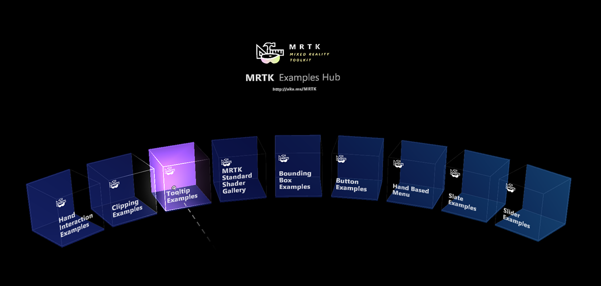
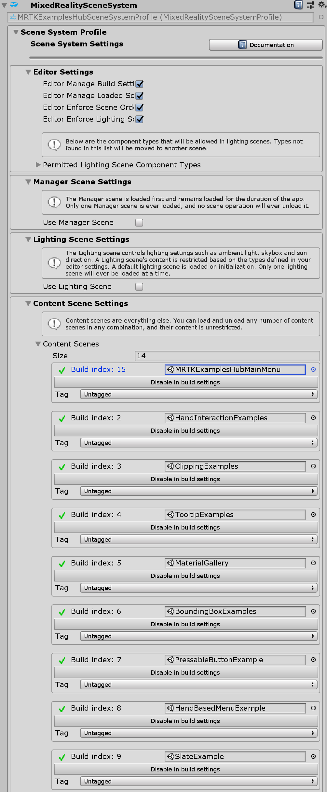
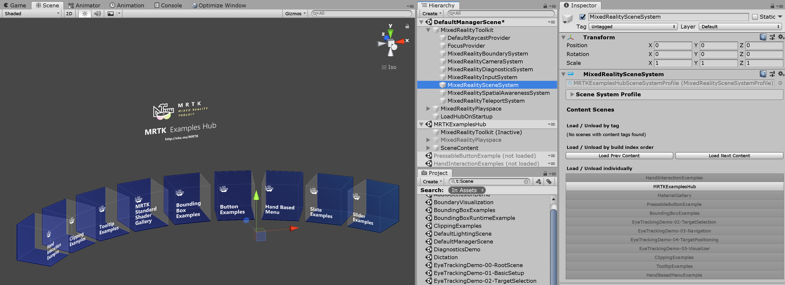
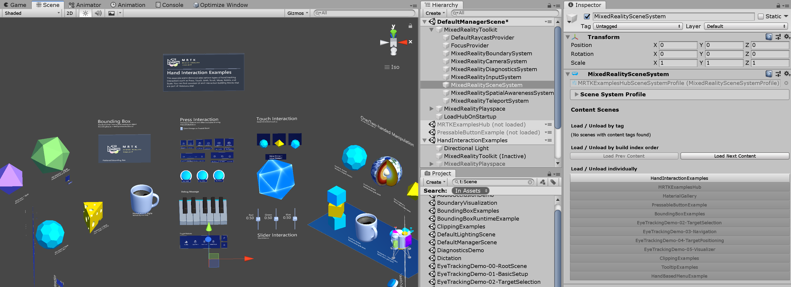
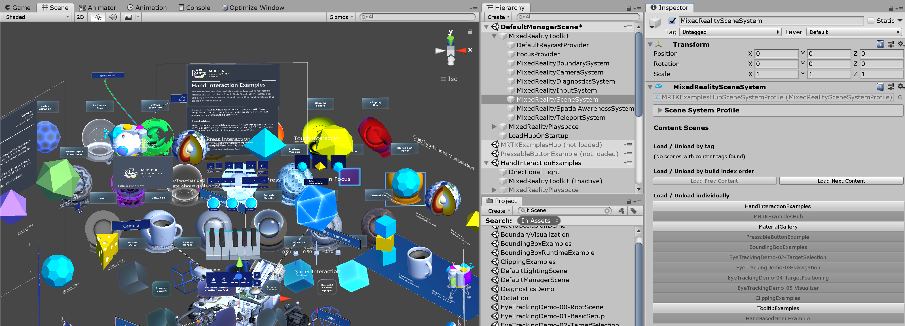
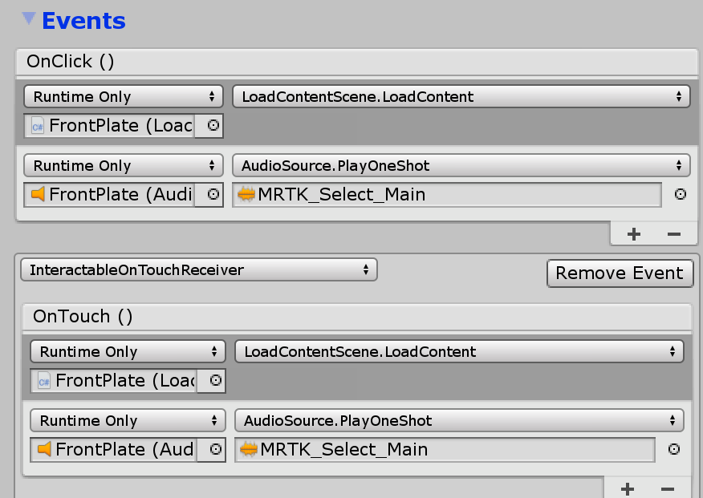
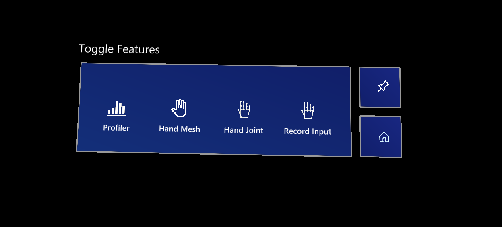
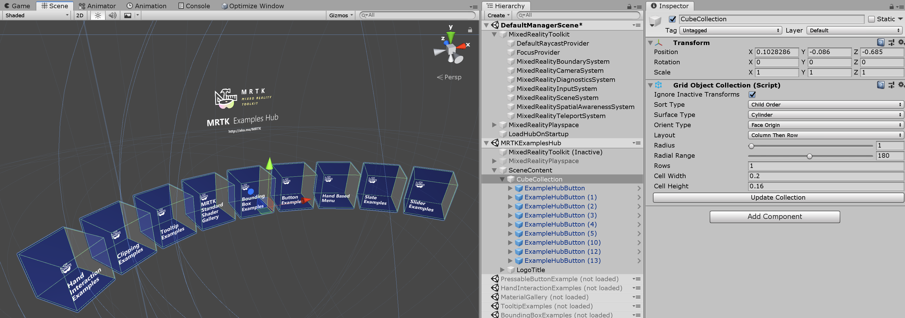

# MRTK Examples Hub



MRTK Examples Hub は、複数の scene (シーン)を簡単に体験できる Unity シーンです。シーンのロードとアンロードには MRTK のシーン システムを使用します。 

**MRTKExamplesHub.unity** は、``MixedRealityToolkit`` や ``MixedRealityPlayspace``などのコンポーネントを共有するコンテナ シーンです。**MRTKExamplesHubMainMenu.unity** は、立方体ボタンがあります。

## 前提条件
MRTK Examples Hub は、[Scene Transition Service](Extensions/SceneTransitionService/SceneTransitionServiceOverview.md) および関連スクリプトを使用します。Unity パッケージを介して、MRTK を使用している場合は、 [release packages](https://github.com/microsoft/MixedRealityToolkit-Unity/releases) の一部である **Microsoft.MixedReality.Toolkit.Unity.Extensions.x.x.x.unitypackage** をインポートしてください。リポジトリをクローンして MRTK を使っている場合は、すでに **MixedRealityToolkit.Extensions** フォルダがプロジェクタ内にあるはずです。

## MRTKExamplesHub シーンとシーン システム

`MixedRealityToolkit.Examples/Experimental/Demos/ExamplesHub/Scenes/` にある **MRTKExamplesHub.unity** を開きます。これは、MixedRealityToolkit、MixedRealityPlayspace および LoadHubOnStartup を含む空のシーンです。このシーンは、MRTK のシーン システムを使うように設定されています。MixedRealityToolkit 配下の `MixedRealitySceneSystem` をクリックします。Inspector (インスペクター) パネルにシーン システムの情報が表示されます。

<br/><br/>
<br/><br/>

インスペクターの下部に、 Scene System Profile で定義されているシーンのリストが表示されます。シーン名をクリックすると、ロード/アンロードできます。
<br/><br/>
<br/><br/> リスト内のシーン名をクリックして _MRTKExamplesHub_ シーンをロードする例。
<br/><br/> _HandInteractionExamples_ シーンをロードする例。
<br/><br/>
複数のシーンをロードする例。

## シーンの実行
このシーンは、Unity のゲーム モードとデバイスの両方で機能します。Unity エディタで **MRTKExamplesHub** シーンを実行し、MRTK の入力シミュレーションを使用してシーンの内容を操作します。ビルドと配置を行うには、シーン システムのリストに含まれる他のシーンとともに **MRTKExamplesHub** シーンをビルドします。インスペクターでは、 [Build Settings] にシーンを簡単に追加することもできます。 [Build Settings] で、 **MRTKExamplesHub** シーンがリストの一番上のインデックス 0 にあることを確認します。


## MRTKExamplesHub でシーンをロードする方法

**MRTKExamplesHub** シーンには、 ``ExamplesHubButton`` prefab (プレハブ)があります。 
このプレハブには、``Interactable`` を含む **FrontPlate** オブジェクトがあります。 
Interactable の ``OnClick()`` と ``OnTouch()`` イベントを使用すると、**LoadContentScene** スクリプトの **LoadContent()** 関数がトリガーされます。 
**LoadContentScene** スクリプトのインスペクターで、ロードするシーン名を定義できます。
<br/><br/>
<br/><br/>
<br/><br/>

このスクリプトは、シーン システムの LoadContent() 関数を使用してシーンをロードします。 
詳細については、[Scene System](SceneSystem/SceneSystemGettingStarted.md) ページを参照してください。

```c#
MixedRealityToolkit.SceneSystem.LoadContent(contentName, loadSceneMode);
```

## メイン メニュー シーンに戻る
メイン メニュー シーン (MRTKExamplesHubMainMenu シーン) に戻るには、同じシーン システムの `LoadContent()` メソッドを使用します。**ToggleFeaturesPanelExamplesHub.prefab** は、**LoadContentScene** スクリプトを含む[ホーム] ボタンを提供します。各シーンでこのプレハブを使用するかカスタム ホーム ボタンを提供して、ユーザーがメイン シーンに戻ることができるようにします。 **MRTKExamplesHub** は共有 コンテナ シーンであるため、**MRTKExamplesHub** シーンに **ToggleFeaturesPanelExamplesHub.prefab** を配置すると常時表示できます。各サンプル シーンでは、**ToggleFeaturesPanel.prefab** が非表示/非アクティブであることを確認してください。




## ボタンの追加

**CubeCollection** オブジェクトで、_ExampleHubButton_ プレハブを複製 (または追加) し、`GridObjectCollection` の **Update Collection** をクリックします。
これにより、新しいボタンの総数に基づいて円柱のレイアウトが更新されます。
詳細については [Object Collection](README_ObjectCollection.md) ページを参照してください。

<br/><br/>
<br/><br/>

ボタンを追加したら、上記のように **LoadContentScene** スクリプト内のシーン名を更新します。
シーン システムのプロファイルにシーンを追加します。
