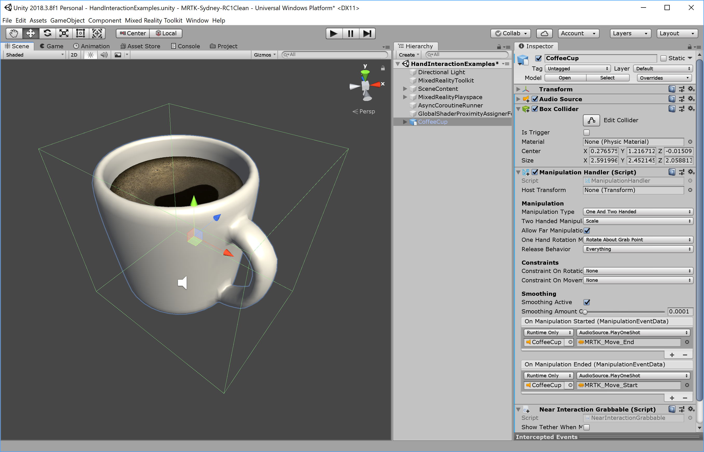

# Manipulation handler #

*ManipulationHandler* スクリプトを使用することで、オブジェクトを片手か両手を使って、移動、スケール調整、および回転を可能にすることができます。特定の種類の移動のみを許可することにより、操作を制限できます。このスクリプトは、HoloLens 2 多関節ハンド入力、手の Ray 、HoloLens (第 1 世代) ジェスチャ入力、没入型ヘッドセット モーション コントローラー入力など、さまざまな種類の入力で動作します。

## Manipulation handler の使用方法 ##

[`ManipulationHandler.cs`](https://github.com/Microsoft/MixedRealityToolkit-Unity/blob/mrtk_release/Assets/MixedRealityToolkit.SDK/Features/Input/Handlers/ManipulationHandler.cs) コンポーネントをゲームオブジェクトに追加します。

また、オブジェクトに衝突可能 (Collidable) なバウンドを合わせて追加してください。オブジェクトが近くにある多関節ハンドに反応するには、[NearInteractionGrabbable.cs](https://github.com/Microsoft/MixedRealityToolkit-Unity/blob/mrtk_release/Assets/MixedRealityToolkit.Services/InputSystem/NearInteractionGrabbable.cs) スクリプトも追加します。

オブジェクトのスケールの最小値または最大値を設定する場合は、[TransformScaleHandler](https://github.com/Microsoft/MixedRealityToolkit-Unity/blob/mrtk_release/Assets/MixedRealityToolkit.SDK/Features/Input/Handlers/TransformScaleHandler.cs) スクリプトも追加してください。

## \[Inspector](インスペクター)のプロパティ ##

**Host Transform**
ドラッグされる Transform。デフォルトでは、コンポーネントのオブジェクトが設定されます。

**Manipulation Type**
片手、両手、または両方を使用してオブジェクトを操作できるかどうかを指定します。

* *One handed only 片手のみ*
* *Two handed only 両手のみ*
* *One and Two handed 片手と両手両方*

**Two Handed Manipulation Type**

* *Scale*: スケーリングのみ可能です。
* *Rotate*: 回転のみ許可されます。。
* *Move Scale*: 移動とスケーリングが許可されます。
* *Move Rotate*: 移動および回転が許可されます。
* *Rotate Scale*: 回転とスケーリングが許可されます。
* *Move Rotate Scale*: 移動、回転およびスケーリングが許可されます。

**Allow Far Manipulation**
ポインターとの遠いインタラクションを使用して操作を実行できるかどうかを指定します。

**One Hand Rotation Mode Near**
オブジェクトが片手/コントローラーの近くで、つかまれているときにオブジェクトがどのように動作するかを指定します。

**One Hand Rotation Mode Far**
オブジェクトがある距離で片手/コントローラーで、つかまれているときにオブジェクトがどのように動作するかを指定します。

**One Hand Rotation Mode Options**
オブジェクトが片手でつかまれているときに、オブジェクトを回転させる方法を指定します。

* *Maintain original rotation*: 移動中にオブジェクトを回転させません
* *Maintain rotation to user*: X/Y 軸のオブジェクトの元の回転を、ユーザに維持する
* *Gravity aligned maintain rotation to user*: オブジェクトの元の回転をユーザに維持しますが、オブジェクトを垂直にします。バウンディングボックスに便利です。
* *Face user*: オブジェクトが常にユーザーに直面していることを確認します。スレート (slates)/ パネルに便利です。
* *Face away from user*: オブジェクトが常にユーザーの顔に向かないようにする。後ろ向きに設定されたスレート (slates)/ パネルに便利です。
* *Rotate about object center*: 多関節ハンド/コントローラでのみ動作します。ハンド/コントローラの回転を使用してオブジェクトを回転しますが、オブジェクトの中心点を中心に回転します。遠くから観察する場合に便利です。
* *Rotate about grab point*: 多関節ハンド/コントローラのためにのみ動作します。オブジェクトを手/コントローラーで保持しているかのように回転します。観察に役立ちます。

**Release Behavior**
オブジェクトが解放されるとき、その物理的な動きの動作を指定します。そのオブジェクト上に Rigidbody コンポーネントが必要です。

* *Nothing*
* *Everything*
* *Keep Velocity (速度キープ)*
* *Keep Angular Velocity (角速度キープ)*

**Constraints on Rotation**
操作時にオブジェクトが回転する軸を指定します。

* *None*
* *X-Axis Only (X軸のみ)*
* *Y-Axis Only (Y軸のみ)*
* *Z-Axis Only (Z軸のみ)*

**Constraints on Movement**
* *None*
* *Fix distance from head (ヘッドからの距離を修正)*

**Smoothing Active**
スムージングをアクティブにするかどうかを指定します。

**Smoothing Amount One Hand**
移動、スケール、回転に適用するスムージングの量。0 は、スムージングがないことを意味します。最大値は、値に変更がないことを意味します。

## Events ##
Manipulation handler は、次のイベントを提供します:

* *OnManipulationStarted*: 操作が開始されたときに起動します。
* *OnManipulationEnded*: 操作が終了した時に起動します。
* *OnHoverStarted*: ハンド/コントローラーが操作可能な物の、近くまたは遠くにホバー (hover) したときに起動します。
* *OnHoverEnded*: ハンド/コントローラーが操作可能な物の、近くまたは遠くにホバー (hover) を解除すると起動します。
