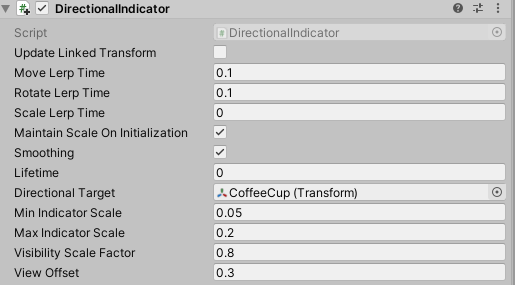

# Solvers (ソルバー)


Solvers(ソルバー) は、事前に定義されたアルゴリズムにしたがってオブジェクトの位置と回転の計算方法を容易にするコンポーネントです。一つの例として、ユーザーのゲイズ レイキャストが現在当たっている面にオブジェクトをを配置するということが挙げられます。

さらに、Unity にはコンポーネントの update 順を指定するための信頼できる方法はありませんが、ソルバー システムはこれらの移動の計算順序を確定的に定義しています。

ソルバーは、オブジェクトを他のオブジェクトやシステムにくっつけるための幅広い振る舞いを提供しています。他の例として、（カメラを基準として）ユーザーの前に浮かぶタグアロング オブジェクトがあります。ソルバーはオブジェクトをコントローラーに追従させるために、コントローラーとオブジェクトにアタッチすることもできます。全てのソルバーは安全に積み重ねることができます。例えば、タグアロング + surface magnetism + momentum と組み合わせられます。

## Solver (ソルバー) の使い方

ソルバー システムは、3つのカテゴリーのスクリプトから構成されています:

* [`Solver`](xref:Microsoft.MixedReality.Toolkit.Utilities.Solvers.Solver): 全てのソルバーが継承する、ベースとなる abstract class です。状態トラッキング、スムーズにするためのパラメーターと実装、自動的なソルバー システムの統合、そしてアップデート順序を提供しています。
* [`SolverHandler`](xref:Microsoft.MixedReality.Toolkit.Utilities.Solvers.SolverHandler): 追跡する参照オブジェクト (例えば、メイン カメラのトランスフォーム、ハンド レイなど) を設定し、ソルバー コンポーネントを集めて適切な順序で更新を実行します。

3つめのカテゴリーはソルバー自身です。以下のソルバーは、基本的な動作のためのビルディング ブロックを提供しています。

* [`Orbital`](#orbital): 参照オブジェクトから、指定された位置とオフセットを持った場所に固定します。
* [`ConstantViewSize`](xref:Microsoft.MixedReality.Toolkit.Utilities.Solvers.ConstantViewSize): 参照オブジェクトから見て、一定のサイズを保つように大きさを変えます。
* [`RadialView`](#radialview): 参照オブジェクトからみて、オブジェクトが視野の中に入るようにします。
* [`SurfaceMagnetism`](#surfacemagnetism): ワールドの面にレイを飛ばし、オブジェクトをその面に合わせます。
* [`Momentum`](xref:Microsoft.MixedReality.Toolkit.Utilities.Solvers.Momentum): 他のソルバーやコンポーネントによって動かされるオブジェクトに対して、運動量や弾性をシミュレーションするために、加速度、速度、摩擦を適用します。
* [`InBetween`](#inbetween): オブジェクトが2つのトラックされたオブジェクトの間にあるように保ちます。
* [`HandConstraint`](#hand-menu-with-handconstraint-and-handconstraintpalmup): オブジェクトが、ハンドと交差しない領域内でハンドを追従するように制約します。メニューなどの、ハンドに拘束されたインタラクティブなコンテンツに便利です。このソルバーは [IMixedRealityHand](xref:Microsoft.MixedReality.Toolkit.Input.IMixedRealityHand) とともに動作するよう意図されていますが、[IMixedRealityController](xref:Microsoft.MixedReality.Toolkit.Input.IMixedRealityController) とも動作します。
* [`HandConstraintPalmUp`](#hand-menu-with-handconstraint-and-handconstraintpalmup): HandConstraint から派生していますが、有効化の前に手のひらがユーザーを向いているかをテストするロジックが含まれています。このソルバーは [IMixedRealityHand](xref:Microsoft.MixedReality.Toolkit.Input.IMixedRealityHand) コントローラーでのみ動作し、他のコントローラー タイプについては、このソルバーは基底クラスと全く同じ動作をします。

ソルバー システムを使うためには、上記コンポーネントの一つをゲームオブジェクトに単に追加するだけです。全てのソルバーは [`SolverHandler`](xref:Microsoft.MixedReality.Toolkit.Utilities.Solvers.SolverHandler) を必要とするため、[`SolverHandler`](xref:Microsoft.MixedReality.Toolkit.Utilities.Solvers.SolverHandler) は Unity によって自動的に作成されます。

> [!NOTE]
> ソルバー システムの使い方の例は、**SolverExamples.scene** ファイルにて見つけることができます。

## 追跡参照を変更する方法

 [`SolverHandler`](xref:Microsoft.MixedReality.Toolkit.Utilities.Solvers.SolverHandler) コンポーネントの *Tracked Target Type* プロパティは、全てのソルバーがアルゴリズムを計算するときに使用する参照点を定義します。例えば、シンプルな [`SurfaceMagnetism`](xref:Microsoft.MixedReality.Toolkit.Utilities.Solvers.SurfaceMagnetism) コンポーネントとともに [`Head`](xref:Microsoft.MixedReality.Toolkit.Utilities.TrackedObjectType.Head) が指定された場合、頭からユーザーのゲイズ方向へのレイキャストが、どの面にヒットするかを解決するために使われます。`TrackedTargetType` プロパティに設定可能な値は以下の通りです。

* *Head* : 参照点はメイン カメラのトランスフォーム
* *ControllerRay*: 参照点は、ライン レイの方向を指しているコントローラーの [`LinePointer`](xref:Microsoft.MixedReality.Toolkit.Input.LinePointer) のトランスフォーム(すなわち、モーション コントローラーやハンド コントローラーのポインター原点)。
    * どちらの手（左手、右手、両手）を優先するかを選択するには、`TrackedHandedness` プロパティを使用します。
* *HandJoint*: 参照点は特定のハンド ジョイントのトランスフォーム
    * どちらの手（左手、右手、両手）を優先するかを選択するには、`TrackedHandedness` プロパティを使用します。
    * 利用するジョイントのトランスフォームを決定するには、`TrackedHandJoint` プロパティを使用します。
* *CustomOverride*: アサインされた `TransformOverride` からの参照点

> [!NOTE]
> *ControllerRay* と *HandJoint* タイプの両方について、`TrackedHandedness` プロパティが `Both` の場合、ソルバー ハンドラーは左のコントローラー/ハンドのトランスフォームを提供しようとし、左が利用できなければ右の値を提供しようとします。


<br/>
*TrackedTargetType に関連するさまざまなプロパティの例*

## Solver (ソルバー) を連鎖させる方法

複数の `Solver` コンポーネントを同じゲームオブジェクトに追加し、アルゴリズムを連鎖させることが可能です。`SolverHandler` コンポーネントは、同じゲームオブジェクト上のすべてのソルバーの更新を取り扱います。デフォルトでは `SolverHandler` は Start で `GetComponents<Solver>()` を呼び出し、これはインスペクターで表示される順序でソルバーを返します。
さらに、*Updated Linked Transform* プロパティを true に設定すると、`Solver` は計算した位置、姿勢、スケールをすべてのソルバー(すなわち、 `GoalPosition`)からアクセスできる仲介変数に保存します。false の場合は、`Solver` はゲームオブジェクトのトランスフォームを直接更新します。トランスフォームのプロパティを仲介の場所に保存すると、他のソルバーがその仲介変数から計算を始めることができます。この理由は、Unity は gameObject.transform を同じフレーム内にスタックして更新することを許容していないからです。

> [!NOTE]
> 開発者は、`SolverHandler.Solvers` プロパティを直接設定することでソルバーの実行順序を変更することができます。

## 新しい Solver (ソルバー) の作り方
すべてのソルバーは抽象基底クラスである [`Solver`](xref:Microsoft.MixedReality.Toolkit.Utilities.Solvers.Solver) を継承しなければなりません。Solver の拡張に主に必要となるのは、`SolverUpdate` メソッドのオーバーライドに関するものです。このメソッドで、開発者は継承された `GoalPosition`、`GoalRotation`、`GoalScale` プロパティを望ましい値に更新すべきです。さらに、`SolverHandler.TransformTarget` を、利用者が望む参照座標系として利用すると、たいていの場合に役に立つでしょう。

以下のコードは、`InFront` という新しいソルバー コンポーネントの例です。これは、アタッチされたオブジェクトを `SolverHandler.TransformTarget` の前 2m の位置に配置します。もし、`SolverHandler.TrackedTargetType` が [`Head`](xref:Microsoft.MixedReality.Toolkit.Utilities.TrackedObjectType.Head) に設定された場合、`SolverHandler.TransformTarget` はカメラのトランスフォームとなり、このソルバーはすべてのフレームでアタッチされたゲームオブジェクトユーザーのゲイズの前 2m の位置に配置します。

```csharp
/// <summary>
/// InFront ソルバーは追跡されるトランスフォーム ターゲットの前 2 m の位置にオブジェクトを配置します
/// </summary>
public class InFront : Solver
{
    ...

    public override void SolverUpdate()
    {
        if (SolverHandler != null && SolverHandler.TransformTarget != null)
        {
            var target = SolverHandler.TransformTarget;
            GoalPosition = target.position + target.forward * 2.0f;
        }
    }
}
```

## Solver implementation guides

### Common Solver properties

Every Solver component has a core-set of identical properties that control the core Solver behavior.

If *Smoothing* is enabled, then the Solver will gradually update the transform of the GameObject over time to the calculated values. The speed of this change is determined by every transform component's *LerpTime* property. For example, a higher *MoveLerpTime* value will result in slower increments in movement between frames.

If *MaintainScale* is enabled, then the Solver will utilize the GameObject's default local scale.


<br/>
*Common properties inherited by all Solver components*

### Orbital

The [`Orbital`](xref:Microsoft.MixedReality.Toolkit.Utilities.Solvers.Orbital) class is a tag-along component that behaves like planets in a solar system. This Solver will ensure the attached GameObject orbits around the tracked transform. Thus, if the *Tracked Target Type* of the [`SolverHandler`](xref:Microsoft.MixedReality.Toolkit.Utilities.Solvers.SolverHandler) is set to [`Head`](xref:Microsoft.MixedReality.Toolkit.Utilities.TrackedObjectType.Head), then the GameObject will orbit around the user's head with a fixed offset applied.

Developers can modify this fixed offset to keep menus or other scene components at eye-level or at waist level etc. around a user. This is done by modifying the *Local Offset* and *World Offset* properties. The *Orientation Type* property determines the rotation applied to the object if it should maintain it's original rotation or always face the camera or face whatever transform is driving it's position etc.


<br/>
*Orbital example*

### RadialView

The [`RadialView`](xref:Microsoft.MixedReality.Toolkit.Utilities.Solvers.RadialView) is another tag-along component that keeps a particular portion of a GameObject within the frustum of the user's view.

The *Min & Max View Degrees* properties determines how large of a portion of the GameObject must always be in view.

The *Min & Max Distance* properties determines how far the GameObject should be kept from the user. For example, walking towards the GameObject with a *Min Distance* of 1m will push the GameObject away to ensure it is never closer than 1m to the user.

Generally, the [`RadialView`](xref:Microsoft.MixedReality.Toolkit.Utilities.Solvers.RadialView) is used in conjunction with *Tracked Target Type* set to [`Head`](xref:Microsoft.MixedReality.Toolkit.Utilities.TrackedObjectType.Head) so that the component follows the user's gaze. However, this component can function to be kept in *"view"* of any *Tracked Target Type*.


<br/>
*RadialView example*

### InBetween

The [`InBetween`](xref:Microsoft.MixedReality.Toolkit.Utilities.Solvers.InBetween) class will keep the attached GameObject between two transforms. These two transform endpoints are defined by the GameObject's own [`SolverHandler`](xref:Microsoft.MixedReality.Toolkit.Utilities.Solvers.SolverHandler) *Tracked Target Type* and the [`InBetween`](xref:Microsoft.MixedReality.Toolkit.Utilities.Solvers.InBetween) component's *Second Tracked Target Type* property. Generally, both types will be set to [`CustomOverride`](xref:Microsoft.MixedReality.Toolkit.Utilities.TrackedObjectType.CustomOverride) and the resulting `SolverHandler.TransformOverride` and `InBetween.SecondTransformOverride` values set to the two tracked endpoints.

At runtime, the [`InBetween`](xref:Microsoft.MixedReality.Toolkit.Utilities.Solvers.InBetween) component will create another [`SolverHandler`](xref:Microsoft.MixedReality.Toolkit.Utilities.Solvers.SolverHandler) component based on the *Second Tracked Target Type* and *Second Transform Override* properties.

The `PartwayOffset` defines where along the line between two transforms the object shall be placed with 0.5 as halfway, 1.0 at the first transform, and 0.0 at the second transform.


<br/>
*Example of using InBetween solver to keep object between two transforms*

### SurfaceMagnetism

The [`SurfaceMagnetism`](xref:Microsoft.MixedReality.Toolkit.Utilities.Solvers.SurfaceMagnetism) works by performing a raycast against a set LayerMask of surfaces and placing the GameObject at that point of contact.

The *Surface Normal Offset* will place the GameObject a set distance in meters away from the surface in the direction of the normal at the hit point on the surface.

Conversely, the *Surface Ray Offset* will place the GameObject a set distance in meters away from the surface but in the opposite direction of the raycast performed. Thus, if the raycast is the user's gaze, then the GameObject will move closer along the line from the hit point on the surface to the camera.

The *Orientation Mode* determines the type of rotation to apply in relation to the normal on the surface.

* *None* - No rotation applied
* *TrackedTarget* - Object will face the tracked transform driving the raycast
* *SurfaceNormal* - Object will align based on normal at hit point on surface
* *Blended* - Object will align based on normal at hit point on surface AND based on facing the tracked transform.

To force the associated GameObject to stay vertical in any mode other than *None*, enable *Keep Orientation Vertical*.

> [!NOTE]
> Use the *Orientation Blend* property to control the balance between rotation factors when *Orientation Mode* is set to *Blended*. A value of 0.0 will have orientation entirely driven by *TrackedTarget* mode and a value of 1.0 will have orientation driven entirely by *SurfaceNormal*.


#### Determining what surfaces can be hit

When adding a [`SurfaceMagnetism`](xref:Microsoft.MixedReality.Toolkit.Utilities.Solvers.SurfaceMagnetism) component to a GameObject, it is important to consider the layer of the GameObject and it's children, if any have colliders. The component works by performing various types of raycasts to determine what surface to "magnet" itself against. If the solver GameObject has a collider on one of the layers listed in the `MagneticSurfaces` property of `SurfaceMagnetism`, then the raycast will likely hit itself resulting in the GameObject attaching to it's own collider point. This odd behavior can be avoided by setting the main GameObject and all children to the *Ignore Raycast* layer or modifying the `MagneticSurfaces` LayerMask array appropriately.

Conversely, a [`SurfaceMagnetism`](xref:Microsoft.MixedReality.Toolkit.Utilities.Solvers.SurfaceMagnetism) GameObject will not collide with surfaces on a layer not listed in the `MagneticSurfaces` property. It is generally recommended to place all desired surfaces on a dedicated layer (i.e *Surfaces*) and setting the `MagneticSurfaces` property to just this layer.  Using *default* or *everything* may result in UI components or cursors contributing to the solver.

Finally, surfaces farther than the `MaxRaycastDistance` property setting will be ignored by the `SurfaceMagnetism` raycasts.

### Hand Menu with HandConstraint and HandConstraintPalmUp


The [`HandConstraint`](xref:Microsoft.MixedReality.Toolkit.Utilities.Solvers.HandConstraint) behavior provides a solver that constrains the tracked object to a region safe for hand constrained content (such as hand UI, menus, etc). Safe regions are considered areas that don't intersect with the hand. A derived class of [`HandConstraint`](xref:Microsoft.MixedReality.Toolkit.Utilities.Solvers.HandConstraint) called [`HandConstraintPalmUp`](xref:Microsoft.MixedReality.Toolkit.Utilities.Solvers.HandConstraintPalmUp) is also included to demonstrate a common behavior of activating the solver tracked object when the palm is facing the user. For example use of this behavior please see the HandBasedMenuExample scene under: [MixedRealityToolkit.Examples/Demos/HandTracking/Scenes/](https://github.com/microsoft/MixedRealityToolkit-Unity/tree/mrtk_release/Assets/MixedRealityToolkit.Examples/Demos/HandTracking/Scenes)

Please see the tool tips available for each [`HandConstraint`](xref:Microsoft.MixedReality.Toolkit.Utilities.Solvers.HandConstraint) property for additional documentation. A few properties are defined in more detail below.


* **Safe Zone**: The safe zone specifies where on the hand to constrain content. It is recommended that content be placed on the Ulnar Side to avoid overlap with the hand and improved interaction quality. Safe zones are calculated by taking the hands orientation projected into a plane orthogonal to the camera's view and raycasting against a bounding box around the hands. Safe zones are defined to work with [`IMixedRealityHand`](xref:Microsoft.MixedReality.Toolkit.Input.IMixedRealityHand) but also works with other controller types. It is recommended to explore what each safe zone represents on different controller types.


* **Activation Events**: Currently the [`HandConstraint`](xref:Microsoft.MixedReality.Toolkit.Utilities.Solvers.HandConstraint) triggers four activation events. These events can be used in many different combinations to create unique [`HandConstraint`](xref:Microsoft.MixedReality.Toolkit.Utilities.Solvers.HandConstraint) behaviors, please see the HandBasedMenuExample scene under: [MixedRealityToolkit.Examples/Demos/HandTracking/Scenes/](https://github.com/microsoft/MixedRealityToolkit-Unity/tree/mrtk_release/Assets/MixedRealityToolkit.Examples/Demos/HandTracking/Scenes) for examples of these behaviors.

    * *OnHandActivate*: triggers when a hand satisfies the IsHandActive method
    * *OnHandDeactivate*: triggers when the IsHandActive method is no longer satisfied.
    * *OnFirstHandDetected*: occurs when the hand tracking state changes from no hands in view, to the first hand in view.
    * *OnLastHandLost*: occurs when the hand tracking state changes from at least one hand in view, to no hands in view.

## Experimental Solvers

These solvers are available in MRTK but are currently experimental. Their APIs and functionality are subject to change. Furthermore, their robustness and quality may be lower than standard features.

### Directional Indicator

The [`DirectionalIndicator`](xref:Microsoft.MixedReality.Toolkit.Experimental.Utilities.DirectionalIndicator) class is a tag-along component that orients itself to the direction of a desired point in space.

Most commonly used when the *Tracked Target Type* of the [`SolverHandler`](xref:Microsoft.MixedReality.Toolkit.Utilities.Solvers.SolverHandler) is set to [`Head`](xref:Microsoft.MixedReality.Toolkit.Utilities.TrackedObjectType.Head). In this fashion, a UX component with the [`DirectionalIndicator`](xref:Microsoft.MixedReality.Toolkit.Experimental.Utilities.DirectionalIndicator)  solver will direct a user to look at the desired point in space.

The desired point in space is determined via the *Directional Target* property.

If the directional target is viewable by the user, or whatever frame of reference is set in the [`SolverHandler`](xref:Microsoft.MixedReality.Toolkit.Utilities.Solvers.SolverHandler), then this solver will disable all [`Renderer`](https://docs.unity3d.com/ScriptReference/Renderer.html) components underneath it. If not viewable, then everything will be enabled on the indicator.

* *Visibility Scale Factor* - Multiplier to increase or decrease the FOV that determines if the *Directional Target* point is viewable or not
* *View Offset* - From the viewpoint of the frame of reference (i.e camera possibly), this property defines how far in the indicator direction should the object be from the center of the viewport.


<br/>
*Directional Indicator properties*


*[Directional Indicator Example Scene](https://github.com/microsoft/MixedRealityToolkit-Unity/blob/mrtk_development/Assets/MixedRealityToolkit.Examples/Experimental/Solvers/DirectionalIndicatorExample.unity)*

## See also

* [Hand Tracking](Input/HandTracking.md)
* [Gaze](Input/Gaze.md)
