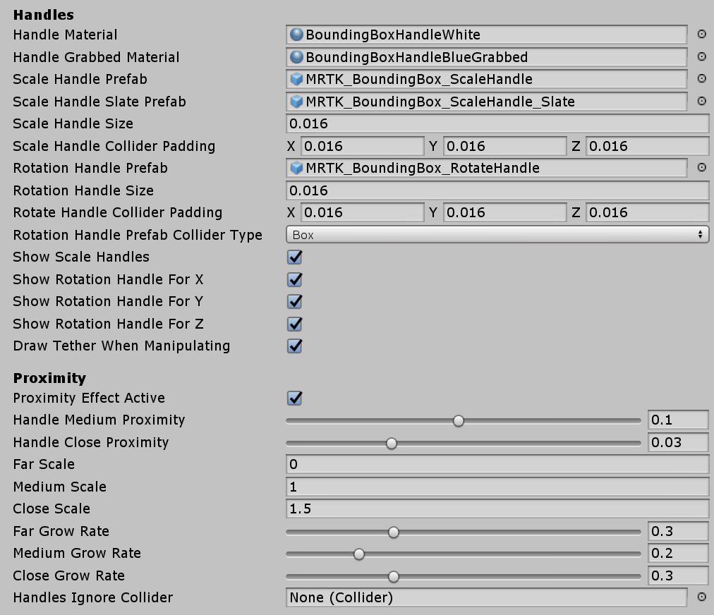
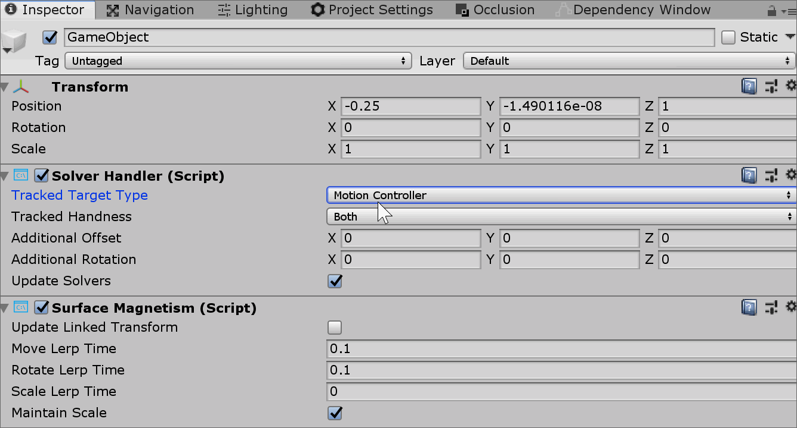

# Microsoft Mixed Reality Toolkit Release Notes

- [Version 2.0.0](#version-200)

## Version 2.0.0

- [Upgrading projects](#upgrading-projects-to-200)
- [What's new](#whats-new-in-200)
- [Known issues](#known-issues-in-200)

This release of the Microsoft Mixed Reality Toolkit supports the following devices and platforms.

- Microsoft HoloLens 2
- Microsoft HoloLens (1st gen)
- Windows Mixed Reality Immersive headsets
- OpenVR

The following software is required.

- Microsoft Visual Studio (2017 or 2019) Community Edition or higher
- Windows 10 SDK 18362 or later (installed by the Visual Studio Installer)
- Unity 2018.4, 2019.1 or 2019.2

### Upgrading projects to 2.0.0

Since the RC2 release, there have been several changes that may impact application projects,
including some files moving to new folder locations. Breaking change details, including mitigation guidance, can be found in the [**Updating from RC2**](Updating.md) article.

For the smoothest upgrade path, please use the following steps.

1. Close Unity
1. Delete **MixedRealityToolkit** (the project may not have all listed folders)
    - MixedRealityToolkit
    - MixedRealityToolkit.Examples
    - MixedRealityToolkit.Extensions
    > [!Note]
    > If additional extensions have been installed, please make a backup prior to deleting this folder.
    - MixedRealityToolkit.Providers
    - MixedRealityToolkit.SDK
    - MixedRealityToolkit.Services
    - MixedRealityToolkit.Tools
    > [!Important]
    > Do NOT delete the **MixedRealityToolkit.Generated** folder.
1. Delete the **Library** folder
1. Re-open the project in Unity
1. Import the new unity packages
    - Foundation - _Import this package first_
    - (Optional) Tools
    - (Optional) Extensions
    > [!Note]
    > If additional extensions had been installed, they may need to be re-imported.
    - (Optional) Examples
1. For each scene in the project
    - Delete **MixedRealityToolkit** and **MixedRealityPlayspace**, if present, from the hierarchy
    - Select **MixedRealityToolkit -> Add to Scene and Configure**

> [!Important]
> Some profiles have been changed (properties have been added) in this release. If the project has custom
profiles, please open them to verify that all of the updated properties are correctly configured.

### What's new in 2.0.0

**BoundingBox**

- Improvements
    - Normalized the handle asset size and scaling logic
    - The handle asset is now sized to 1-meter
    - Default values and examples are updated
- New features
    - Animated handle by proximity
    - Match the HoloLens 2 shell behavior
    - Handles can be configured to appear only when a hand is close to them
- New example scene
    - The BoundingBoxExample scene, in the Examples package (Demos\UX\BoundingBox\Scenes\BoundingBoxExamples.unity), shows various types of configurations

> [!Important] 
> Normalized asset handle size and scaling logic require updated handle scale values. With this change, the existing bounding box
handle will be displayed in a very large size. Please refer to the **Bounding box handle styles** section in the [Bounding Box](README_BoundingBox.md)
documentation for updated recommended values for the handle size. Handle configuration examples can be found in the **BoundingBoxExamples** scene.

**Clipping Example**

The ClippingExamples scene, in the Examples package (Demos\StandardShader\Scenes\ClippingExamples.unity), demonstrates using the MRTK
Standard Shader’s new clipping feature.

**CoreServices**

The [CoreServices](xref:Microsoft.MixedReality.Toolkit.CoreServices) static class works in conjunction with the
MixedRealityServiceRegistry to provide applications with a fast and convenient mechanism to acquire instances of core
services (ex: Input System).

**Default HoloLens (1st gen) profile**

We have added a new profile for HoloLens (1st gen) development that includes some of the
recommended MRTK configurations for best performance.

To configure the application for HoloLens (1st gen) optimized settings, set the
Mixed Reality Toolkit's **Active Profile** to **DefaultHoloLens1ConfigurationProfile**.

**Dependency window**

A [dependency window](Tools/DependencyWindow.md) has been added which displays how assets reference and depend on each other.
This tool can be used to easily determine which assets within a project are not being used.

**Example: Launch applications from within a Unity app**

See the HandInteractionExamples scene, in the Examples package (Demos\HandInteraction\Scenes\HandInteractionDemos.unity), for a
demonstration of using the LaunchUri script to start an external application.

**Extension Service Creation Wizard**

Making the transition from singletons to services can be difficult. The [Extension Service Creation Wizard](Tools/ExtensionServiceCreationWizard.md)
supplements documentation and sample code by enabling devs to create new services easily

**Fingertip Cursor**

The fingertip cursor has been updated to better match the HoloLens 2 shell.

**Hand Menu Graduated from Experimental**

The [HandConstraint](xref:Microsoft.MixedReality.Toolkit.Utilities.Solvers.HandConstraint) and [HandConstraintPalmUp](xref:Microsoft.MixedReality.Toolkit.Utilities.Solvers.HandConstraintPalmUp)
solvers are now an official feature (no longer experimental) and have improved documentation.

The HandConstraintPalmUp solver now has a toggle to enforce the hand’s fingers are coplanar before activating.

**HoloLens 2 Button**

- Improved many visual details to match the HoloLens 2 shell including
    - Compressing visuals
    - Far interaction support
    - Focus highlight
    - Shader effects
- HoloLens 2 style Round Button has been added

**HoloLens 2 Shell Parity**

This release updates the MRTK to better mirror the featires. behaviors and visuals of the HoloLens 2 shell experience. This [GitHub](https://github.com/microsoft/MixedRealityToolkit-Unity/issues/4200) issue describes the changes.

**IMixedRealityRaycastProvider**

The input system was updated to allow for raycast customization, via custom implementations of [`IMixedRealityRaycastProvider`](xref:Microsoft.MixedReality.Toolkit.Input.IMixedRealityRaycastProvider).

Specify the desired raycast provider in the Input System's configuration profile. 

**Improved solvers**

Solvers can now be controlled by the first available hand/controller instead of being locked to left or right handedness. Old value types of *Tracked Target Type* need to be updated to the new non-obsolete values.

Please review the **solvers** section of [Updating from RC2 to 2.0.0](Updating.md#solvers) for additional changes and mitigation details.

**Input animation recording**
 
MRTK features a [recording system](InputSimulation/InputAnimationRecording.md) by which head movement and hand tracking
data can be stored in animation files. The recorded data can then be played back using the [input simulation system](InputSimulation/InputSimulationService.md).

**MRTK Standard Shader**

The [MRTK Standard Shader](README_MRTKStandardShader.md) now supports Unity's Lightweight Scriptable render pipeline.

Additional improvments
- A warning and "Fix Now" button is now displayed on materials which are in a project that has depth buffer
sharing enabled and do not write depth
- Proximity lights now have per material color overrides and a "Subtractive Light" option to mimic proximity
shadows
- Clipping primitives can now be toggled on/off at runtime without requiring shader permutations to be known
at (player) build time
- Additive and transparent materials are now clipped correctly. A new property for non-opaque or cutout materials
called “Blended Clipping Width” allows developers to set the width of the clip blend region
- Lighting of back face triangles is now correct

**Optimize Window**

The MRTK [Optimize Window](Tools/OptimizeWindow.md) is a utility to help automate and inform in the process of
configuring a mixed reality project for best performance in Unity.

**Radial Solver**

There have been improvements on vertical positioning. Check ‘Use Fixed Vertical Position’ to lock the vertical movement
to achieve shell-style tag-along behavior. An example of lazy-following tag-along behavior can be seen in the
‘ToggleFeaturesPanel’ prefab (SDK\Features\UX\Prefabs\ToggleFeaturesPanel.prefab).

**SceneSystem**

The [Scene System](SceneSystem/SceneSystemGettingStarted.md) has been added to help with
applications that contain more than once scene.

**Service managers (experimental)**

This release adds service managers to enable the light-weight addition of specific Microsoft 
Mixed Reality Toolkit features, such as the Spatial Awareness system, individually.

These service managers are imported as part of the Foundation package and are located in the
MixedRealityToolkit.SDK\Experimental\Features folder and are a work in progress.

Service manager prefabs are provided for the following services.

- BoundarySystem
- CameraSystem
- DiagnosticsSystem
- InputSystem
- SpatialAwarenessSystem
- TeleportSystem (requires the Input System)

To use, drag and drop the desired prefab into the heirarchy and select the configuration
profile. 

> [!Note]
> These service managers are currently experimental, may have issues and
are subject to change. Please file any and all issues that are encountered on GitHub

**Slate**

- Improved
    - Usability of slates by adding the shadow based on the finger proximity
    - ‘Follow Me’ behavior to match the HoloLens 2 shell behavior, using Radial Solver.
- Fixed
    - Border thickness issue fixed on flattend Bounding Box

**SpatialObjectMeshObserver**

We have added the SpatialObjectMeshObserver to improve developer productivity when working
with the Spatial Awareness system. This observer reads mesh data from imported 3D models
and uses them to simulate environmental data from devices such as Microsoft HoloLens 2.

SpatialObjectMeshObserver is not enabled in the default profiles, please see the
[Spatial Awareness Getting Started](SpatialAwareness/SpatialAwarenessGettingStarted.md) article
for more information on how to use this feature. 

**Take Screenshot**

A Take Screenshot utility menu item (Mixed Reality Toolkit > Utilities > Take Screenshot) has been added
to capture high resolution screenshots within the editor. Screenshots can be captured with a transparent
clear color for use in easy post compositing of images for documentation or media.

**UX controls**

The following UX controls in the following list can now be instantiated and configured from code.

- BoundingBox
- ManipulationHandler
- HandInteractionPanZoom
- Interactable (basic features)

**Updated architecture documentation**

The [archtecture documentation](Architecture/Overview.md) is all new for this version.

### Known issues in 2.0.0

The sections below highlight some of the known issues in the Microsoft Mixed Reality Toolkit.

**Extension service wizard**

When using the extension service wizard,  *Generate Inspector* and/or *Generate Profile* are not actually optional. Trying to create an extension service with either of these deselected will result in an error on the following page. Furthermore, the extension service created for the user will create a property for the ScriptableObject profile that was not actually created. This results in a compiler error until the property line is removed. 

Current workaround steps:

1. Ignore error message in extension service wizard
1. Open up the *ExtensionService.cs file created and remove reference to the non-existent profile.

Issue [#5654](https://github.com/microsoft/MixedRealityToolkit-Unity/issues/5654) is tracking this problem.

**Long paths**

When building on Windows, there is a MAX_PATH limit of 255 characters. Unity is affected by these limits and may fail to build a binary if its resolved output path is longer than 255 characters.

This can manifest as CS0006 errors in Visual Studio that look like:

> CS0006: Metadata file 'C:\path\to\longer\file\that\is\longer\than\255\characters\mrtk.long.binary.name.dll' could not be found.

This can be worked around by moving the Unity project folder closer to the root of the drive, for example:

> C:\src\project

Please see [this issue](https://github.com/microsoft/MixedRealityToolkit-Unity/issues/5469) for more background information. 

**Runtime profile swapping**

MRTK fully support profile swapping at runtime. This feature is being investigated for a future release. Please see issues [4289](https://github.com/microsoft/MixedRealityToolkit-Unity/issues/4289),
[5465](https://github.com/microsoft/MixedRealityToolkit-Unity/issues/5465) and
[5466](https://github.com/microsoft/MixedRealityToolkit-Unity/issues/5466) for more information.

**Text overflow in the some of the scroll view example when deployed with 16-bit depth buffer**

Examples made with Unity's scroll view show text overflow on the device when it is built with 16-bit depth buffer. (e.g. EyeTrackingDemo-03-Navigation.unity scene) Use 24-bit depth to build these example scenes.

**Unity 2019: Could not copy the file HolographicAppRemoting.dll**

There is a known issue with version 3.0.0 of the Windows Mixed Reality package for Unity 2019. If
the project has this version installed, the following error will be encountered when compiling in Microsoft
Visual Studio.

To work around the issues, please check for a newer version or roll back to version 3.0.2 using Window > Package Manager in the Unity editor.

**VR/Immersive devices: Content in some demo scenes is placed below the user**

Some demo scenes contained in the Examples package are optimized for HoloLens device's (headset's y position is 0). These scenes
may place objects below the user when run on VR/Immersive device's (headset's Y position is the distance from the floor). To work around this issue, select the **Scene Content** object, in the Hierarchy, and set the Transform's Position Y value to **1.5** (1.5 meters, or the preferred headset height).

