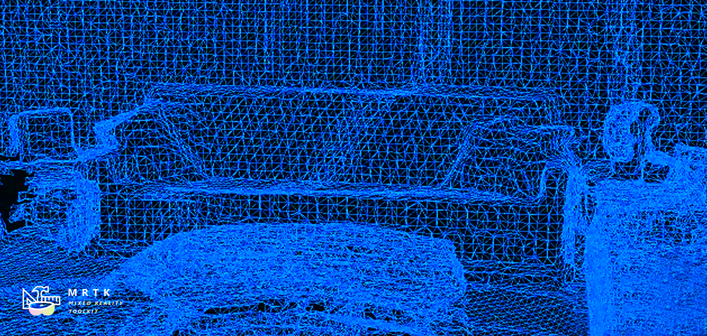
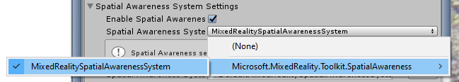
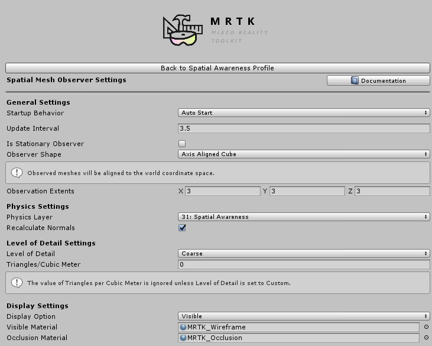

# 空間認識 (Spatial Awareness)

空間認識システムは、複合現実アプリケーションで現実世界の環境認識を提供します。 Microsoft HoloLens で導入されたとき、空間認識は環境のジオメトリを表すメッシュのコレクションを提供し、ホログラムと現実世界の間の魅力的なインタラクションを可能にしました。

## はじめに

空間認識のサポートを追加するには、Mixed Reality Toolkit の 2 つの主要なコンポーネント (空間認識システムとサポートされているプラットフォーム プロバイダー) が必要です。

1. 空間認識システムを[有効](#空間認識-spatial-awareness-を有効にする)にする
2. 1 つ以上の空間オブザーバーを[登録](#オブザーバーの登録)して[設定](#オブザーバーの設定)する
3. 空間認識をサポートするプラットフォームに[ビルドしてデプロイ](#ビルドとデプロイ)する

### 空間認識 (Spatial Awareness) を有効にする

空間認識システムは、MixedRealityToolkit オブジェクト (または別の [サービス レジストラ](xref:Microsoft.MixedReality.Toolkit.IMixedRealityServiceRegistrar) コンポーネント) によって管理されます。以下の手順は、このシステムが既に有効になっている既定のプロファイル (DefaultMixedRealityToolkitConfigurationProfile) のユーザーには必要ありません。次の手順では、MixedRealityToolkit オブジェクトの使用を想定しています。他のサービス レジストラで必要な手順は異なる場合があります。

> [!NOTE]
> 空間認識システムは、既定の HoloLens 2 プロファイル (DefaultHoloLens2ConfigurationProfile) ではデフォルトで無効になっており、その目的は、メッシュの計算とレンダリングの視覚的なオーバーヘッドを回避することです。

1. [Hierarchy] (ヒエラルキー) から MixedRealityToolkit オブジェクトを選択する

2. [Inspector] (インスペクター) の空間認識システム セクションに移動し、*Enable Spatial Awareness System* にチェックを入れる

3. Spatial Awareness System の実装を選択する

### オブザーバーの登録

空間認識システムがアプリケーションに現実世界に関するデータを提供する前に、少なくとも 1 つの空間オブザーバーを登録する必要があります。空間オブザーバーは、一般にプラットフォーム固有のコンポーネントで、提供されるデータの種類 (例: メッシュ) が異なる可能性があります。

1. Spatial Awareness System プロファイルを開く

2. "Add Spatial Observer" をクリックする
3. Spatial Observer の実装を選択する

> [!NOTE]
> 既定のプロファイル (DefaultMixedRealitSpatialAwarenessSystemProfile) のユーザーは、Mixed Reality Toolkit Windows Mixed Reality Provider パッケージの [WindowsMixedRealitySpatialMeshObserver](xref:Microsoft.MixedReality.Toolkit.WindowsMixedReality.SpatialAwareness.WindowsMixedRealitySpatialMeshObserver) を使用するように事前設定された空間認識システムを使用できます。

#### オブザーバーの設定

空間オブザーバーがシステムに登録されると、目的のデータを提供するように構成されます。空間オブザーバーを構成する場合、多くの実装では、オブザーバーの構成プロファイルに共通の既定値を自動設定します。

1. Spatial Observer プロファイルを開く

2. 必要なオプションを設定する

前の手順の図は、空間メッシュ オブザーバーの構成プロファイルを示しています。メッシュ オブザーバーが使用できる特定の設定に関する詳細については、[Configuring the Spatial Awareness Mesh Observer](ConfiguringSpatialAwarenessMeshObserver.md) を参照してください。他のオブザーバーも同様の設定を持つ可能性があります。

### ビルドとデプロイ

空間認識システムを目的のオブザーバーで構成すると、プロジェクトをビルドしてターゲット プラットフォームにデプロイできます。

> [!WARNING]
> Microsoft HoloLens を含む一部のプラットフォームでは、Unity 内からリモート実行をサポートしています。この機能により、ビルドとデプロイの手順を必要とせずに、迅速な開発とテストが可能になります。ターゲット ハードウェアとプラットフォームで実行される、ビルドおよびデプロイされたバージョンのアプリケーションを使用して、最終的な受け入れテストを行うようにしてください。

## 以下参照

- [Spatial Awareness API documentation](xref:Microsoft.MixedReality.Toolkit.SpatialAwareness)
- [Configuring the Spatial Awareness Mesh Observer](ConfiguringSpatialAwarenessMeshObserver.md)
- [Spatial Object Mesh Observer](SpatialObjectMeshObserver.md)