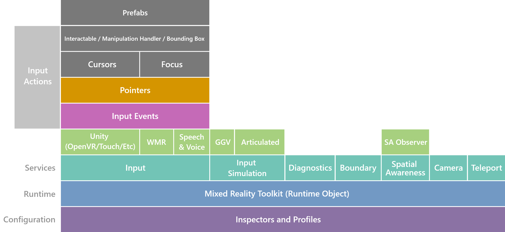

# Architecture overview

For an overall introduction to the contents of MRTK, the architecture information contained in this document will help you understand the following:

- Large pieces of MRTK and how they connect
- Concepts that MRTK introduces which may not exist in vanilla Unity
- How some of the larger systems (such as Input) work

This section isn't intended to teach you how to do tasks, but rather how such tasks are structured and why.

## Many audiences, one toolkit

MRTK doesn't have a single, uniform audience. It's been written to support use cases
ranging from first time hackathons, to individuals building complex, shared experiences
for enterprise. Some code and APIs may have been written that are optimized for one more
than the other (i.e. some parts of the MRTK seem more optimized for "one click configure"),
but it's important to note that some of those are more for historical and resourcing
reasons. As MRTK evolves, the features that get built should be designed to scale to
support the range of use cases.

MRTK also has requirements to gracefully scale across VR and AR experiences. It should be easy to build applications that gracefully
fallback in behavior when deployed on a HoloLens 2 OR a HoloLens 1, and it should be
simple to build applications that target OpenVR and WMR (and other platforms). While at
times the team may focus a particular iteration on a specific system or platform, the
long term goal is to build a wide range of support for wherever people are building
mixed reality experiences.

## High level breakdown

The MRTK is both a collection of tools for getting mixed reality (MR) experiences off
the ground quickly, and also an application framework with opinions on its own runtime,
how it should be extended, and how it should be configured.

At a high level, the MRTK can be broken down in the following ways:

The MRTK also contains another set of grab-bag utilities that have little to no
dependencies on the rest of the MRTK (to list a few: build tools, solvers, audio
influencers, smoothing utilities, and line renderers)

The remainder of the architecture documentation will build bottom up, starting from the framework
and runtime, progressing to more interesting and complex systems, such as input. Please see the
table of contents to continue with the architectural overview.
