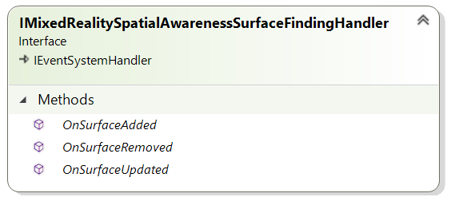

# IMixedRealitySpatialAwarenessSurfaceFindingHandler Interface

| Toolkit Layer | Namespace |
| --- | --- |
| Core | Microsoft.MixedReality.Toolkit.Core.Interfaces.SpatialAwarenessSystem.Handlers |

## OnSurfaceAdded([MixedRealitySpatialSurfaceEventData](./MixedRealitySpatialSurfaceEventData.md) eventData)

Called when a new planar surface has been identified by the spatial awareness system.

## OnSurfaceUpdated([MixedRealitySpatialSurfaceEventData](./MixedRealitySpatialSurfaceEventData.md) eventData)

Called when an existing planar surface has been modified by the spatial awareness system.

## OnSurfaceDeleted([MixedRealitySpatialSurfaceEventData](./MixedRealitySpatialSurfaceEventData.md) eventDatawhat do )

Called when an existing planar surface has been discarded by the spatial awareness system.

## See Also

- [Mixed Reality Spatial Awareness System Architecture](./SpatialAwarenessSystemArchitecture.md)
- [MixedRealitySpatialAwarenessSurfaceFindingHandler Class](./MixedRealitySpatialAwarenessSurfaceFindingHandler.md)
