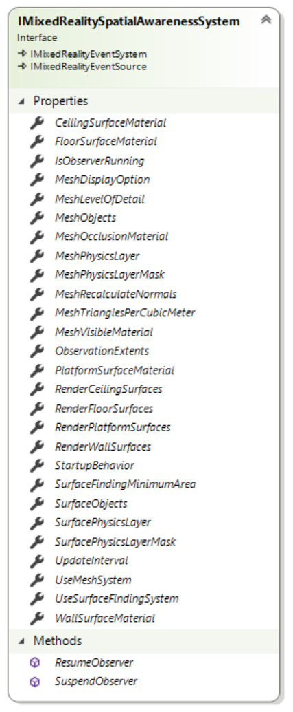

# IMixedRealitySpatialAwarenessSystem Interface

| Toolkit Layer | Namespace |
| --- | --- |
| Core | Microsoft.MixedReality.Toolkit.Core.Interfaces.SpatialAwarenessSystem |

The IMixedRealitySpatialAwarenessSystem is the interface that defines the requirements of the spatial awareness system. The interface is divided, logically into multiple sections. As new functionality is added, the appropriate settings section is to be defined.

## General System Controls

The spatial awareness system contains data and methods that configure and control the overall spatial awareness system.

### StartupBehavior

| Type |
| --- |
| AutoStartBehavior |

Gets or sets a value that indicates that the developer intends for the spatial observer to start automatically or wait until explicitly resumed. This allows the application to decide precisely when it wishes to begin receiving spatial data notifications.

### ObservationExtents

| Type |
| --- |
| Vector3 |

Gets or sets the size of the volume from which individual observations will be made. This is not the total size of the observable space.

### UpdateInterval

| Type |
| --- |
| float |

Gets or sets the frequency, in seconds, at which the spatial observer updates.

### IsObserverRunning

| Type |
| --- |
| bool |

Indicates the current running state of the spatial observer. 

*This is a read-only property, set by the spatial awareness system.*

### void ResumeObserver()

Starts / restarts the spatial observer. This will cause spatial observation events (ex: MeshAddedEvent) to resume being sent.

### void SuspendObserver()

Stops / pauses the spatial observer. This will cause spatial observation events to be suspended until ResumeObserver is called.

## Mesh Handling Controls

The mesh handling section contains the data and methods that configure and control the representation of data as a collection of meshes.

For platforms that do not natively support returning observation data as a mesh, implementations can optionally process the native data before providing it to the caller.

### Use Mesh System

| Type |
| --- |
| bool |

Gets or sets a value that indicates if the spatial mesh subsystem is in use by the application. Turning this off will suspend all mesh events and cause the subsystem to return an empty collection when the GetMeshes method is called.

### MeshPhysicsLayer

| Type |
| --- |
| int |

Get or sets the desired Unity Physics Layer on which to set the spatial mesh.

### MeshPhysicsLayerMask

| Type |
| --- |
| int |

Gets the bit mask that corresponds to the value specified in MeshPhysicsLayer.

*This is a read-only property set by the spatial awareness system.*

### MeshLevelOfDetail

| Type |
| --- |
| [SpatialAwarenessMeshLevelOfDetail](./SpatialAwarenessMeshLevelOfDetail.md) |

Gets or sets the level of detail for the returned spatial mesh. Setting this value to Custom, implies that the developer is specifying a custom value for MeshTrianglesPerCubicMeter.

Specifying any other value will cause MeshTrianglesPerCubicMeter to be overwritten.

### MeshTrianglesPerCubicMeter

| Type |
| --- |
| int |

Gets or sets the level of detail, in triangles per cubic meter, for the returned spatial mesh. 

When specifying Coarse or Fine for the MeshLevelOfDetail, this value will be automatically overwritten.

### MeshRecalculateNormals

| Type |
| --- |
| bool |

Gets or sets the value indicating if the spatial awareness system to generate normal for the returned meshes as some platforms may not support returning normal along with the spatial mesh.

### MeshDisplayOption

| Type |
| --- |
| [SpatialMeshDisplayOptions](./SpatialMeshDisplayOptions.md) |

Gets or sets a value indicating how the mesh subsystem is to display surface meshes within the application.

Applications that wish to process the Meshes should set this value to None.

### MeshVisibleMaterial

| Type |
| --- |
| Material |

Gets or sets the material to be used when displaying spatial meshes.

### MeshOcclusionMaterial

| Type |
| --- |
| Material |

Gets or sets the material to be used when spatial meshes should occlude other object.

### IDictionary<uint, GameObject> GetMeshes()

Returns the collection of GameObjects being managed by the spatial awareness mesh subsystem.

## Surface Finding Controls

The surface finding section contains the data and methods that configure and control the representation of data as a collection of planar surfaces.

### UseSurfaceFindingSystem

| Type |
| --- |
| bool |

Indicates if the surface finding subsystem is in use by the application. Turning this off will suspend all surface events.

### SurfacePhysicsLayer

| Type |
| --- |
| int |

Get or sets the desired Unity Physics Layer on which to set spatial surfaces.

### SurfacePhysicsLayerMask

| Type |
| --- |
| int |

Gets the bit mask that corresponds to the value specified in SurfacePhysicsLayer. 

*This is a read-only property set by the spatial awareness system.*

### SurfaceFindingMinimumArea

| Type |
| --- |
| float |

Gets or sets the minimum surface area, in square meters, that must be satisfied before a surface is identified.

### DisplayFloorSurfaces

| Type |
| --- |
| bool |

Gets or sets a value indicating if the surface subsystem is to automatically display floor surfaces within the application. When enabled, the surfaces will be added to the scene and displayed using the configured FloorSurfaceMaterial.

### FloorSurfaceMaterial

| Type |
| --- |
| Material |

Gets or sets the material to be used when displaying planar surface(s) identified as a floor.

### DisplayCeilingSurfaces

| Type |
| --- |
| bool |

Gets or sets a value indicating if the surface subsystem is to automatically display ceiling surfaces within the application. When enabled, the surfaces will be added to the scene and displayed using the configured CeilingSurfaceMaterial.

### CeilingSurfaceMaterial

| Type |
| --- |
| Material |

Gets or sets the material to be used when displaying planar surface(s) identified as a ceiling.

### DisplayWallSurfaces

| Type |
| --- |
| bool |

Gets or sets a value indicating if the surface subsystem is to automatically display wall surfaces within the application. When enabled, the surfaces will be added to the scene and displayed using the configured WallSurfaceMaterial.

### WallSurfaceMaterial

| Type |
| --- |
| Material |

Gets or sets the material to be used when displaying planar surface(s) identified as a wall.

### DisplayPlatformSurfaces

| Type |
| --- |
| bool |

Gets or sets a value indicating if the surface subsystem is to automatically display raised horizontal platform surfaces within the application. When enabled, the surfaces will be added to the scene and displayed using the configured PlatformSurfaceMaterial.

### PlatformSurfaceMaterial

| Type |
| --- |
| Material |

Gets or sets the material to be used when displaying planar surface(s) identified as a raised horizontal platform.

### IDictionary<int, GameObject> GetSurfaceObjects()

Returns the collection of GameObjects managed by the surface finding subsystem.

## See Also

- [Mixed Reality Spatial Awareness System Architecture](./SpatialAwarenessSystemArchitecture.md)
- [MixedRealitySpatialAwarenessSystem Class](./MixedRealitySpatialAwarenessSystem.md)
- [IMixedRealitySpatialAwarenessMeshDescription Interface](./IMixedRealitySpatialAwarenessMeshDescription.md)
- [IMixedRealitySpatialAwarenessPlanarSurfaceDescription Interface](./IMixedRealitySpatialAwarenessPlanarSurfaceDescription.md)
- [SpatialAwarenessMeshDisplayOptions Enumeration](./SpatialAwarenessMeshDisplayOptions.md)
- [SpatialAwarenessMeshLevelOfDetail Enumeration](./SpatialAwarenessMeshLevelOfDetail.md)
