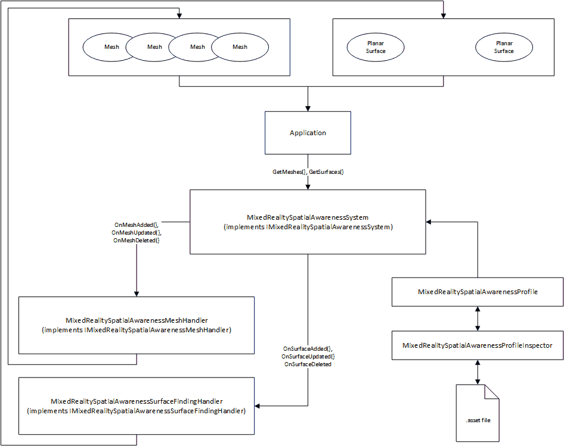

# Mixed Reality Toolkit Spatial Awareness System Architecture

The Mixed Reality Spatial Awareness System is intended to abstract the specific implementation details of platforms, such as the Microsoft HoloLens, that provide support for mapping the real-world and providing the data to Mixed Reality experiences.

Where possible, we are designing for common functionality (ex: identification of planar surfaces) well as access to the lowest level of available data (ex: mesh or point data).

It is expected that many platforms may not support one or more of the interfaces defined herein. In fact, some may not support spatial awareness at all. On those platforms, the system must gracefully fail and provide the developer with appropriate data (null, empty collections, etc.) in return.

Each interface defined will implement one or more Properties, Methods and/or Events (PMEs) that can be accessed by application code.

## Interfaces

- [IMixedRealitySpatialAwarenessSystem](./IMixedRealitySpatialAwarenessSystem.md)
- [IMixedRealitySpatialAwarenessMeshHandler](./IMixedRealitySpatialAwarenessMeshHandler.md)
- [IMixedRealitySpatialAwarenessSurfaceFindingHandler](./IMixedRealitySpatialAwarenessSurfaceFindingHandler.md)
- [IMixedRealitySpatialObserver](./IMixedRealitySpatialObserver.md)

## Classes

- [MixedRealitySpatialAwarenessSystem](./MixedRealitySpatialAwarenessSystem.md)
- [MixedRealitySpatialAwarenessMeshHandler](./MixedRealitySpatialAwarenessMeshHandler.md)
- [MixedRealitySpatialAwarenessSurfaceFindingHandler](./MixedRealitySpatialAwarenessSurfaceFindingHandler.md)

## Enumerations

- [SpatialAwarenessMeshDisplayOptions](./SpatialAwarenessMeshDisplayOptions.md)
- [SpatialAwarenessMeshLevelOfDetail](./SpatialAwarenessMeshLevelOfDetail.md)
- [SpatialAwarenessSurfaceTypes](./SpatialAwarenessSurfaceTypes.md)

## Event Data Types

- [MixedRealitySpatialAwarenessEventData](./MixedRealitySpatialAwarenessEventData.md)

## Configuration Profile

- [MixedRealitySpatialAwarenessProfile](./MixedRealitySpatialAwarenessProfile.md)
- [MixedRealitySpatialAwarenessProfileInspector](./MixedRealitySpatialAwarenessProfileInspector/md)
 
## Example Implementation

The Mixed Reality Toolkit's default implementation of the spatial awareness system can be found in the Assets/MixedRealityToolkit/SDK/Features/SpatialAwarenessSystem folder. This implementation can be used as an example of how to build your own spatial awareness system. It is well documented and demonstrates each of the features described in this architecture specification.
