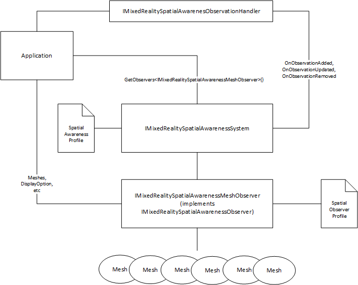

# Mixed Reality Toolkit Spatial Awareness System Architecture

The Mixed Reality Spatial Awareness System is intended to abstract the specific implementation details of platforms, such as the Microsoft HoloLens, that provide support for mapping the real-world and providing the data to Mixed Reality experiences.

It is expected that many platforms may not support support one or more spatial awareness features. On those platforms, the system must gracefully fail and provide the developer with appropriate data (null, empty collections, etc.) in return.

Each interface defined will implement one or more Properties, Methods and/or Events (PMEs) that can be accessed by application code.

## System

- [IMixedRealitySpatialAwarenessSystem](xref:Microsoft.MixedReality.Toolkit.SpatialAwareness.IMixedRealitySpatialAwarenessSystem)

## Observers

- [IMixedRealitySpatialAwarenessObserver](xref:Microsoft.MixedReality.Toolkit.SpatialAwareness.IMixedRealitySpatialAwarenessObserver)
- [IMixedRealitySpatialAwarenessMeshObserver](xref:Microsoft.MixedReality.Toolkit.SpatialAwareness.IMixedRealitySpatialAwarenessMeshObserver)
- [BaseSpatialObserver](xref:Microsoft.MixedReality.Toolkit.SpatialAwareness.BaseSpatialObserver)

## Objects

- [IMixedRealitySpatialAwarenessObject](xref:Microsoft.MixedReality.Toolkit.SpatialAwareness.IMixedRealitySpatialAwarenessObject)
- [BaseSpatialAwarenessObject](xref:Microsoft.MixedReality.Toolkit.SpatialAwareness.BaseSpatialAwarenessObject)
- [SpatialAwarenessMeshObject](xref:Microsoft.MixedReality.Toolkit.SpatialAwareness.SpatialAwarenessMeshObject)
- [SpatialAwarenessPlanarObject](xref:Microsoft.MixedReality.Toolkit.SpatialAwareness.SpatialAwarenessPlanarObject)

## Enumerations

- [SpatialAwarenessMeshDisplayOptions](xref:Microsoft.MixedReality.Toolkit.SpatialAwareness.SpatialAwarenessMeshDisplayOptions)
- [SpatialAwarenessMeshLevelOfDetail](xref:Microsoft.MixedReality.Toolkit.SpatialAwareness.SpatialAwarenessMeshLevelOfDetail)
- [SpatialAwarenessSurfaceTypes](xref:Microsoft.MixedReality.Toolkit.SpatialAwareness.SpatialAwarenessSurfaceTypes)

## Events and Event Data

- [IMixedRealitySpatialAwarenessObservationHandler<T>](xref:Microsoft.MixedReality.Toolkit.SpatialAwareness.IMixedRealitySpatialAwarenessObservationHandler`1)
- [MixedRealitySpatialAwarenessEventData](xref:Microsoft.MixedReality.Toolkit.SpatialAwareness.MixedRealitySpatialAwarenessEventData)
- [MixedRealitySpatialAwarenessEventData<T>](xref:Microsoft.MixedReality.Toolkit.SpatialAwareness.MixedRealitySpatialAwarenessEventData`1)

## Profiles

- [MixedRealitySpatialAwarenessSystemProfile](xref:Microsoft.MixedReality.Toolkit.SpatialAwareness.MixedRealitySpatialAwarenessSystemProfile)
- [BaseSpatialAwarenessObserverProfile](xref:Microsoft.MixedReality.Toolkit.SpatialAwareness.BaseSpatialAwarenessObserverProfile)
- [MixedRealitySpatialAwarenessMeshObserverProfile](xref:Microsoft.MixedReality.Toolkit.SpatialAwareness.MixedRealitySpatialAwarenessMeshObserverProfile)

## Example Implementation

### Service

The default spatial awareness system is a good example for developers looking to create their own implementation or to learn more about how the system works. It is provided as part of the Mixed Reality Toolkit Spatial Awareness service package. 

The latest released code is available on [GitHub](https://github.com/Microsoft/MixedRealityToolkit-Unity/blob/mrtk_release/Assets/MixedRealityToolkit.Services/SpatialAwarenessSystem/MixedRealitySpatialAwarenessSystem.cs).

#### Class Documentation

- [MixedRealitySpatialAwarenessSystem](xref:Microsoft.MixedReality.Toolkit.SpatialAwareness.MixedRealitySpatialAwarenessSystem)

### Mesh Observer

The Windows Mixed Reality Spatial Mesh Observer is a great example of a spatial  observer and is included as part of the Mixed Reality Toolkit Windows Mixed Reality provider package. 

The latest released code is available on [GitHub](https://github.com/Microsoft/MixedRealityToolkit-Unity/tree/mrtk_release/Assets/MixedRealityToolkit.Providers/WindowsMixedReality).

#### Class Documentation

- [WindowsMixedRealitySpatialMeshObserver](xref:Microsoft.MixedReality.Toolkit.WindowsMixedReality.SpatialAwareness.WindowsMixedRealitySpatialMeshObserver)
