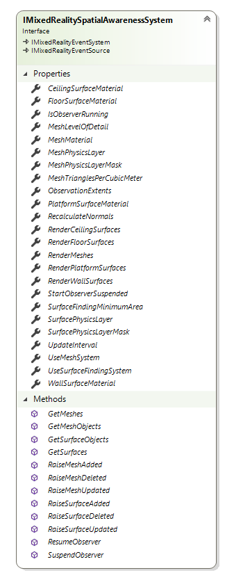
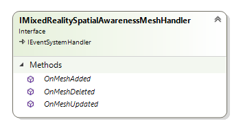
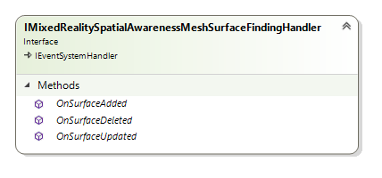
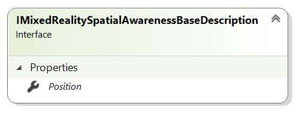
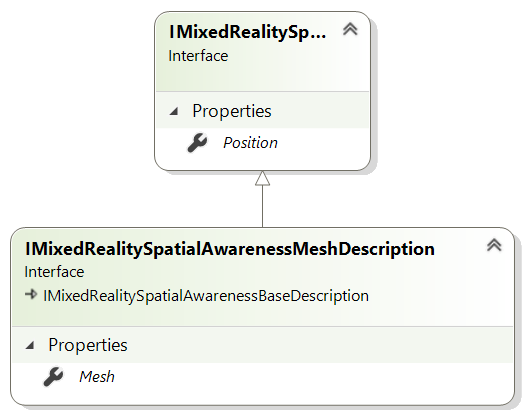
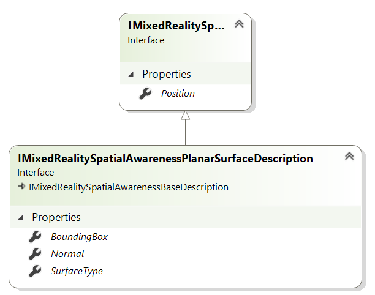
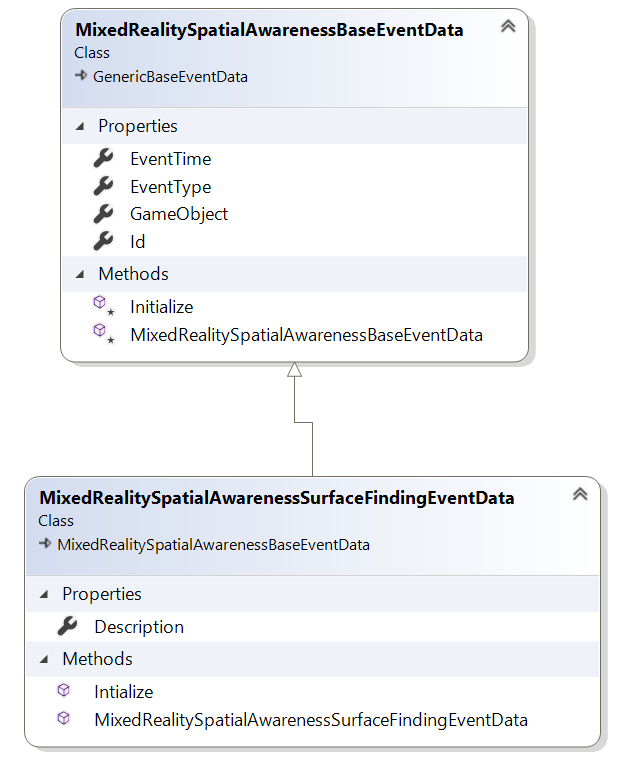

# Mixed Reality Toolkit Spatial Awareness System Architecture

The Mixed Reality Spatial Awareness System is intended to abstract the specific implementation details of platforms, such as the Microsoft HoloLens, that provide support for mapping the real-world and providing the data to Mixed Reality experiences.

As of this writing, the Mixed Reality Toolkit will provide support for Spatial Awareness on the Microsoft HoloLens. As additional platforms are supported, such as ARKit and ARCore, this support will be expanded to encompass any features and/or limitations of those systems.

Where possible, we are designing for common functionality (ex: identification of planar surfaces) well as access to the lowest level of available data (ex: mesh or point data).

It is expected that many platforms may not support one or more of the interfaces defined herein. In fact, some may not support spatial awareness at all. On those platforms, the system must gracefully fail and provide the developer with appropriate data (null, empty collections, etc.) in return.

Each interface defined will implement one or more Properties, Methods and/or Events (PMEs) that can be accessed by application code.


## Interfaces

## IMixedRealitySpatialAwarenessSystem

| Toolkit Layer | Namespace |
| --- | --- |
| Core | Microsoft.MixedReality.Toolkit.Core.Interfaces.SpatialAwarenessSystem |

The IMixedRealitySpatialAwarenessSystem is the interface that defines the requirements of the spatial awareness system. The interface is divided, logically into multiple sections. As new functionality is added, the appropriate settings section is to be defined.



### General System Controls

The spatial awareness system contains data and methods that configure and control the overall spatial awareness system.

#### StartObserverSuspended

Gets or sets a value that indicates that the developer intends for the spatial observer to not return data until explicitly resumed. This allows the application to decide precisely when it wishes to begin receiving spatial data notifications.

#### ObservationExtents

Gets or sets the size of the volume from which individual observations will be made. This is not the total size of the observable space.

#### UpdateInterval

Gets or sets the frequency, in seconds, at which the spatial observer updates.

#### IsObserverRunning

Indicates the current running state of the spatial observer. 

*This is a read-only property, set by the spatial awareness system.*

#### void ResumeObserver()

Starts / restarts the spatial observer. This will cause spatial observation events (ex: MeshAddedEvent) to resume being sent.

#### void SuspendObserver()

Stops / pauses the spatial observer. This will cause spatial observation events to be suspended until ResumeObserver is called.

### Mesh Handling Controls

The mesh handling section contains the data and methods that configure and control the representation of data as a collection of meshes.

For platforms that do not natively support returning observation data as a mesh, implementations can optionally process the native data before providing it to the caller.

#### Use Mesh System

Gets or sets a value that indicates if the spatial mesh subsystem is in use by the application. Turning this off will suspend all mesh events and cause the subsystem to return an empty collection when the GetMeshes method is called.

#### MeshPhysicsLayer

Get or sets the desired Unity Physics Layer on which to set the spatial mesh.

#### MeshPhysicsLayerMask

Gets the bit mask that corresponds to the value specified in MeshPhysicsLayer.

*This is a read-only property set by the spatial awareness system.*

#### MeshLevelOfDetail

Gets or sets the level of detail, as a [MixedRealitySpatialAwarenessMeshLevelOfDetail](#mixedrealityspatialawarenessmeshlevelofdetail) value, for the returned spatial mesh. Setting this value to Custom, implies that the developer is specifying a custom value for TrianglesPerCubicMeter.

Specifying any other value will cause TrianglesPerCubicMeter to be overwritten.

#### TrianglesPerCubicMeter

Gets or sets the level of detail, in triangles per cubic meter, for the returned spatial mesh. 

When specifying Coarse or Fine for the MeshLevelOfDetail, this value will be automatically overwritten.

#### RecalculateNormals

Gets or sets the value indicating if the spatial awareness system to generate normal for the returned meshes as some platforms may not support returning normal along with the spatial mesh. 

#### RenderMeshes

Gets or sets a value indicating if the mesh subsystem is to automatically display surface meshes within the application. When enabled, the meshes will be added to the scene and rendered using the configured MeshMaterial.

Applications that wish to process the Meshes should set this value to false.

#### MeshMaterial

Gets or sets the material to be used when rendering spatial meshes.

#### void RaiseMeshAdded(uint meshId, Vector3 position, Mesh meshData, GameObject meshObject)

The spatial awareness system will call the IMixedRealitySpatialAwarenessMeshHandler.OnMeshAdded method to indicate a new mesh has been added.

#### void RaiseMeshUpdated(uint meshId, Vector3 position, Mesh meshData, GameObject meshObject)

The spatial awareness system will call the IMixedRealitySpatialAwarenessMeshHandler.OnMeshUpdated method to indicate an existing mesh has changed.

#### void RaiseMeshRemoved(uint meshId)

The spatial awareness system will call the IMixedRealitySpatialAwarenessMeshHandler.OnMeshRemoved method to indicate an existing mesh has been removed.

#### [MixedRealitySpatialAwarenessMeshDescription](#mixedrealityspatialawarenessmeshdescription)[] GetMeshes()

Returns the collection of Meshes being managed by the spatial awareness mesh subsystem.

#### GameObject[] GetMeshes()

Returns the collection of GameObjects being managed by the spatial awareness mesh subsystem.

### Surface Finding Controls

The surface finding section contains the data and methods that configure and control the representation of data as a collection of planar surfaces.

#### UseSurfaceFindingSystem

Indicates if the surface finding subsystem is in use by the application. Turning this off will suspend all surface events.

#### SurfacePhysicsLayer

Get or sets the desired Unity Physics Layer on which to set spatial surfaces.

#### SurfacePhysicsLayerMask

Gets the bit mask that corresponds to the value specified in SurfacePhysicsLayer. 

*This is a read-only property set by the spatial awareness system.*

#### SurfaceFindingMinimumArea

Gets or sets the minimum surface area, in square meters, that must be satisfied before a surface is identified.

#### RenderFloorSurfaces

Gets or sets a value indicating if the surface subsystem is to automatically display floor surfaces within the application. When enabled, the surfaces will be added to the scene and rendered using the configured FloorSurfaceMaterial.

#### FloorSurfaceMaterial

Gets or sets the material to be used when rendering planar surface(s) identified as a floor.

#### RenderCeilingSurfaces

Gets or sets a value indicating if the surface subsystem is to automatically display ceiling surfaces within the application. When enabled, the surfaces will be added to the scene and rendered using the configured CeilingSurfaceMaterial.

#### CeilingSurfaceMaterial

Gets or sets the material to be used when rendering planar surface(s) identified as a ceiling.

#### RenderWallSurfaces

Gets or sets a value indicating if the surface subsystem is to automatically display wall surfaces within the application. When enabled, the surfaces will be added to the scene and rendered using the configured WallSurfaceMaterial.

#### WallSurfaceMaterial

Gets or sets the material to be used when rendering planar surface(s) identified as a wall.

#### RenderPlatformSurfaces

Gets or sets a value indicating if the surface subsystem is to automatically display raised horizontal platform surfaces within the application. When enabled, the surfaces will be added to the scene and rendered using the configured PlatformSurfaceMaterial.

#### PlatformSurfaceMaterial

Gets or sets the material to be used when rendering planar surface(s) identified as a raised horizontal platform.

#### void RaiseSurfaceAdded(uint surfaceId, Vector3 position, Bounds surfaceData, Vector3 normal, GameObject surfaceObject)

The spatial awareness system will call the IMixedRealitySpatialAwarenessSurfaceFindingHandler.OnSurfaceAdded method to indicate a new planar surface has been added.

#### void RaiseSurfaceUpdated(uint surfaceId, Vector3 position, Bounds surfaceData, Vector3 normal, GameObject surfaceObject)

The spatial awareness system will call the IMixedRealitySpatialAwarenessSurfaceFindingHandler.OnSurfaceUpdated method to indicate an existing planar surface has changed.

#### void RaiseSurfaceRemoved(uint surfaceId)

The spatial awareness system will call the IMixedRealitySpatialAwarenessSurfaceFindingHandler.OnSurfaceRemoved method to indicate an existing planar surface has been removed.

#### [MixedRealitySpatialAwarenessPlanarSurfaceDescription](#mixedrealityspatialawarenessplanarsurfacedescription)[] GetSurfaces()

Returns the collection of surface descriptions being tracked by the surface finding subsystem.

#### GameObject[] GetSurfaceObjects()

Returns the collection of GameObjects managed by the surface finding subsystem.

## IMixedRealitySpatialAwarenessMeshHandler

| Toolkit Layer | Namespace |
| --- | --- |
| Core | Microsoft.MixedReality.Toolkit.Core.Interfaces.SpatialAwarenessSystem.Handlers |



### void OnMeshAdded([MixedRealitySpatialMeshEventData](#mixedrealityspatialawarenessmesheventdata) eventData)

Called when a new surface mesh has been identified by the spatial awareness system.

### void OnMeshUpdated([MixedRealitySpatialMeshEventData](#mixedrealityspatialawarenessmesheventdata) eventData)

Called when an existing surface mesh has been modified by the spatial awareness system.

### OnMeshDeleted([MixedRealitySpatialMeshEventData](#mixedrealityspatialawarenessmesheventdata) eventData)

Called when an existing surface mesh has been discarded by the spatial awareness system.

## IMixedRealitySpatialAwarenessSurfaceFindingHandler

| Toolkit Layer | Namespace |
| --- | --- |
| Core | Microsoft.MixedReality.Toolkit.Core.Interfaces.SpatialAwarenessSystem.Handlers |



### OnSurfaceAdded([MixedRealitySpatialSurfaceEventData](#mixedrealityspatialawarenesssurfaceeventdata))

Called when a new planar surface has been identified by the spatial awareness system.

### OnSurfaceUpdated([MixedRealitySpatialSurfaceEventData](#mixedrealityspatialawarenesssurfaceeventdata))

Called when an existing planar surface has been modified by the spatial awareness system.

### OnSurfaceDeleted([MixedRealitySpatialSurfaceEventData](#mixedrealityspatialawarenesssurfaceeventdata))

Called when an existing planar surface has been discarded by the spatial awareness system.

## IMixedRealitySpatialAwarenessBaseDescription

| Toolkit Layer | Namespace |
| --- | --- |
| Core | Microsoft.MixedReality.Toolkit.Core.Definitions.SpatialAwarenessSystem |

The IMixedRealitySpatialAwarenessBaseDescription interface describes the core data required for an application to understand a object in the environment.



### Position

| Type |
| --- |
| Vector3 |

The position, in the environment, at which the object should be placed.

## IMixedRealitySpatialAwarenessMeshDescription

| Toolkit Layer | Namespace |
| --- | --- |
| Core | Microsoft.MixedReality.Toolkit.Core.Definitions.SpatialAwarenessSystem |

The IMixedRealitySpatialAwarenessMeshDescription interface describes the data required for an application to understand how to construct and place a mesh in the environment.



### Position

*Inherited from [IMixedRealitySpatialAwarenessBaseDescription](#imixedrealityspatialawarenessbasedescription).*

### Mesh

| Type |
| --- |
| Mesh |

The mesh data.

## IMixedRealitySpatialAwarenessPlanarSurfaceDescription

| Toolkit Layer | Namespace |
| --- | --- |
| Core | Microsoft.MixedReality.Toolkit.Core.Definitions.SpatialAwarenessSystem |

The IMixedRealitySpatialAwarenessPlanarSurfaceDescription interface describes the data required for an application to understand how to construct and place a planar surface.



### Position

*Inherited from [IMixedRealitySpatialAwarenessBaseDescription](#imixedrealityspatialawarenessbasedescription).*

### BoundingBox

| Type |
| --- |
| Bounds |

The axis aligned bounding box that contains the surface being described.

### Normal

| Type |
| --- |
| Vector3 |

The normal of the described surface.

### SurfaceType

| Type |
| --- |
| [MixedRealitySpatialAwarenessSurfaceTypes](#mixedrealityspatialawarenesssurfacetypes) |

The semantic (ex: Floor) associated with the surface.

# Classes

## MixedRealitySpatialAwarenessSystem

| Toolkit Layer | Namespace |
| --- | --- |
| SDK - Surface Awareness Package | Microsoft.MixedReality.Toolkit.SDK.SpatialAwarenessSystem |

The MixedRealitySpatialAwarenessSystem class provides the default implementation of the spatial awareness system. Implements the [IMixedRealitySpatialAwarenessSystem](#imixedrealityspatialawarenesssystem) interface.

## MixedRealitySpatialAwarenessMeshHandler

| Toolkit Layer | Namespace |
| --- | --- |
| SDK - Surface Awareness Package | Microsoft.MixedReality.Toolkit.SDK.SpatialAwarenessSystem |

The MixedRealitySpatialAwarenessMeshHandler class provides the default implementation of the [IMixedRealitySpatialAwarenessMeshHandler](#imixedrealityspatialawarenessmeshhandler) interface.

## MixedRealitySpatialAwarenessSurfaceFindingHandler

| Toolkit Layer | Namespace |
| --- | --- |
| SDK - Surface Awareness Package | Microsoft.MixedReality.Toolkit.SDK.SpatialAwarenessSystem |

The MixedRealitySpatialAwarenessSurfaceFindingHandler class provides the default implementation of the [IMixedRealitySpatialAwarenessSurfaceFindingHandler](#imixedrealityspatialawarenesssurfacefindinghandler) interface.

## MixedRealitySpatialAwarenessBaseDescription

| Toolkit Layer | Namespace |
| --- | --- |
| SDK - Surface Awareness Package | Microsoft.MixedReality.Toolkit.SDK.SpatialAwarenessSystem |

The MixedRealitySpatialAwarenessBaseDescription class provides the default implementation of the [IMixedRealitySpatialAwarenessBaseDescription](#imixedrealityspatialawarenessbasedescription) interface.

## MixedRealitySpatialAwarenessMeshDescription

| Toolkit Layer | Namespace |
| --- | --- |
| SDK - Surface Awareness Package | Microsoft.MixedReality.Toolkit.SDK.SpatialAwarenessSystem |

The MixedRealitySpatialAwarenessMeshDescription class provides the default implementation of the [MixedRealitySpatialAwarenessMeshDescription](#imixedrealityspatialawarenessmeshdescription) interface.

## MixedRealitySpatialAwarenessPlanarSurfaceDescription

| Toolkit Layer | Namespace |
| --- | --- |
| SDK - Surface Awareness Package | Microsoft.MixedReality.Toolkit.SDK.SpatialAwarenessSystem |

The MixedRealitySpatialAwarenessPlanarSurfaceDescription class provides the default implementation of the [MixedRealitySpatialAwarenessPlanarSurfaceDescription](#imixedrealityspatialawarenessplanarsurfacedescription) interface.

# System Profile Management Classes and Types

## MixedRealitySpatialAwarenessProfile

| Toolkit Layer | Namespace |
| --- | --- |
| Core | Microsoft.MixedReality.Toolkit.Core.Definitions.SpatialAwarenessSystem |

The MixedRealitySpatialAwarenessProfile derives from Unity’s ScriptableObject and enables the developer to configure the spatial awareness system.

The following settings map one-to-one to properties of the same name defined in the [IMixedRealitySpatialAwarenessSystem](#imixedrealityspatialawarenesssystem) interface.

The data types, default values and the supported range of values, if appropriate, are detailed.

### General Configuration Settings

#### StartObserverSuspended

| Type | Default Value | Range |
| --- | --- | --- |
| Boolean | False | n/a |

#### ObservationExtents

| Type | Default Value | Range |
| --- | --- | --- |
| Vector3 | Vector.one * 10 (10x10x10 meter cube) | TBD |

#### UpdateInterval

| Type | Default Value | Range |
| --- | --- | --- |
| Single | 3.5 (seconds) | 0.0 - 5.0 (seconds) |

Setting 0.0 indicates that the data should be updated at the platform's highest available frequency.

### Mesh Handler Configuration Settings

#### UseMeshSystem

| Type | Default Value | Range |
| --- | --- | --- |
| Boolean | True | n/a |

#### MeshPhysicsLayer

| Type | Default Value | Range |
| --- | --- | --- |
| Int32 | 31 | 0 - 31 |

#### MeshLevelOfDetail

| Type | Default Value | Range |
| --- | --- | --- |
| MixedRealitySpatialAwarenessLevelOfDetail | Coarse | Custom, Coarse, Fine |

#### MeshTrianglesPerCubicMeter

| Type | Default Value | Range |
| --- | --- | --- |
| Int32 | 0 | 0 - Int32.MaxValue |

#### RecalculateNormals

| Type | Default Value | Range |
| --- | --- | --- |
| Boolean | True | n/a |

#### DisplayMeshes

| Type | Default Value | Range |
| --- | --- | --- |
| Boolean | True | n/a |

#### MeshMaterial

| Type | Default Value | Range |
| --- | --- | --- |
| Material | MRTK_Wireframe | n/a |

### Surface Finding Handler Configuration Settings

#### UseSurfaceFindingSystem

| Type | Default Value | Range |
| --- | --- | --- |
| Boolean | False | n/a |

#### SurfaceFindingPhysicsLayer

| Type | Default Value | Range |
| --- | --- | --- |
| Int32 | 31 | 0 - 31 |

#### SurfaceFindingUpdateInterval

| Type | Default Value | Range |
| --- | --- | --- |
| Single | TBD (seconds) | 0.0 - TBD (seconds) |

#### SurfaceFindingMinimumArea

| Type | Default Value | Range |
| --- | --- | --- |
| Single | 0.025 (square meters) | TBD (square meters) |

#### RenderFloorSurfaces

| Type | Default Value | Range |
| --- | --- | --- |
| Boolean | False | n/a |

#### FloorSurfaceMaterial

| Type | Default Value | Range |
| --- | --- | --- |
| Material | TBD | n/a |

#### RenderCeilingSurfaces

| Type | Default Value | Range |
| --- | --- | --- |
| Boolean | False | n/a |

#### CeilingSurfaceMaterial

| Type | Default Value | Range |
| --- | --- | --- |
| Material | TBD | n/a |

#### RenderWallSurfaces

| Type | Default Value | Range |
| --- | --- | --- |
| Boolean | False | n/a |

#### FloorWallMaterial

| Type | Default Value | Range |
| --- | --- | --- |
| Material | TBD | n/a |

#### RenderPlatformSurfaces

| Type | Default Value | Range |
| --- | --- | --- |
| Boolean | False | n/a |

#### FloorPlatformMaterial

| Type | Default Value | Range |
| --- | --- | --- |
| Material | TBD | n/a |

## MixedRealitySpatialAwarenessProfileInspector

| Toolkit Layer | Namespace |
| --- | --- |
| Core | Microsoft.MixedReality.Toolkit.Inspectors.Profiles |

The MixedRealitySpatialAwarenessProfileInspector derives from MixedRealityBaseConfigurationProfileInspector to provide a visual means of modifying the spatial awareness profile using the Unity Inspector.

Each of the properties defined under [MixedRealitySpatialAwarenessProfile](#mixedrealityspatialawarenessprofile) are represented as elements in the user interface and are persisted when the user saves.

## MixedRealitySpatialAwarenessSurfaceTypes

| Toolkit Layer | Namespace |
| --- | --- |
| Core | Microsoft.MixedReality.Toolkit.Core.Defintitions.SpatialAwareness |

``` C#
public enum MixedRealitySpatialAwarenessSurfaceTypes
{
    /// <summary>
    /// An unknown / unsupported type of surface.
    /// </summary>
    Unknown = 0,

    /// <summary>
    /// The environment’s floor.
    /// </summary>
    Floor,

    /// <summary>
    /// The environment’s ceiling.
    /// </summary>
    Ceiling,

    /// <summary>
    /// A wall within the user’s space.
    /// </summary>
    Wall,

    /// <summary>
    /// A raised, horizontal surface such as a shelf.
    /// </summary>
    /// <remarks>
    Platforms, like floors, that can be used for placing objects 
    /// requiring a horizontal surface.
    /// </remarks>
    Platform
}
```

## MixedRealitySpatialAwarenessMeshLevelOfDetail

| Toolkit Layer | Namespace |
| --- | --- |
| Core | Microsoft.MixedReality.Toolkit.Core.Defintitions.SpatialAwareness |

``` C#
public enum MixedRealitySpatialAwarenessMeshLevelOfDetail
{
    /// <summary>
    /// The custom level of detail allows specifying a custom value for
    /// MeshTrianglesPerCubicMeter.
    /// </summary>
    Custom = -1,

   /// <summary>
    /// The coarse level of detail is well suited for identifying large
    /// environmental features, such as floors and walls.
    /// </summary>
    Coarse = 0,

    /// <summary>
    /// The fine level of detail is well suited for using as an occlusion
    /// mesh.
    /// </summary>
    Fine = 2000
}
```

# Event Data Classes and Types

## MixedRealitySpatialAwarenessBaseEventData

| Toolkit Layer | Namespace |
| --- | --- |
| Core | Microsoft.MixedReality.Toolkit.Core.EventDatum.SpatialAwareness |

The MixedRealitySpatialAwarenessBaseEventData provides the data shared by all of the spatial awareness event types.


### EventTime

| Type |
| --- |
| DateTime |

The time at which the event occurred.

### EventType

| Type |
| --- |
| [MixedRealitySpatialAwarenessEventType](#mixedrealityspatialawarenesseventtype) |

The type of event that has occurred.

### Id

| Type |
| --- |
| UInt32 |

An identifier assigned to a specific object in the spatial awareness system.

### GameObject

| Type |
| --- |
| [MixedRealitySpatialAwarenessEventType](#mixedrealityspatialawarenesseventtype) |

Unity GameObject, managed by the spatial awareness system, representing the data in this event.

## MixedRealitySpatialAwarenessMeshEventData

| Toolkit Layer | Namespace |
| --- | --- |
| Core | Microsoft.MixedReality.Toolkit.Core.EventDatum.SpatialAwareness |

The MixedRealitySpatialAwarenessMeshEventData derives from [MixedRealitySpatialAwarenessBaseEventData](#mixedrealityspatialawarenessbaseeventdata) and adds the information required for applications to understand changes that occur in the spatial awareness system’s mesh subsystem.

*Some events may not leverage all properties within this class, in those instances a neutral value will be set.*


### EventTime

*Inherited from [MixedRealitySpatialAwarenessBaseEventData](#mixedrealityspatialawarenessbaseeventdata).*

### EventType

*Inherited from [MixedRealitySpatialAwarenessBaseEventData](#mixedrealityspatialawarenessbaseeventdata).*

### Id

*Inherited from [MixedRealitySpatialAwarenessBaseEventData](#mixedrealityspatialawarenessbaseeventdata).*

### GameObject

*Inherited from [MixedRealitySpatialAwarenessBaseEventData](#mixedrealityspatialawarenessbaseeventdata).*

### Description

| Type |
| --- |
| [MixedRealitySpatialAwarenessMeshDescription](#mixedrealityspatialawarenessmeshdescription) |

For MeshAdded and MeshUpdated events, this will contain the mesh description. For MeshRemoved, the value will be null.

## MixedRealitySpatialSurfaceEventData

| Toolkit Layer | Namespace |
| --- | --- |
| Core | Microsoft.MixedReality.Toolkit.Core.EventDatum.SpatialAwareness |

The MixedRealitySpatialSurfaceEventData derives from [MixedRealitySpatialAwarenessBaseEventData](#mixedrealityspatialawarenessbaseeventdata) and adds the information required for applications to understand changes that occur in the spatial awareness system’s surface finding subsystem. Note: Some events may not leverage all properties within this class, in those instances a neutral value will be set.



### EventTime

*Inherited from [MixedRealitySpatialAwarenessBaseEventData](#mixedrealityspatialawarenessbaseeventdata).*

### EventType

*Inherited from [MixedRealitySpatialAwarenessBaseEventData](#mixedrealityspatialawarenessbaseeventdata).*

### Id

*Inherited from [MixedRealitySpatialAwarenessBaseEventData](#mixedrealityspatialawarenessbaseeventdata).*

### GameObject

*Inherited from [MixedRealitySpatialAwarenessBaseEventData](#mixedrealityspatialawarenessbaseeventdata).*

### Description

| Type |
| --- |
| [MixedRealitySpatialAwarenessPlanarSurfaceDescription](#mixedrealityspatialawarenessplanarsurfacedescription) |

For SurfaceAdded and SurfaceUpdated events, this will contain the description of the planar surface. For SurfaceRemoved, the value will be null.

## MixedRealitySpatialAwarenessEventType

| Toolkit Layer | Namespace |
| --- | --- |
| Core | Microsoft.MixedReality.Toolkit.Core.Definitions.SpatialAwareness |

``` C#
public enum MixedRealitySpatialAwarenessEventType
{
    /// <summary>
    /// A spatial awareness subsystem is reporting that a new spatial element 
    /// has been identified.
    /// </summary>
    Added = 0,

    /// <summary>
    /// A spatial awareness subsystem is reporting that an existing spatial
    /// element has been modified.
    /// </summary>
    Updated,

    /// <summary>
    /// A spatial awareness subsystem is reporting that an existing spatial
    /// element has been discarded.
    /// </summary>
    Deleted
}
```