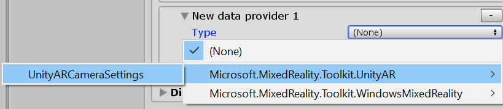

# Creating a camera settings provider

The Camera system is an extensible system for providing support for platform specific camera configurations. To add support for a new camera configuration, a custom settings provider may be required.

> [!NOTE]
> The complete source code used in this example can be found in the **MRTK/Providers/UnityAR** folder.

## Namespace and folder structure

Data providers can be distributed in one of two ways:

1. Third party add-ons
1. Part of the Microsoft Mixed Reality Toolkit

The approval process for submissions of new data providers to the MRTK will vary on a case-by-case basis and will be communicated at the time of the initial proposal. Proposals can be submitted by creating a new [*Feature Request* type issue](https://github.com/microsoft/MixedRealityToolkit-Unity/issues).

### Third party add-ons

**Namespace**

Data providers are required to have a namespace to mitigate potential name collisions. It is recommended that the namespace includes the following components.

- Company name producing the add-on
- Feature area

For example, a camera settings provider created and shipped by the Contoso company may be *"Contoso.MixedReality.Toolkit.Camera"*.

**Folder structure**

It is recommended that the source code for data providers be layed out in a folder hierarchy as shown in the following image.


Where the *ContosoCamera* folder contains the implementation of the data provider, the *Editor* folder contains the inspector (and any other Unity editor specific code), and the *Profiles*
folder contains one or more pre-made profile scriptable objects.

### MRTK submission

**Namespace**

If a camera settings provider is being submitted to the [Mixed Reality Toolkit repository](https://github.com/Microsoft/MixedRealityToolkit-Unity), the namespace **must** begin with
Microsoft.MixedReality.Toolkit (ex: *Microsoft.MixedReality.Toolkit.CameraSystem*).

**Folder structure**

All code must be located in a folder beneath MRTK/Providers (ex: MRTK/Providers/UnityAR).

## Define the camera settings object

The first step in creating a camera settings provider is determining the type of data (ex: meshes or planes) it will provide to applications.

All spatial data objects must implement the [`IMixedRealityCameraSettingsProvider`](xref:Microsoft.MixedReality.Toolkit.CameraSystem.IMixedRealityCameraSettingsProvider)
interface.

## Implement the settings provider

### Specify interface and/or base class inheritance

All camera settings providers must implement the [`IMixedRealityCameraSettingsProvider`](xref:Microsoft.MixedReality.Toolkit.CameraSystem.IMixedRealityCameraSettingsProvider)
interface, which specifies the minimum functionality required by the camera system. The MRTK foundation includes the [`BaseCameraSettingsProvider`](xref:Microsoft.MixedReality.Toolkit.CameraSystem.BaseCameraSettingsProvider)
class which provides a default implementation of the required functionality.

```c#
namespace namespace Microsoft.MixedReality.Toolkit.Experimental.UnityAR
{
    public class UnityARCameraSettings : BaseCameraSettingsProvider
    { }
}
```

#### Apply the MixedRealityDataProvider attribute

A key step in creating a camera settings provider is to apply the [`MixedRealityDataProvider`](xref:Microsoft.MixedReality.Toolkit.MixedRealityDataProviderAttribute)
attribute to the class. This step enables setting the default profile and platform(s) for the data provider, when selected in the Camera System profile as well as name, folder path, and more.

```c#
    [MixedRealityDataProvider(
        typeof(IMixedRealityCameraSystem),
        SupportedPlatforms.Android | SupportedPlatforms.IOS,
        "Unity AR Foundation Camera Settings",
        "UnityAR/Profiles/DefaultUnityARCameraSettingsProfile.asset",
        "MixedRealityToolkit.Providers")]
    public class UnityARCameraSettings : BaseCameraSettingsProvider
    { }
```

### Implement the IMixedRealityDataProvider methods

Once the class has been defined, the next step is to provide the implementation of the [`IMixedRealityDataProvider`](xref:Microsoft.MixedReality.Toolkit.IMixedRealityDataProvider) interface.

> [!NOTE]
> The [`BaseDataProvider`](xref:Microsoft.MixedReality.Toolkit.BaseDataProvider`1) class, via the [`BaseService`](xref:Microsoft.MixedReality.Toolkit.BaseService) class, provides empty implementations for [`IMixedRealityDataProvider`](xref:Microsoft.MixedReality.Toolkit.IMixedRealityDataProvider) methods. The details of these methods are generally data provider specific.

The methods that should be implemented by the data provider are:

- `Destroy()`
- `Disable()`
- `Enable()`
- `Initialize()`
- `Reset()`
- `Update()`

> [!NOTE]
> Not all settings providers will require implementations for all of these methods. It is highly recommended that `Destroy()` and `Initialize()` be implemented at a minimum.

### Implement the data provider logic

The next step is to add the logic of the settings provider by implementing [`IMixedRealityCameraSettingsProvider`](xref:Microsoft.MixedReality.Toolkit.CameraSystem.IMixedRealityCameraSettingsProvider). This portion of the data provider will typically be camera configuration specific.

## Create the profile and inspector

In the Mixed Reality Toolkit, data providers are configured using [profiles](../Profiles/Profiles.md).

### Define the profile

Profile contents should mirror the developer selectable configuration options. Any user configurable properties defined in each interface should also be contained with the profile.

```c#
using UnityEngine.SpatialTracking;

namespace namespace Microsoft.MixedReality.Toolkit.Experimental.UnityAR
{
    [CreateAssetMenu(
        menuName = "Mixed Reality Toolkit/Profiles/Unity AR Camera Settings Profile",
        fileName = "UnityARCameraSettingsProfile",
        order = 100)]
    public class UnityARCameraSettingsProfile : BaseCameraSettingsProfile
    {
        [SerializeField]
        [Tooltip("The portion of the device (ex: color camera) from which to read the pose.")]
        private ArTrackedPose poseSource = TrackedPoseDriver.TrackedPose.ColorCamera;

        /// <summary>
        /// The portion of the device (ex: color camera) from which to read the pose.
        /// </summary>
        public ArTrackedPose PoseSource => poseSource;

        [SerializeField]
        [Tooltip("The type of tracking (position and/or rotation) to apply.")]
        private ArTrackingType trackingType = TrackedPoseDriver.TrackingType.RotationAndPosition;

        /// <summary>
        /// The type of tracking (position and/or rotation) to apply.
        /// </summary>
        public ArTrackingType TrackingType => trackingType;

        [SerializeField]
        [Tooltip("Specifies when (during Update and/or just before rendering) to update the tracking of the pose.")]
        private ArUpdateType updateType = TrackedPoseDriver.UpdateType.UpdateAndBeforeRender;

        /// <summary>
        /// Specifies when (during Update and/or just before rendering) to update the tracking of the pose.
        /// </summary>
        public ArUpdateType UpdateType => updateType;
    }
}
```

The `CreateAssetMenu` attribute can be applied to the profile class to enable customers to create a profile instance using the **Create** > **Assets** > **Mixed Reality Toolkit** > **Profiles** menu.

### Implement the inspector

Profile inspectors are the user interface for configuring and viewing profile contents. Each profile inspector should extend the [`BaseMixedRealityToolkitConfigurationProfileInspector`](xref:Microsoft.MixedReality.Toolkit.Editor.BaseMixedRealityToolkitConfigurationProfileInspector) class.

The `CustomEditor` attribute informs Unity the type of asset to which the inspector applies.

```c#
namespace namespace Microsoft.MixedReality.Toolkit.Experimental.UnityAR
{
    [CustomEditor(typeof(UnityARCameraSettingsProfile))]
    public class UnityARCameraSettingsProfileInspector : BaseMixedRealityToolkitConfigurationProfileInspector
    { }
}
```

## Create assembly definition(s)

The Mixed Reality Toolkit uses assembly definition ([.asmdef](https://docs.unity3d.com/Manual/ScriptCompilationAssemblyDefinitionFiles.html)) files to specify dependencies
between components as well as to assist Unity in reducing compilation time.

It is recommended that assembly definition files are created for all data providers and their editor components.

Using the [folder structure](#namespace-and-folder-structure) in the earlier example, there would be two .asmdef files for the ContosoCamera data provider.

The first assembly definition is for the data provider. For this example, it will be called ContosoCamera and will be located in the example's *ContosoCamera* folder. This assembly definition must specify a dependency on Microsoft.MixedReality.Toolkit and any other assemblies upon which it depends.

The ContosoCameraEditor assembly definition will specify the profile inspector and any editor specific code. This file must be located in the root folder of the editor code. In this example, the file will be located in the *ContosoCamera\Editor* folder. This assembly definition will contain a reference to the ContosoCamera assembly as well as:

- Microsoft.MixedReality.Toolkit
- Microsoft.MixedReality.Toolkit.Editor.Inspectors
- Microsoft.MixedReality.Toolkit.Editor.Utilities

## Register the data provider

Once created, the data provider can be registered with the Camera system to be used in the application.



## Packaging and distribution

Data providers that are distributed as third party components have the specific details of packaging and distribution left to the preference of the developer. Likely, the most common solution will be to generate a .unitypackage and distribute via the Unity Asset Store.

If a data provider is submitted and accepted as a part of the Microsoft Mixed Reality Toolkit package, the Microsoft MRTK team will package and distribute it as part of the MRTK offerings.

## See also

- [Camera System Overview](CameraSystemOverview.md)
- [`BaseCameraSettingsProvider` class](xref:Microsoft.MixedReality.Toolkit.CameraSystem.BaseCameraSettingsProvider)
- [`IMixedRealityCameraSettingsProvider` interface](xref:Microsoft.MixedReality.Toolkit.CameraSystem.IMixedRealityCameraSettingsProvider)
- [`IMixedRealityDataProvider` interface](xref:Microsoft.MixedReality.Toolkit.IMixedRealityDataProvider)
