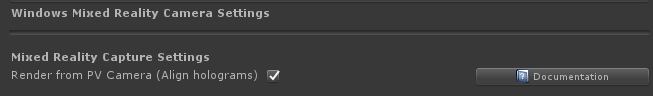

# Windows Mixed Reality camera settings provider

The Windows Mixed Reality camera settings provider determines the type of device, upon which the application is running and applies the appropriate configuration settings based on the display (transparent or opaque).

## Enabling the Windows Mixed Reality camera settings provider

The following steps presume use of the MixedRealityToolkit object. Steps required for other service registrars may be different.

1. Select the MixedRealityToolkit object in the scene hierarchy.

    

2. Navigate the Inspector panel to the camera system section and expand the **Camera Settings Providers** section.

    

3. Click **Add Camera Settings Provider** and expand the newly added **New camera settings** entry.

    

4. Select the Windows Mixed Reality Camera Settings provider

    

> [!NOTE]
> When using the Microsoft Mixed Reality Toolkit default profiles, the Windows Mixed Reality camera settings provider will already be enabled and configured.

## Configuring the Windows Mixed Reality camera settings provider

The Windows Mixed Reality Camera Settings also supports a profile. This profile provides the following options:



### Render mixed reality capture from the photo/video camera

With this setting on HoloLens 2, you can enable hologram alignment in your mixed reality captures. If enabled, the platform will provide an additional HolographicCamera to the app when a mixed reality capture photo or video is taken. This HolographicCamera provides view matrices corresponding to the photo/video camera location, and it provides projection matrices using the photo/video camera field of view. This will ensure that holograms, such as hand meshes, remain visibly aligned in the video output.

### HoloLens 2 reprojection method

Sets the initial method for HoloLens 2 reprojection. The default recommendation is to use depth reprojection, as all parts of the scene will be independently stabilized based on their distance from the user. If holograms still appear unstable, try ensuring all objects have properly submitted their depth to the depth buffer. This is sometimes a shader setting. If depth appears to be properly submitted and instability is still present, try autoplanar stabilization, which uses the depth buffer to calculate a stabilization plane. If an app is unable to submit enough depth data for either of those options to be usable, planar reprojection is provided as a fallback. This method will be based on an app's provided focus point data via [SetFocusPointForFrame](https://docs.unity3d.com/ScriptReference/XR.WSA.HolographicSettings.SetFocusPointForFrame.html).

To update the reprojection method at runtime, access the `WindowsMixedRealityReprojectionUpdater` like so:

```c#
var reprojectionUpdater = CameraCache.Main.EnsureComponent<WindowsMixedRealityReprojectionUpdater>();
reprojectionUpdater.ReprojectionMethod = HolographicDepthReprojectionMethod.AutoPlanar;
```

This only needs to be updated once and the value is reused for all subsequent frames. If the method will be updated frequently, it's recommended to cache the result of `EnsureComponent` instead of calling it often.

## See also

- [Camera System Overview](CameraSystemOverview.md)
- [Creating a Camera Settings Provider](CreateSettingsProvider.md)
- [Rendering Mixed Reality Capture from the PV camera](https://docs.microsoft.com/windows/mixed-reality/mixed-reality-capture-for-developers#render-from-the-pv-camera-opt-in)
- [Holographic reprojection](https://docs.microsoft.com/windows/mixed-reality/hologram-stability#reprojection)
