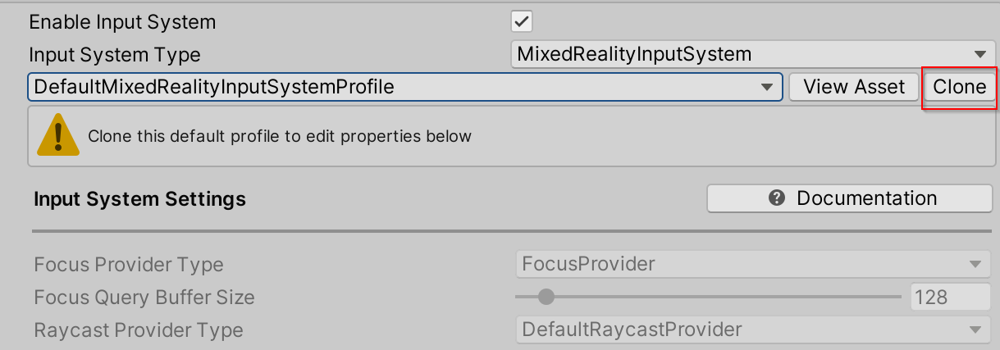
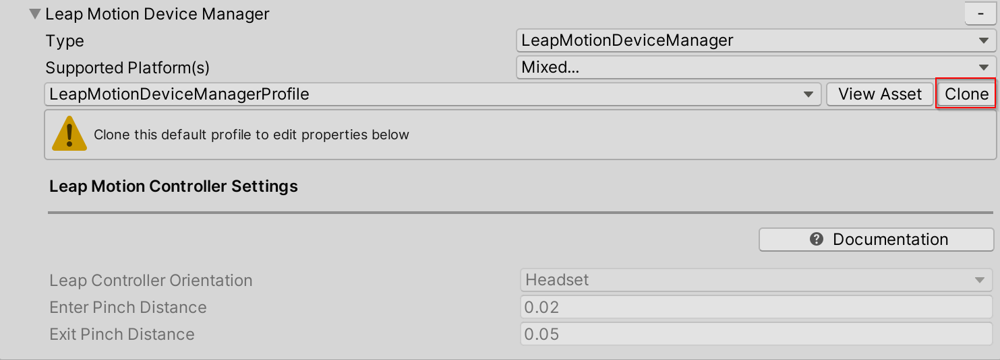
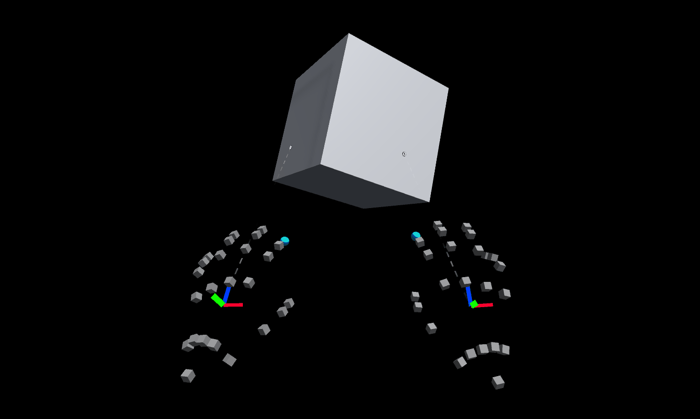
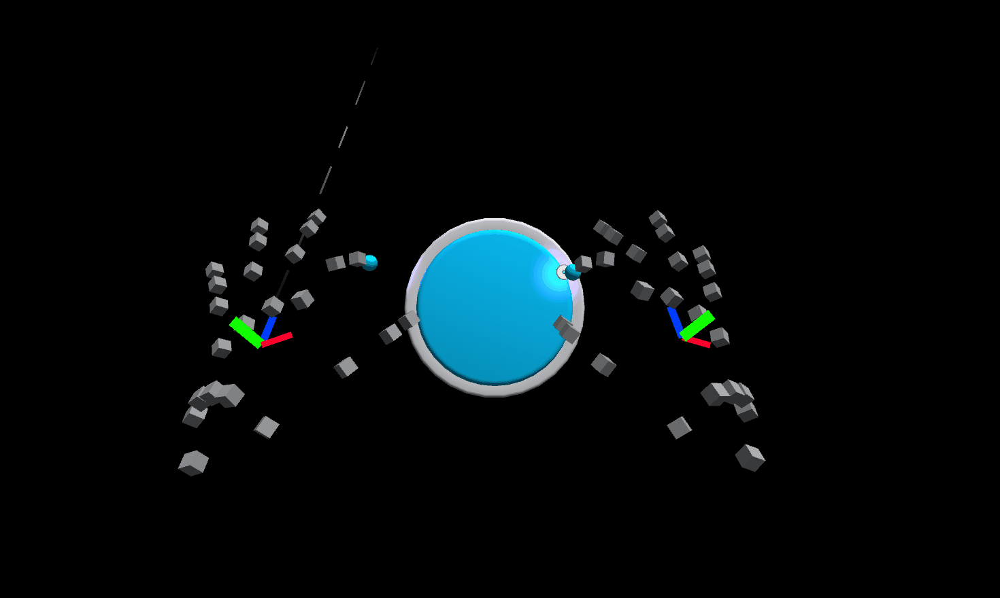

# How to Configure Leap Motion (by Ultraleap) Hand Tracking in MRTK

A [Leap Motion Controller](https://www.ultraleap.com/product/leap-motion-controller/) is required to use this data provider.

The Leap Motion Data Provider enables articulated hand tracking for VR and could be useful for rapid prototyping in the editor.  The data provider can be configured to use the Leap Motion Controller mounted on a headset or placed on a desk face up.


## Using Leap Motion (by Ultraleap) hand tracking in MRTK

1. Prepare MRTK project for Leap Motion

    - **This step only applies for the Leap Motion Unity Core Assets version 4.4.0 and if the source of MRTK is cloned from the git repo, NOT from the Unity packages. This step is not required if the Core Assets from Leap Motion Unity Modules version 4.5.0 are used. If the MRTK source is going to be from the Unity packages, start at the next step**

    - Navigate to **Mixed Reality Toolkit > Utilities > Leap Motion > Configure CSC File for Leap Motion**. Updating the csc file filters out the obsolete warnings produced by the Leap Motion Unity Core Assets.  The MRTK repo contains a csc file that converts warnings to errors, this conversion halts the Leap Motion MRTK configuration process.  The obsolete warnings issue is tracked [here](https://github.com/leapmotion/UnityModules/issues/1082).

    

1. Importing MRTK and the Core Assets from Leap Motion Unity Modules version 4.5.0
    - Import the **Microsoft.MixedReality.Toolkit.Foundation** package into the Unity project.
    - Install the [Leap Motion SDK 4.0.0](https://developer.leapmotion.com/releases/?category=orion)
    - Download and import the [Core Assets from Leap Motion Unity Modules version 4.5.0](https://developer.leapmotion.com/unity)
        - Leap Motion Unity Core Assets version [4.4.0](https://github.com/leapmotion/UnityModules/releases/tag/Release-CoreAsset-4.4.0) and the Core Assets from Leap Motion Unity Modules version [4.5.0](https://github.com/leapmotion/UnityModules/releases/tag/UM-4.5.0) are supported, but Core Assets from Leap Motion Unity Modules version 4.5.0 are preferred.
        - If using Core Assets from Leap Motion Unity Modules version 4.5.0, import the **Core** package into the Unity project.
    > [!NOTE]
    > On import of the Core Assets, test directories are removed and 10 assembly definitions are added to the project. Make sure Visual Studio is closed.
    - If using Unity 2018.4.x
        - After the Core Assets import, navigate to **Assets/LeapMotion/**, there should be a LeapMotion.asmdef file next to the Core directory.  If the asmdef file is not present, go to the [Leap Motion Common Errors](#leap-motion-has-not-integrated-with-mrtk). If the file is present, go to the next step.

    - If using Unity 2019.3.x, go to the next step

1. Adding the Leap Motion Data Provider
    - Create a new Unity scene
    - Add MRTK to the scene by navigating to **Mixed Reality Toolkit** > **Add to Scene and Configure**
    - Select the MixedRealityToolkit game object in the hierarchy and select **Copy and Customize** to clone the default mixed reality profile.

    

    - Select the **Input** Configuration Profile

    

    - Select **Clone** in the input system profile to enable modification.

    

    - Open the **Input Data Providers** section, select **Add Data Provider** at the top, a new data provider will be added at the end of the list.  Open the new data provider and set the **Type** to **Microsoft.MixedReality.Toolkit.LeapMotion.Input > LeapMotionDeviceManager**

    

    - Select **Clone** to change the default Leap Motion settings.

    

    - The Leap Motion Data Provider contains the `LeapControllerOrientation` property which is the location of the Leap Motion Controller. `LeapControllerOrientation.Headset` indicates the controller is mounted on a headset. `LeapControllerOrientation.Desk` indicates the controller is placed flat on desk. The default value is set to `LeapControllerOrientation.Headset`.  If the orientation is the desk, an extra property `LeapControllerOffset` will appear.  `LeapControllerOffset` is the anchor for the position of the desk leap hands.  The offset is calculated relative to the main camera position and the default value is (0,-0.2, 0.2) to make sure the hands appear in front and in view of the camera.
    - `EnterPinchDistance` and `ExitPinchDistance` are the distance thresholds for pinch/air tap gesture detection.  The pinch gesture is calculated by measuring the distance between the index finger tip and the thumb tip.  To raise an on input down event, the default `EnterPinchDistance` is set to 0.02.  To raise an on input up event (exiting the pinch), the default distance between the index finger tip and the thumb tip is 0.05.

    `LeapControllerOrientation`: Headset (Default) |  `LeapControllerOrientation`: Desk
    :-------------------------:|:-------------------------:
      |  
     |     

1. Testing the Leap Motion Data Provider
    - After Leap Motion Data Provider has been added to the input system profile, press play, move your hand in front of the Leap Motion Controller and you should see the joint representation of the hand.

1. Building your project
    - Navigate to **File > Build Settings**
    - Only Standalone builds are supported if using the Leap Motion Data Provider.
    - For instructions on how to use a Windows Mixed Reality headset for Standalone builds, see [Build and Deploy](../BuildAndDeploy.md#building-and-deploying-mrtk-to-a-windows-mixed-reality-headset).

## Getting the hand joints

Getting joints using the Leap Motion Data Provider is identical to hand joint retrieval for an MRTK Articulated Hand.  For more information, see [Hand Tracking](../Input/HandTracking.md#polling-joint-pose-from-handjointutils).

With MRTK in a unity scene and the Leap Motion Data Provider added as an Input Data Provider in the Input System profile, create an empty game object and attach the following example script.

This script is a simple example of how to retrieve the pose of the palm joint in a Leap Motion Hand.  A sphere follows the left Leap hand while a cube follows the right Leap hand.

```c#
using Microsoft.MixedReality.Toolkit;
using Microsoft.MixedReality.Toolkit.Input;
using Microsoft.MixedReality.Toolkit.Utilities;
using System.Collections.Generic;
using UnityEngine;

public class LeapHandJoints : MonoBehaviour, IMixedRealityHandJointHandler
{
    private GameObject leftHandSphere;
    private GameObject rightHandCube;

    private void Start()
    {
        // Register the HandJointHandler as a global listener
        CoreServices.InputSystem.RegisterHandler<IMixedRealityHandJointHandler>(this);

        // Create a sphere to follow the left hand palm position
        leftHandSphere = GameObject.CreatePrimitive(PrimitiveType.Sphere);
        leftHandSphere.transform.localScale = Vector3.one * 0.03f;

        // Create a cube to follow the right hand palm position
        rightHandCube = GameObject.CreatePrimitive(PrimitiveType.Cube);
        rightHandCube.transform.localScale = Vector3.one * 0.03f;
    }

    public void OnHandJointsUpdated(InputEventData<IDictionary<TrackedHandJoint, MixedRealityPose>> eventData)
    {
        if (eventData.Handedness == Handedness.Left)
        {
            Vector3 leftHandPalmPosition = eventData.InputData[TrackedHandJoint.Palm].Position;
            leftHandSphere.transform.position = leftHandPalmPosition;
        }

        if (eventData.Handedness == Handedness.Right)
        {
            Vector3 rightHandPalmPosition = eventData.InputData[TrackedHandJoint.Palm].Position;
            rightHandCube.transform.position = rightHandPalmPosition;
        }
    }
```

## Unity editor workflow tip

Using the Leap Motion Data Provider does not require a VR headset.  Changes to an MRTK app can be tested in the editor with the Leap hands without a headset.

The Leap Motion Hands will show up in the editor, without a VR headset plugged in.  If the `LeapControllerOrientation` is set to **Headset**, then the Leap Motion controller will need to be held up by one hand with the camera facing forward.

> [!NOTE]
> If the camera is moved using WASD keys in the editor and the `LeapControllerOrientation` is **Headset**, the hands will not follow the camera. The hands will only follow camera movement if a VR headset is plugged in while the `LeapControllerOrientation` is set **Headset**.  The Leap hands will follow the camera movement in the editor if the `LeapControllerOrientation` is set to **Desk**.

## Removing Leap Motion from the Project

1. Close Unity
1. Close Visual Studio, if it's open
1. Open File Explorer and navigate to the root of the MRTK Unity project
    - Delete the **UnityProjectName/Library** directory
    - Delete the **UnityProjectName/Assets/LeapMotion** directory
    - Delete the **UnityProjectName/Assets/LeapMotion.meta** file
1. Reopen Unity

In Unity 2018.4, you might notice that errors still remain in the console after deleting the Library and the Leap Motion Core Assets.
If errors are logged after reopening, restart Unity again.

## Common Errors

### Leap Motion Obsolete Errors

If the source of MRTK is from the repo and the Unity version is 2019.3.x, the following error might be in the console after the import of the Leap Motion Unity Core Assets:

```
Assets\LeapMotion\Core\Scripts\EditorTools\LeapPreferences.cs(84,6): error CS0618: 'PreferenceItem' is obsolete: '[PreferenceItem] is deprecated. Use [SettingsProvider] instead.
```

In Unity version 2018.4.x, the following obsolete errors might be logged:

```
Assets\LeapMotion\Core\Scripts\Attachments\AttachmentHands.cs(105,7): error CS0618: 'PrefabType' is obsolete: 'PrefabType no longer tells everything about Prefab instance.'
```

```
Assets\LeapMotion\Core\Scripts\Attachments\AttachmentHands.cs(105,31): error CS0618: 'PrefabUtility.GetPrefabType(Object)' is obsolete: 'Use GetPrefabAssetType and GetPrefabInstanceStatus to get the full picture about Prefab types.'
```

These errors appear if **Mixed Reality Toolkit > Utilities > Leap Motion > Configure CSC File for Leap Motion** was not selected BEFORE the Leap Motion Unity Core Assets import.

#### Solution

- Navigate to **Mixed Reality Toolkit > Utilities > Leap Motion > Configure CSC File for Leap Motion**, this will update the csc file to filter out Leap Motion warnings that are converted to errors in MRTK repo.
- Close Unity
- Reopen Unity

### Leap Motion has not integrated with MRTK

This error can occur if the Unity version is 2018.4.x, the MRTK source is from the Unity packages and after the import of the Leap Motion Unity Core Assets.

To test if MRTK recognizes the presence of the Leap Motion Unity Core Assets, open the LeapMotionHandTrackingExample scene located in MRTK/Examples/Demos/HandTracking/ and press play.  If the Leap Motion Unity Core Assets are recognized a green message on the informational panel in the scene will appear.  If the Leap Motion Unity Core Assets are not recognized a red message will appear.

If the Leap Motion Unity Core Assets are in your project and you see a red message on the informational panel, the project needs to be configured.

#### Solution

- Navigate to **Mixed Reality Toolkit > Utilities > Leap Motion > Configure Leap Motion**
  - This will force Leap Motion integration if the configuration process was not started after the Leap Motion Unity Core Assets import.

### Copying assembly Multiplayer HLAPI failed

On import of the Leap Motion Unity Core Assets this error might be logged:

```
Copying assembly from 'Temp/com.unity.multiplayer-hlapi.Runtime.dll' to 'Library/ScriptAssemblies/com.unity.multiplayer-hlapi.Runtime.dll' failed
```

#### Solution

- A short term solution is to restart Unity. See [Issue 7761](https://github.com/microsoft/MixedRealityToolkit-Unity/issues/7761) for more information.

## Leap Motion Example Scene

The example scene uses the DefaultLeapMotionConfiguration profile and determines if the Unity project has been configured correctly to use the Leap Motion Data Provider.

The example scene is contained in the **Microsoft.MixedReality.Toolkit.Examples** package in the **MRTK/Examples/Demos/HandTracking/** directory.  

## See also

* [Input Providers](../Input/InputProviders.md)
* [Hand Tracking](../Input/HandTracking.md)
