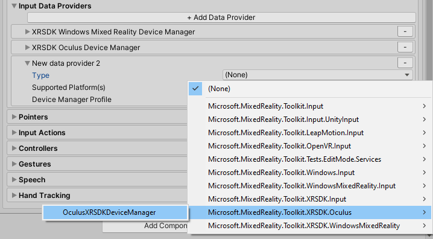

# How to configure Oculus Quest in MRTK using the XRSDK pipeline

A [Oculus Quest](https://www.oculus.com/quest/?locale=en_US) is required to use this data provider.

The Oculus XRSDK Data Provider enables the use of the Oculus Quest with MRTK using [Unity's XR Pipeline](https://docs.unity3d.com/Manual/XR.html).
This pipeline is the standard for developing XR applications in Unity 2019.3 and beyond. To use this pipeline, make sure that you using **Unity 2019.3 or newer**
The Oculus Quest XR Plugin does not currently support hand tracking. In order to use hand tracking, consult the [MRTK-Quest](https://github.com/provencher/MRTK-Quest)
project which uses the Legacy XR pipeline.

## Deploying to Oculus Quest

1. Follow [these steps](https://developer.oculus.com/documentation/unity/book-unity-gsg/) to ensure that your project is ready to deploy on Oculus Quest.
    - Make sure that the Oculus Plug-in Provider is included in your project by going to **Edit --> Project Settings --> XR Plug-in Management --> Plug-in Providers**

    

    - If it does not show up ensure that the **Oculus XR Plugin** is installed under **Window --> Package Manager**

    

1. Ensure that [developer mode](https://developer.oculus.com/documentation/native/android/mobile-device-setup/) is enabled on your device. Installing the Oculus ADB Drivers is optional.

1. Adding the Oculus XRSDK Data Provider
    - Create a new Unity scene or open a pre-existing scene like HandInteractionExamples
    - Add MRTK to the scene by navigating to **Mixed Reality Toolkit** > **Add to Scene and Configure**
    - Select the MixedRealityToolkit game object in the hierarchy and select **Copy and Customize** to clone the default mixed reality profile.

    

    - Select the **Input** Configuration Profile

    

    - Select **Clone** in the input system profile to enable modification.

    

    - Open the **Input Data Providers** section, select **Add Data Provider** at the top, and new data provider will be added at the end of the list.  Open the new data provider and set the **Type** to **Microsoft.MixedReality.Toolkit.XRSDK.Oculus > OculusXRSDKDeviceManager**

    

1. Building your project to deploy on Oculus Quest
    - Plug in your Oculus Quest via a USB 3.0 -> USB C cable
    - Navigate to **File > Build Settings**
    - Change the deployment to **Android**
    - Ensure that the Oculus Quest is selected as the applicable run device
    
    

    - Select Build and Run 
    - Accept the _Allow USB Debugging_ prompt from inside the quest
    - See your scene inside the Oculus Quest

## Common errors

### Quest not recognized by Unity

Make sure your Android paths are properly configured. If you continue to encounter problems, follow this [guide](https://developer.oculus.com/documentation/unity/book-unity-gsg/#install-android-tools)

**Edit > Preferences > External Tools > Android**

