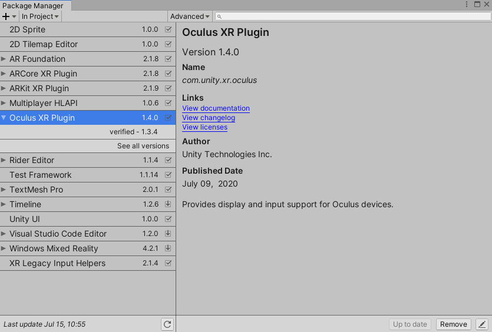
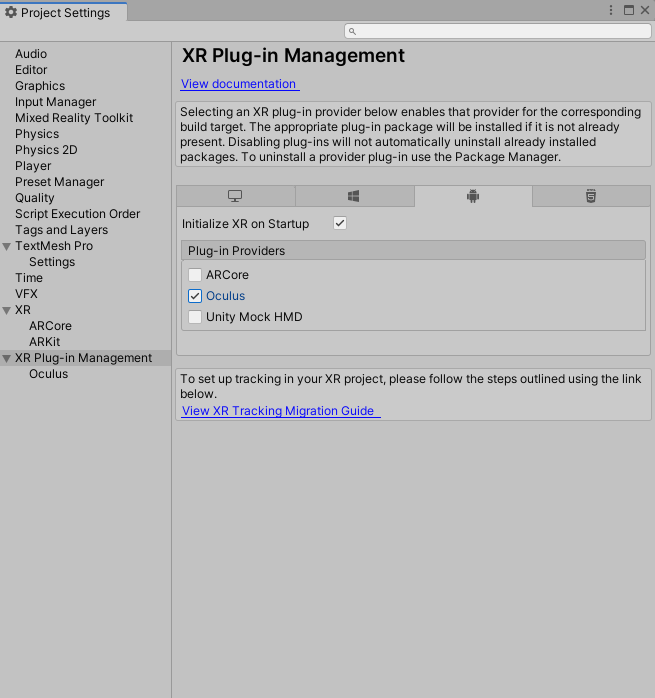
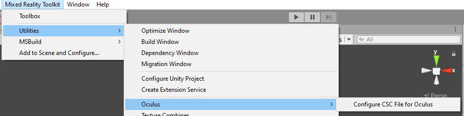
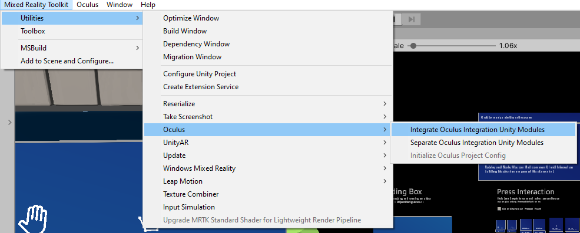
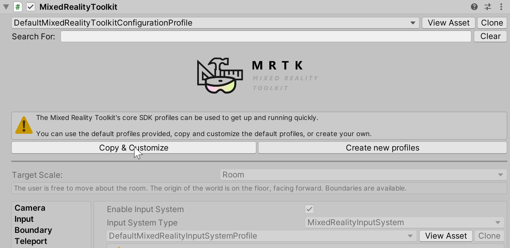
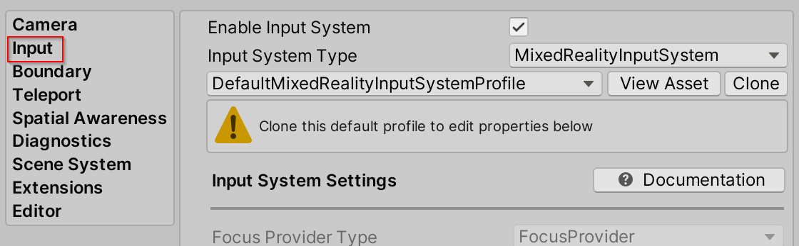
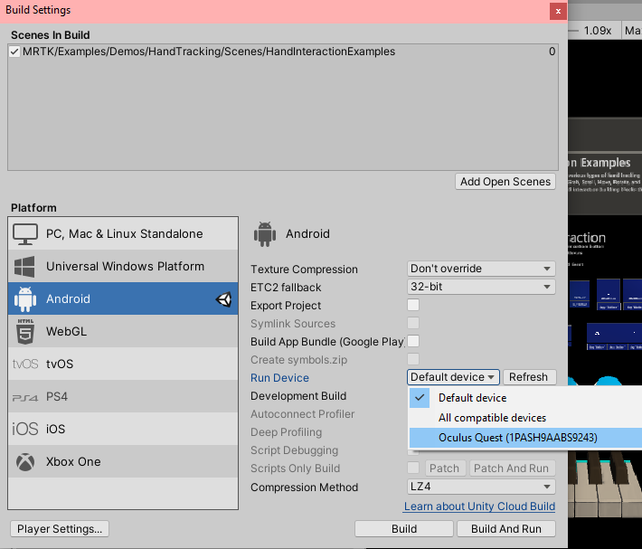
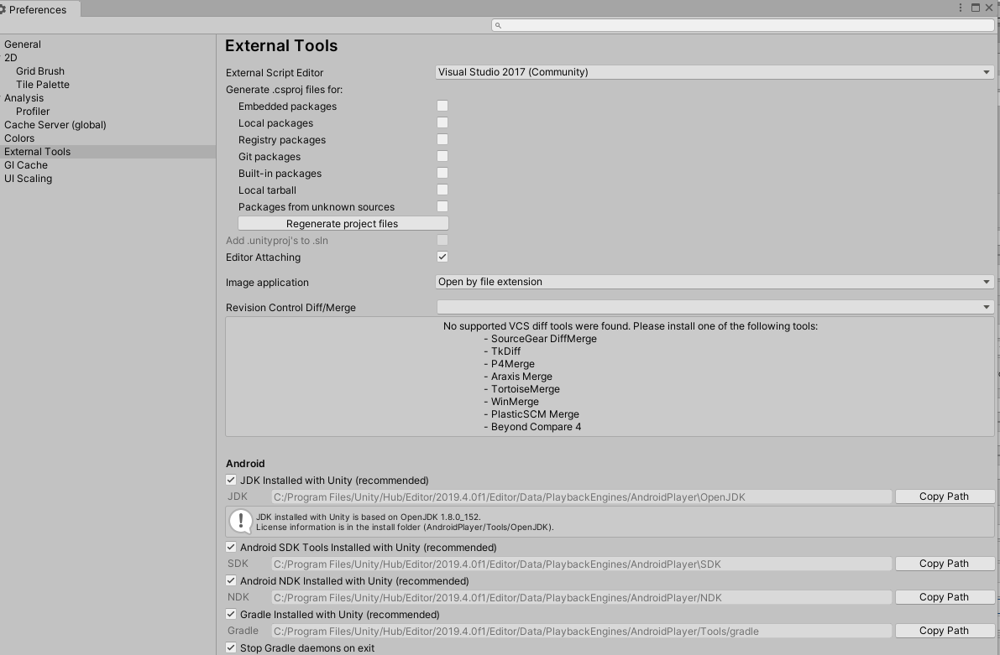

# How to configure Oculus Quest in MRTK using the XRSDK pipeline

A [Oculus Quest](https://www.oculus.com/quest/) is required.

MRTK's support for the Oculus Quest comes via two different sources, Unity's XR pipeline and the Oculus Integration Unity package. The **Oculus XRSDK Data Provider** enables the use
of both sources and must be used to use MRTK on the Oculus Quest.

The [Unity's XR Pipeline](https://docs.unity3d.com/Manual/XR.html) enables the use of Oculus Touch controllers and head tracking with the Oculus Quest.
This pipeline is the standard for developing XR applications in Unity 2019.3 and beyond. To use this pipeline, make sure that you using **Unity 2019.3 or newer**.

The [Oculus Integration Unity package](https://assetstore.unity.com/packages/tools/integration/oculus-integration-82022) allows for the use of **hand tracking** with the Oculus Quest. 
This data provider does **NOT** use Unity's **XR Pipeline** or **Legacy XR Pipeline**, but because controllers and headtracking are handeled by the Unity's XR Pipeline, the steps in
**Setting up project for the Oculus Quest** must be followed to ensure that you are using the **XR Pipeline** and not the to-be-deprecated **Legacy XR Pipeline**.

## Setting up project for the Oculus Quest

1. Follow [these steps](https://developer.oculus.com/documentation/unity/book-unity-gsg/) to ensure that your project is ready to deploy on Oculus Quest.

1. Ensure that [developer mode](https://developer.oculus.com/documentation/native/android/mobile-device-setup/) is enabled on your device. Installing the Oculus ADB Drivers is optional.

## Setting up the XR Pipeline for Oculus Quest
1. Ensure that the **Oculus XR Plugin** is installed under **Window --> Package Manager**

    

1. Make sure that the Oculus Plug-in Provider is included in your project by going to **Edit --> Project Settings --> XR Plug-in Management --> Plug-in Providers**

    

## Setting up the Oculus Integration Unity package
1. Download and import [Oculus Integration](https://assetstore.unity.com/packages/tools/integration/oculus-integration-82022) from the Unity Asset Store. The latest version tested to
work is 19.1. Older versions can be found from this [archive](https://developer.oculus.com/downloads/package/unity-integration-archive/)

1. Navigate to Mixed Reality Toolkit > Utilities > Oculus > Configure CSC File for Oculus. Updating the csc file filters out the obsolete warnings produced by the Oculus Integration Assets. 
The MRTK repo contains a csc file that converts warnings to errors, this conversion halts the MRTK-quest configuration process.

    

1. Navigate to Mixed Reality Toolkit > Utilities > Oculus > Integrate Oculus Integration Unity Modules. Doing this will update the asmdefs with definitions and references needed for the
relevant Oculus Quest code to function.

    

1. In the imported Oculus folder (It should be found at Assets/Oculus), there is a scriptable object called OculusProjectConfig. In that config file, you need to set HandTrackingSupport 
to "Controllers and Hands".

    
   
## Setting up the scene
1. Create a new Unity scene or open a pre-existing scene like HandInteractionExamples
1. Add MRTK to the scene by navigating to **Mixed Reality Toolkit** > **Add to Scene and Configure**

## Using the Oculus XRSDK Data Provider

1. Configure your profile to use the **Oculus XRSDK Data Provider**
    - If not intending to modify the configuration profiles
        - Change your profile to DefaultXRSDKInputSystemProfile and go to [Build and deploy your project to Oculus Quest](OculusQuestMRTK.md#build-and-deploy-your-project-to-oculus-quest)

    - Otherwise follow the following:
        - Select the MixedRealityToolkit game object in the hierarchy and select **Copy and Customize** to clone the default mixed reality profile.

        

        - Select the **Input** Configuration Profile

        

        - Select **Clone** in the input system profile to enable modification.

        

        - Open the **Input Data Providers** section, select **Add Data Provider** at the top, and new data provider will be added at the end of the list.  Open the new data provider and set the **Type** to **Microsoft.MixedReality.Toolkit.XRSDK.Oculus > OculusXRSDKDeviceManager**

        

    - You can verify that the Oculus Controllers are detected by 

## Build and deploy your project to Oculus Quest
1. Plug in your Oculus Quest via a USB 3.0 -> USB C cable
1. Navigate to **File > Build Settings**
1. Change the deployment to **Android**
1. Ensure that the Oculus Quest is selected as the applicable run device
    
    

1. Select Build and Run 
1. Accept the _Allow USB Debugging_ prompt from inside the quest
1. See your scene inside the Oculus Quest

## Common errors

### Quest not recognized by Unity

Make sure your Android paths are properly configured. If you continue to encounter problems, follow this [guide](https://developer.oculus.com/documentation/unity/book-unity-gsg/#install-android-tools)

**Edit > Preferences > External Tools > Android**

