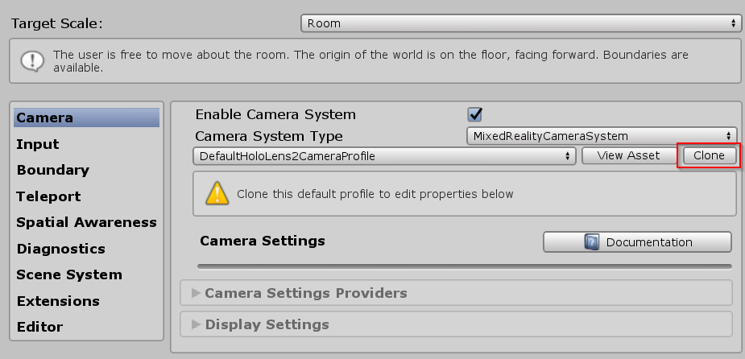
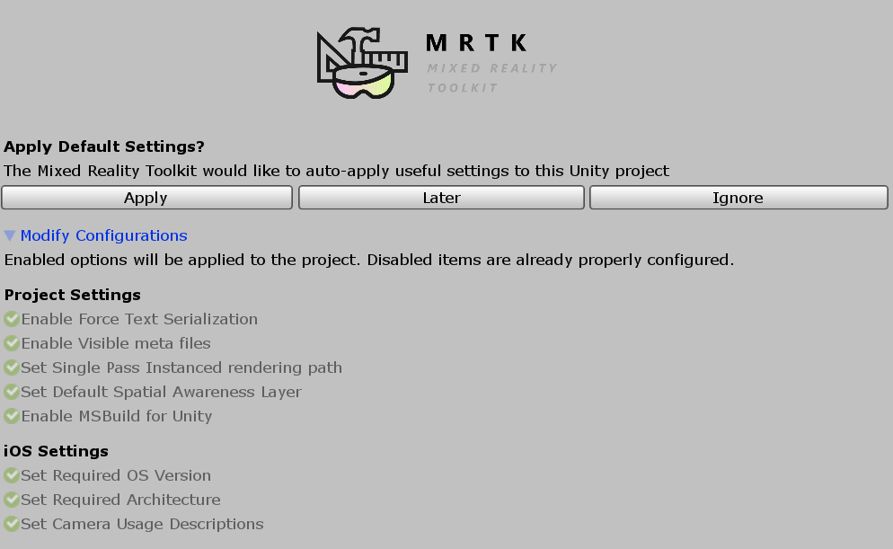
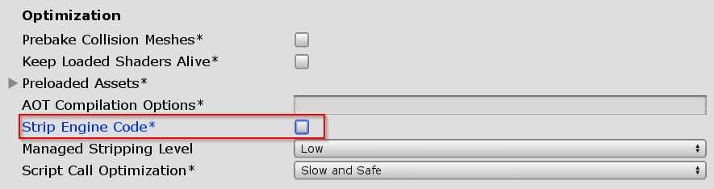

# How to configure MRTK for iOS and Android [Experimental]

## Install required packages

1. Download and import the **Microsoft.MixedReality.Toolkit.Providers.UnityAR** package, from [GitHub](https://github.com/microsoft/MixedRealityToolkit-Unity/releases/tag/v2.2.0) or [NuGet](../MRTKNuGetPackage.md)

> [!NOTE]
> After you import the the UnityAR package, you will see the following error: 
> *Assembly has reference to non-existent assembly 'Unity.XR.ARFoundation' (Assets/MixedRealityToolkit.Staging/UnityAR/Microsoft.MixedReality.Toolkit.Providers.UnityAR.asmdef)*
". To resolve, install the correct version of ARFoundation listed below.

2. In the Unity Package Manager (UPM), install the following packages:

    **Unity 2018.4.x** 

    | **Android** | **iOS** | Comments |
    | --- | --- | --- |
    | AR Foundation    Version: 1.5.0 - preview 6 | AR Foundation    Version: 1.5.0 - preview 6 | For Unity 2018.4, this package is included as a preview. To view package: Window > Package Manager > Advanced > Show Preview Packages|
    | ARCore XR Plugin   Version: 2.1.2 | ARKit XR Plugin   Version: 2.1.2 | |

    **Unity 2019.x**

    | **Android** | **iOS** | 
    | --- | --- |
    | AR Foundation    Version: 2.1.4 |  AR Foundation    Version: 2.1.4 |
    | ARCore XR Plugin   Version: 2.1.2 | ARKit XR Plugin   Version: 2.1.2 |

1. If using Unity 2019.x, the assembly definition file for the Unity AR provider needs to be modified to have the **UnityEngine.SpatialTracking** reference added.

    > [!Note]
    > MRTK will automatically update the assembly definition based on the version of Unity in which the project has been loaded. This information is presented here for reference.
    
    

## Enabling the Unity AR camera settings provider

The following steps presume use of the MixedRealityToolkit object. Steps required for other service registrars may be different.

1. Select the MixedRealityToolkit object in the scene hierarchy.

    

1. Select **Copy and Customize** to Clone the MRTK Profile to enable custom configuration.

    

1. Select **Clone** next to the Camera Profile.

    

1. Navigate the Inspector panel to the camera system section and expand the **Camera Settings Providers** section.

    

1. Click **Add Camera Settings Provider** and expand the newly added **New camera settings** entry.

    

1. Select the Unity AR Camera Settings provider

    

    For more information about configuring the Unity AR camera settings provider: [Unity AR camera settings provider](../CameraSystem/UnityArCameraSettings.md).

## Building a scene for Android and iOS devices

1. Make sure you have added the UnityAR Camera Settings Provider to your scene.

2. Switch platform to either Android or iOS in the Unity Build Settings

When you switch the platform you should see the MRTK Project Configurator Window with settings for your chosen platform.  Click Apply to enable platform specific settings.

iOS Project Configurator Settings

3. There are no additional steps after switching the platform for Android. 

4. If the platform is iOS, Edit > Project Settings > Player > Other Settings, under the Optimization header, **uncheck** Strip Engine Code

> [!NOTE]
> Unchecking Strip Engine Code is the short term solution to an error in Xcode [#6646](https://github.com/microsoft/MixedRealityToolkit-Unity/issues/6646).  We are working on a long term solution for MRTK 2.3.0.

5. Build and run the scene

## See also

- [Unity AR Camera Settings](../CameraSystem/UnityArCameraSettings.md)
