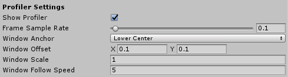

# Configuring the diagnostics system

## General settings


### Enable verbose logging

Indicates whether or not verbose MRTK logging will be enabled. This defaults to false, but can be
turned on to take detailed traces that allow the MRTK team to debug/dig into issues. For example,
when filing an issue, attaching the Unity player logs (either from the editor or from the player)
can help narrow down the source of bugs and issues.

Note that this option is independent of whether or not diagnostics system is enabled - this shows
up under the diagnostics system because it's a logging option, but ultimately operates at a higher
level because it affects logging across the entire MRTK codebase.

### Show diagnostics

Indicates whether or not the diagnostics system is to display the configured diagnostic options.

When disabled, all configured diagnostic options will be hidden.

## Profiler settings



### Show profiler

Indicates whether or not the Visual Profiler is to be displayed.

### Frame sample rate

The amount of time, in seconds to collect frames for frame rate calculation. The range is 0 to 5 seconds.

### Window anchor

To what portion of the view port should the profiler window be anchored. The default value is Lower Center.

### Window offset

The offset, from the center of the view port, to place the Visual Profiler. The offset will be in the direction of the *Window Anchor* property.

### Window scale

Size multiplier applied to the profiler window. For example, setting the value to 2 will double the window size.

### Window follow speed

The speed at which to move the profiler window to maintain visibility within the view port.

## Programmatically controlling the diagnostics system

It's also possible to toggle the visibility of the diagnostics system and the profiler at runtime. For example, the code below will hide the diagnostics system and profiler.

```c#
CoreServices.DiagnosticsSystem.ShowDiagnostics = false;

CoreServices.DiagnosticsSystem.ShowProfiler = false;
```

## See also

- [Diagnostics System](DiagnosticsSystemGettingStarted.md)
- [Using the Visual Profiler](UsingVisualProfiler.md)
