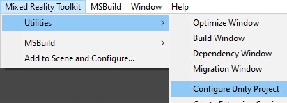
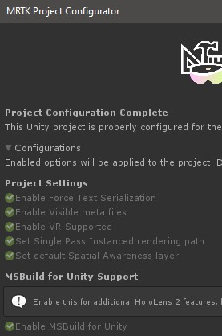
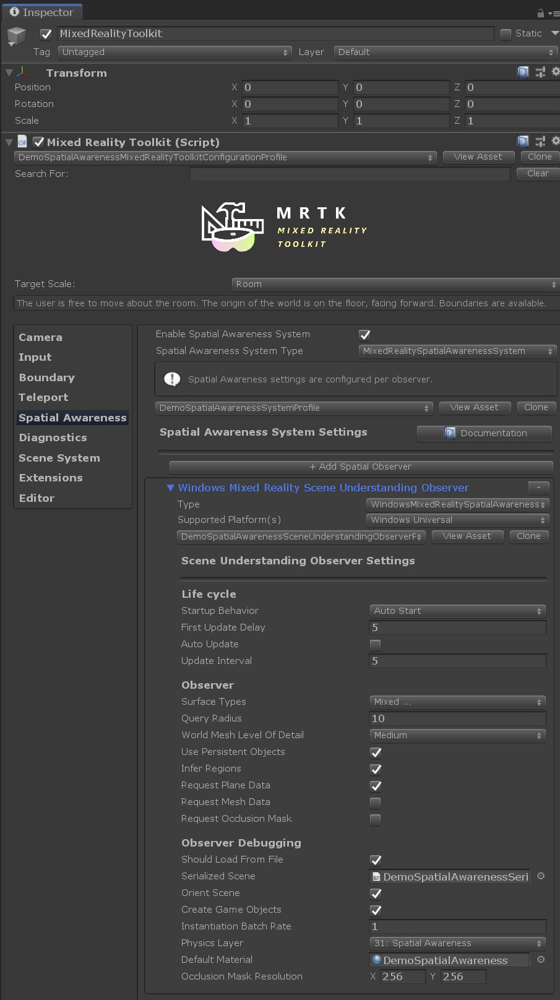

# MRTK Scene Understanding Demo

Scene Understanding will return a semantic representation of scene entities as well as their geometric forms on __HoloLens 2__ (not HoloLens 1!).

Expected use cases of this technology include:
* Placement. Objects on nearest surface such as wall or platform
* Construct nav-mesh for platform style games
* Provide physics engine friendly geometry as quads
* Accelerlate development by avoiding the need to write similar algorithims

This is an __experminental__ prelease that integrates [Scene Understanding](https://docs.microsoft.com/en-us/windows/mixed-reality/scene-understanding) as a new MRTK spatial observer.

## Goals and features of the demo
* Demo scene with visualization of Scene Objects with options for configuring the observer
* Example script that excersises the event system demonstrating common tasks
* Save device room data for offline development
* In-editor workflow for developing with previously saved room data (.bytes files)
* For the first time, access to the highest possible resolution of the world mesh!

## Observer overview

When asked, the [Scene Understanding Observer](https://github.com/microsoft/MixedRealityToolkit-Unity/blob/ff68a86445152d98ee5b0b1a25bd5f303169e4ed/Assets/MixedRealityToolkit.Providers/Experimental/WindowsMixedReality/WindowsMixedRealitySpatialAwarenessSceneUnderstandingObserver.cs) will return [Scene Objects](https://github.com/microsoft/MixedRealityToolkit-Unity/blob/ff68a86445152d98ee5b0b1a25bd5f303169e4ed/Assets/MixedRealityToolkit/Definitions/SpatialAwareness/Experimental/SpatialAwarenessSceneObject.cs) with attributes useful for mixed world development. What is returned is dependent on the configuration of the observer when fetched. For instance, one may want the occlusion mask, the observer must be configured to generate quads.

It is expected the majority of "real" applications will never show the underlying data in raw form.

## Background and development notes

This feature built atop Spatial Awareness is based on scene understanding technology from Microsoft. 

The Scene Understanding observer inherits from the older spatial awareness infrastructure, and thus the implementation is and odd fit in places.

Scene Understanding is a __platform specific__ technology. Spatial Awareness is meant to cover _platform agnostic_ capabilities. With few data points, it's likely we don't have the proper abstraction yet. 

## Prerequisites

Ensure build settings' platform is set to UWP.

Ensure your project is configured to use MSBuild.

A restart of the unity editor maybe required if there are errors about missing assembly references. This should trigger download of packages.

## Demonstration and debugging Scene Understanding

### Unity demo scene

Open the scene file and press play!

`Assets/MixedRealityToolkit.Examples/Experimental/SpatialAwareness/DemoSpatialAwareness.unity`

#### Configuring the observer service

Select the 'MixedRealityTookit' game object and check the inspector.

These options will allow one to configure the observer on play. 

Press play at this point the example serialized scene data will be loaded and displayed in the editor (assuming the observer is configured to show 'debug' objects)

### Example script

The example script _DemoSpatialAwarenessController.cs_, demonstrates the major concepts in working with the Scene Understanding service.

* Subscribing to Scene Understanding events
* Handling Scene Understanding events
* Finding the nearest platform
* Instantiating a prefab and placing it in an open spot

This example script uses MRKT UI to toggle service features on the Spatial Understanding observer.

Turning on *Instantiate Prefabs*, will demonstrate creating objects that size to fit themselves to all [Scene Objects](https://github.com/microsoft/MixedRealityToolkit-Unity/blob/ff68a86445152d98ee5b0b1a25bd5f303169e4ed/Assets/MixedRealityToolkit/Definitions/SpatialAwareness/Experimental/SpatialAwarenessSceneObject.cs), gathered neatly under a parent object.

### Built app notes

Build and deploy to HoloLens in the standard way. Once running, a number of buttons should appear to play with the features.

The "Place" button will make a prefab appear on the nearest platform. (which may be behind the person!) One should hear a spatial sound when this occurs in order to help locate it.

Note, their are some pit falls in making queries to the observer. Misconfiguration of a fetch request result in your event payload not containing the expected data. For example, if one dosen't request quads, then no occlusion mask textures will be present. Like wise, no world mesh will appear if the observer is not configured to request meshes. The `DemoSpatialAwarenessController` script takes care of some of these dependencies, but not all.

Saved .bytes files can be accessed through the [device portal](https://docs.microsoft.com/en-us/windows/mixed-reality/using-the-windows-device-portal) at `User Folders/LocalAppData/.../LocalState/PREFIX_yyyyMMdd_hhmmss.bytes`. These `bytes` can be used in edtor by specifying them in the observer profile found in the inspector.

# See Also

* https://docs.microsoft.com/en-us/windows/mixed-reality/scene-understanding
* https://docs.microsoft.com/en-us/windows/mixed-reality/scene-understanding-sdk