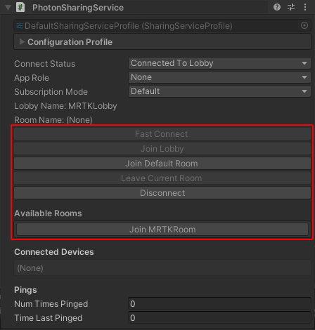

# Sharing Service Overview

This extension provides a basic way to send and receive data to / from other devices.

## Enabling the extension

To enable the extension, open your RegisteredServiceProvider profile. Click Register a new Service Provider to add a new configuration. In the Component Type field, select PhotonSharingService (or any other ISharingService implementation).

### Installing and configuring Photon

This implementation of the sharing service uses Photon's PUN 2. Without this package installed, the service will not function.

[Download the required Photon package here](https://assetstore.unity.com/packages/tools/network/pun-2-free-119922). See that package's documentation for details on how to set up and configure your Photon account.

## Connecting

### Fast Connect

The simplest way to connect is with `ISharingService.FastConnect()`. This option uses your service profile's settings to join or create a default lobby and room. We recommend using this while prototyping your app. If `ConnectOnStartup` is set to **true** in your service profile the service will automatcally call this option on startup.

### Connecting In Editor

If [service inspectors](../..\MixedRealityConfigurationGuide.md#service-inspectors) are enabled you can fast connect, join lobbies, view available rooms and join rooms from the service's inspector:

Advanced options for connecting will be covered in the matchmaking section.

---
## Next Steps

- [Pinging Devices](SharingServicePingingDevices.md)
- [Sending and Receiving Data](SharingServiceSendingAndReceiving.md)
- [Using Data Subscriptions](SharingServiceDataSubscriptions.md)
- [Using App Roles](SharingServiceAppRoles.md)
- [Matchmaking](SharingServiceMatchmaking.md)
- [Profile Options](SharingServiceProfileOptions.md)
