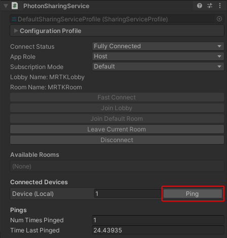

# Sharing Service : Pinging Devices

Pinging other connected devices or Unity editor instances is a quick way to test that everything has been configured correctly.
Use `ISharingService.PingDevice(short deviceID)` to send pings.

```c#
// Ping script for a project using the default sharing service config profile.
// On startup the service will automatically connect all devices using the profile to the a default lobby / room.
public class PingTestScript : MonoBehaviour
{
    private void Start()
    {
        MixedRealityServiceRegistry.TryGetService<ISharingService>(out ISharingService service);
        // Subscribe to pinged event
        service.OnLocalDevicePinged += OnLocalDevicePinged;
    }

    private void Update()
    {
        MixedRealityServiceRegistry.TryGetService<ISharingService>(out ISharingService service);
        // Wait for service to connect
        if (service.Status != ConnectStatus.FullyConnected)
        {
            return;
        }

        if (UnityEngine.Input.GetKeyDown(KeyCode.P))
        {
            foreach (DeviceInfo device in service.ConnectedDevices)
            {   // Skip our own device
                if (!device.IsLocalDevice)
                {
                    service.PingDevice(deviceID);
                }
            }
        }
    }

    private void OnLocalDevicePinged()
    {   // Play sound, etc.
        Debug.Log("Pinged!");
    }
}
```
If [service inspectors](../..\MixedRealityConfigurationGuide.md#service-inspectors) are enabled you can also ping connected devices using the service's inspector.

