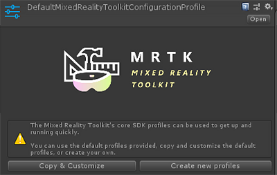
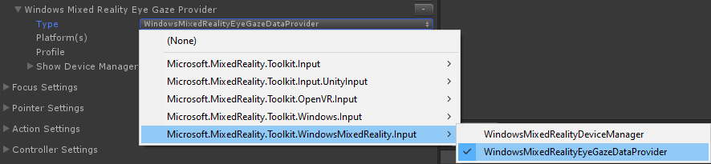
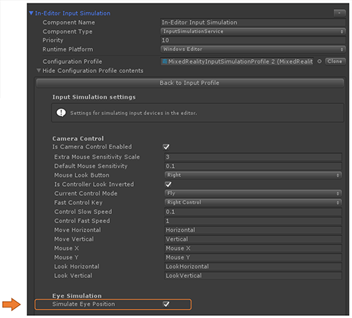

# Getting started with Eye Tracking in MRTK
This page covers how to set up your Unity MRTK scene to use Eye Tracking in your app.
The following assumes you are starting out with a fresh new scene.
Alternatively, you can check out our already configured [MRTK Eye Tracking Examples](EyeTracking_ExamplesOverview.md).

### Eye tracking requirements 
For Eye Tracking to work correctly, the following requirements must be met:

1. An _'Eye Gaze Data Provider'_ must be added to the input system. This provides eye tracking data from the platform.
2. The GazeProvider must have its "Use Eye Tracking" property set to true. Note that true is the default value (so no special
   action is required unless you have actively unchecked this property.)
3. The _'Gaze Input'_ capability must be enabled in the application manifest. **Currently this is only available in Visual Studio.**
4. The HoloLens **must** be calibrated for the current user under system settings.

**IMPORTANT:** If any of the above requirements are not met, the application will automatically fall back to head-based gaze tracking.

Below are the steps required to enable eye tracking in an application. 

### Setting up the scene
Set up the _MixedRealityToolkit_ by simply clicking _'Mixed Reality Toolkit -> Configure…'_ in the menu bar.

### Setting up the MRTK profiles required for Eye Tracking
After setting up your MRTK scene, you will be asked to choose a profile for MRTK. 
You can simply select _DefaultMixedRealityToolkitConfigurationProfile_ and then select the _'Copy & Customize'_ option.

### Create an "Eye Gaze Data Provider"
- Navigate to the _'Input System Profile'_ in your MRTK main profile.

- To edit the default one ( _'DefaultMixedRealityInputSystemProfile'_ ), click the _'Clone'_ button next to it. 

- Double click on your new input profile and select _'+ Add Data Provider'_. 

- Create a new data provider: 
    - Under **Type** select _'Microsoft.MixedReality.Toolkit.WindowsMixedReality.Input'_ -> _'WindowsMixedRealityEyeGazeDataProvider'_
    
    - For **Platform(s)** select _'Windows Universal'_.

### Enabling Eye Tracking in the GazeProvider
In HoloLens v1, head gaze was used as primary pointing technique. 
While head gaze is still available via the _GazeProvider_ in MRTK which is attached to your [Camera](https://docs.unity3d.com/ScriptReference/Camera.html), you can check to use eye gaze instead by ticking the _'Use Eye Tracking'_ checkbox as shown in the screenshot below.

**NOTE:** Developers can toggle between eye tracking and head tracking in code by changing the _'UseEyeTracking'_ property of _'GazeProvider'_.  

### Simulating Eye Tracking in the Unity Editor
You can simulate Eye Tracking input in the Unity Editor to ensure that events are correctly triggered before deploying the app to your HoloLens 2.
The eye gaze signal is simulated by simply using the camera's location as eye gaze origin and the camera's forward vector as eye gaze direction.
While this is great for initial testing, please note that it is not a good imitation for rapid eye movements. 
For this, it is better to ensure frequent tests of your eye-based interactions on the HoloLens 2.

1. **Enable simulated Eye Tracking**: 
    - Navigate to your main _'MRTK Configuration Profile'_ -> _'Input System Profile'_ -> _'Data Providers'_ -> _'Input Simulation Service'_.
    - Check the _'Simulate Eye Position'_ checkbox.

2. **Disable default head gaze cursor**: 
In general, it is recommended to avoid showing an eye gaze cursor or if absolutely required to make it _very_ subtle.
Check out our [eye gaze cursor tutorial](EyeTracking_Cursor.md) for more information on how to best handle it.
We do recommend to hide the default head gaze cursor that is attached to the MRTK gaze pointer profile by default.
    - Navigate to your main _'MRTK Configuration Profile'_ -> _'Input System Profile'_ -> _'PointerSettings.PointerProfile'_
    - At the bottom of the _'PointerProfile'_, you should assign an invisible cursor prefab to the _'GazeCursor'_. If you downloaded the MRTK Examples folder, you can simply reference the included -'EyeGazeCursor'_ prefab.

### Accessing eye gaze data
Now that your scene is set up to use Eye Tracking, let's take a look at how to access it in your scripts: 
[Accessing Eye Tracking Data in your Unity Script](EyeTracking_EyeGazeProvider.md).

 
### Testing your Unity app on a HoloLens 2
Building your app with Eye Tracking should be similar to how you would compile other HoloLens 2 MRTK apps. 
The only difference is that the *'Gaze Input'* capability is unfortunately not yet supported by Unity under 'Player Settings -> Publishing Settings -> Capabilities'. 
To use Eye Tracking on your HoloLens 2 device, you need to manually edit the package manifest that is part of your build Visual Studio project.
Follow these steps:

1. Build your Unity project as you would normally do for _HoloLens 2_.
2. Open your compiled Visual Studio project and then open the _'Package.appxmanifest'_ in your solution.
3. Make sure to tick the _'Gaze Input'_ checkbox under _Capabilities_.

**IMPORTANT:** Don't forget to calibrate HoloLens for the current user. Without calibration, eye tracking won't work. Calibration can be found under system settings.  

If everything is set up correctly, a prompt should pop up asking the user for permission to use Eye Tracking when you start your Unity app on a HoloLens 2 device for the first time.

---
[Back to "Eye Tracking in the MixedRealityToolkit"](EyeTracking_Main.md)
