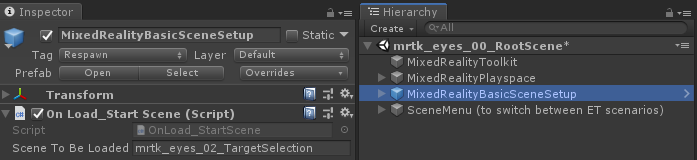
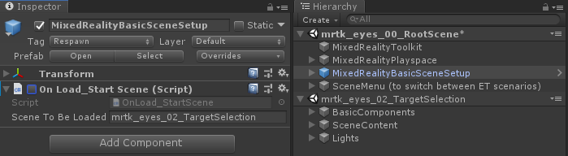

# Eye Tracking Examples in MRTK
This page covers how to get quickly started with using Eye Tracking in MRTK by building on our provided MRTK example package.
The samples let you experience one of our new magical input capabilities: **Eye Tracking**! 
The demo include a number of different use cases for seamlessly combining information about what you are looking at with **Voice** and **Hand** input. 
This enables users to quickly and effortlessly select and move holograms across their view simply by looking at a target and saying _'Select'_ or performing a hand gesture. 
The demos also include an example for eye-gaze-directed scroll, pan and zoom of text and images on a slate. 
Finally, an example is provided for recording and visualizing the user's visual attention on a 2D slate.

## Overview of MRTK Eye Tracking Samples

### Setting up the MRTK Eye Tracking Samples

The [Eye Tracking example package](https://github.com/Microsoft/MixedRealityToolkit-Unity/tree/mrtk_release/Assets/MixedRealityToolkit.Examples/Demos/EyeTracking) comes with a number of different Unity scenes that are described in more detail below:

- EyeTrackingDemo-00-RootScene.unity:
This is the main (_root_) scene that has all the core MRTK components included.
It comes with a graphical scene menu that allows you to easily switch between the different Eye Tracking scenes which will be [loaded additively](https://docs.unity3d.com/ScriptReference/SceneManagement.LoadSceneMode.Additive.html).
To try out the Eye Tracking demos in your Unity Player, all you have to do is to load this scene and hit play.
Make sure that the _'OnLoad_StartScene'_ script is enabled for this so that the root scene knows which additive scene to load first.

- Individual Eye Tracking sample scenes - See [Demo Scenarios](#demo-scenarios) for a description of each:
  - EyeTrackingDemo-01-BasicSetup.unity
  - EyeTrackingDemo-02-TargetSelection.unity
  - EyeTrackingDemo-03-Navigation.unity
  - EyeTrackingDemo-04-TargetPositioning.unity
  - EyeTrackingDemo-05-Visualizer.unity

How to quickly change a scene and test it in the Unity editor:
- Load the _root_ scene
- Disable the _'OnLoadStartScene'_ script
- _Drag and drop_ one of the Eye Tracking test scenes that are described below (or any other scene) into your _Hierarchy_ view.

  
### Demo Scenarios
[**Eye-Supported Target Selection**](EyeTracking_TargetSelection.md)

This tutorial showcases the ease of accessing eye gaze data to select targets. 
It includes an example for subtle yet powerful feedback to provide confidence to the user that a target is focused while not being overwhelming.
In addition, there is a simple example of smart notifications that automatically disappear after being read. 

**Summary**: Fast and effortless target selections using a combination of eyes, voice and hand input.

 

[**Eye-Supported Navigation**](EyeTracking_Navigation.md)

Imagine you are reading some information on a distant display or your e-reader and when you reach the end of the displayed text, the text automatically scrolls up to reveal more content. 
Or how about magically zooming directly toward where you were looking at? 
These are some of the examples showcased in this tutorial about eye-supported navigation.
In addition, there is an example for hands-free rotation of 3D holograms by making them automatically rotate based on your current focus. 

**Summary**: Scroll, pan, zoom, 3D rotation using a combination of eyes, voice and hand input.

 

[**Eye-Supported Positioning**](EyeTracking_Positioning.md)

This tutorial shows an input scenario called [Put-That-There](https://youtu.be/CbIn8p4_4CQ) dating back to research from the MIT Media Lab in the early 1980's with eye, hand and voice input.
The idea is simple: Benefit from your eyes for fast target selection and positioning. 
Simply look at a hologram and say _'put this'_, look over where you want to place it and say _'there!'_. 
For more precisely positioning your hologram, you can use additional input from your hands, voice or controllers. 

**Summary**: Positioning holograms using Eyes, Voice and Hand input (*drag-and-drop*). Eye-supported sliders using Eyes+Hands. 

 

[**Visualization of Visual Attention**](EyeTracking_Visualization.md)

Information about where users look at is an immensely powerful tool to assess usability of a design and to identify problems in efficient work streams. 
This tutorial discusses different eye tracking visualizations and how they fit different needs. 
We provide basic examples for logging and loading Eye Tracking data and examples for how to visualize them. 

**Summary**: Two-dimensional attention map (heatmaps) on slates. Recording & replaying Eye Tracking data.

---
[Back to "Eye Tracking in the MixedRealityToolkit"](EyeTracking_Main.md)
