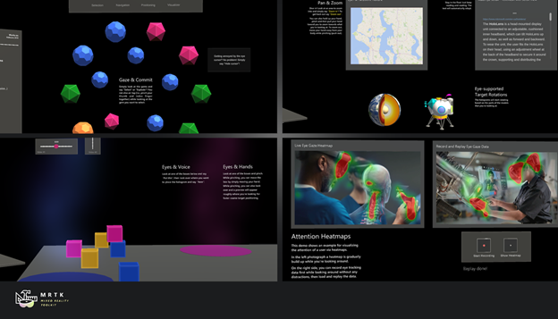

# Eye Tracking in the Mixed Reality Toolkit

The [Mixed Reality Toolkit](https://github.com/Microsoft/MixedRealityToolkit-Unity) (MRTK) supports amongst others _'HoloLens 2'_ which offers an exciting and powerful new input: Eye Tracking! 
Eye Tracking enables users to quickly and effortlessly engage with holograms across their view and can make your system smarter by better identifying a user's intention.
New to Eye Tracking? No problem! We have created a number of videos, tutorials and samples to get you started! 
1. [Getting started with Eye Tracking in MRTK](EyeTracking_BasicSetup.md)

2. [Building on the MRTK Eye Tracking samples](EyeTracking_ExamplesOverview.md)
---
