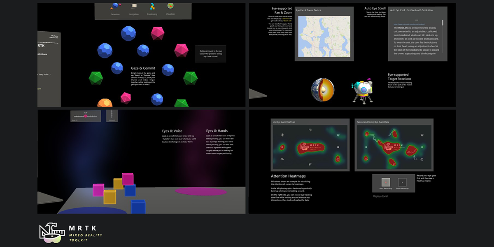

# Eye tracking in the Mixed Reality Toolkit

_HoloLens 2_ offers an exciting and powerful new input: Eye tracking!
Eye tracking enables users to quickly and effortlessly engage with holograms across their view and can make your system smarter by better identifying a user's intention. Check out Microsoft's Mixed Reality [documentation on eye tracking on HoloLens 2](https://docs.microsoft.com/windows/mixed-reality/eye-tracking) for more details, such as explaining powerful applications and design guidelines for eye tracking in mixed reality.

New to eye tracking? No problem! There are a number of videos, tutorials and samples to get you started in the [Mixed Reality Toolkit](https://github.com/Microsoft/MixedRealityToolkit-Unity)!
It is recommended to start by exploring some of the existing eye tracking samples that demonstrate best practices for eye-based interactions. You can then use these samples to pull the parts that seem relevant to you into your app. Finally, we also describe how to set up a fresh scene with the core components to get eye tracking working in your app.

1. [MRTK eye tracking samples](EyeTracking_ExamplesOverview.md)

2. [MRTK eye tracking setup](EyeTracking_BasicSetup.md)

3. [Accessing eye tracking data via Code](EyeTracking_EyeGazeProvider.md)

4. [Validate eye tracking calibration on device](EyeTracking_IsUserCalibrated.md)

## See also

- [MRTK Eye Tracking setup](EyeTracking_BasicSetup.md)
- [MRTK Eye Tracking via Code](EyeTracking_EyeGazeProvider.md)
- [MRTK Eye Tracking Calibration](EyeTracking_IsUserCalibrated.md)
- [HoloLens 2 Eye Tracking Documentation](https://docs.microsoft.com/windows/mixed-reality/eye-tracking)
