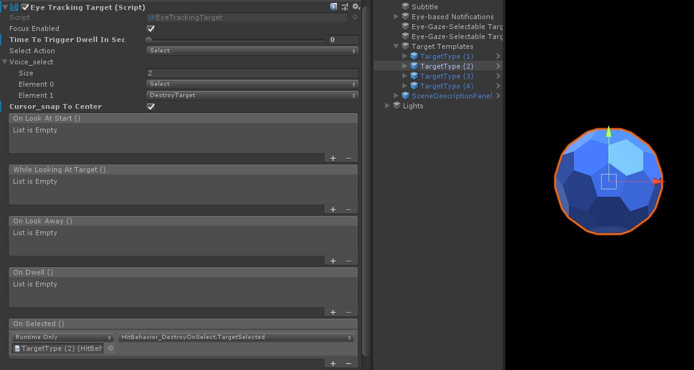

# Eye-Supported Target Selection
This page discusses different options for accessing eye gaze data and eye gaze specific events to select targets in MRTK. 
Eye tracking allows for fast and effortless target selections using a combination of information about what a user is looking at with additional inputs such as _hand tracking_ and _voice commands_:
- Look & Pinch (i.e., hold up your hand in front of you and pinch your thumb and index finger together)
- Look & Say _"Select"_ (default voice command)
- Look & Say _"Explode"_ or _"Pop"_ (custom voice commands)
- Look & Bluetooth button

To select holographic content using eye gaze, there are several options:

**1. Use the primary focus pointer:** 
This can be understood as your primary cursor. 
Please note that based on the current design head or eye gaze is suppressed as a cursor input if hand rays are used.

For example: 
A user wants to select a distant holographic button.
As a developer, you want to provide a flexible solution that allows the user to achieve this tasks in various conditions:
- Walk up to the button and poke it
- Look at it from a distance and say "select"
- Target the button using a hand ray and performing a pinch
In this case, the most flexible solution is to use the primary focus handler as it will notify you whenever the currently prioritized primary focus pointer triggers an event. 
Please note that if hand rays are enabled, the head or eye gaze focus pointer are disabled as soon as the hands come into view.

This is why in our eye tracking sample scenes, we have disabled the hand ray to allow for showcasing richer interactions using eyes + hand motions - see [**Eye-Supported Positioning**](EyeTracking_Positioning.md).

**2. Use both eye focus and hand rays at the same time:** 
There might be instances where you want to be more specific which type of focus pointers can trigger certain events and allow for simultaneously using multiple far interaction techniques. 

For example:
In your app, a user can use far hand rays to manipulate some holographic mechanical setup.
As part of that scenario, you want to support a mechanic that grabs some holographic tools to repair an engine. 
While doing so, the user has to go through a number of instructions and record his progress by marking off some check boxes.
If the user has his/her hands _not busy_, it would be instinctual to simply touch the check box or select it using a hand ray. 
However, if the user has his/her hands busy, holding the holographic tools in place, you want to enable the user to seamlessly scroll through the instructions using their eye gaze and simply looking at a check box and say "check it!".


## Use generic focus and pointer handlers
If eye tracking is set up correctly (see [Basic MRTK Setup to use Eye Tracking](EyeTracking_BasicSetup.md)), enabling users to select 
holograms using their eyes is the same as for any other focus input (e.g., head gaze or hand ray).
This provides the great advantage of a flexible way to interact with your holograms by defining the main focus type in your MRTK Input Pointer Profile depending on your user's needs, while leaving your code untouched.
This allows for switching between head or eye gaze without changing a line of code or replace hand rays with eye targeting for far interactions.

### Focusing a hologram
To detect when a hologram is focused, use the _'IMixedRealityFocusHandler'_ interface that provides you with two interface members: _OnFocusEnter_ and _OnFocusExit_.

Here is a simple example from [ColorTap.cs](xref:Microsoft.MixedReality.Toolkit.Examples.Demos.EyeTracking.ColorTap) to change a hologram's color when being looked at.

```csharp 
    public class ColorTap : MonoBehaviour, IMixedRealityFocusHandler
    {
        void IMixedRealityFocusHandler.OnFocusEnter(FocusEventData eventData)
        {
            material.color = color_OnHover;
        }

        void IMixedRealityFocusHandler.OnFocusExit(FocusEventData eventData)
        {
            material.color = color_IdleState;
        }
        ...
    }
```

### Selecting a focused hologram 
To select focused holograms, use PointerHandler to listener for input event to confirm a selection. 
For example, adding the _IMixedRealityPointerHandler_ will make them react to simple pointer input. 
The _IMixedRealityPointerHandler_ interface requires implementing the following three interface members: 
_OnPointerUp_, _OnPointerDown_, and _OnPointerClicked_.

In the example below, we change the color of a hologram by looking at it and pinching or saying "select".
Which action is required to trigger the event is defined by ```eventData.MixedRealityInputAction == selectAction``` whereby we can set the type of ```selectAction``` in the Unity Editor - by default it's the "Select" action.
The types of available  can be configured in the MRTK Profiler via
_MRTK Configuration Profile_ -> _Input_ -> _Input Actions_. 

```csharp 
   public class ColorTap : MonoBehaviour, IMixedRealityFocusHandler, IMixedRealityPointerHandler
    {
        // Allow for editing the type of select action in the Unity Editor.
        [SerializeField]
        private MixedRealityInputAction selectAction = MixedRealityInputAction.None; 
        ...
      
        void IMixedRealityPointerHandler.OnPointerUp(MixedRealityPointerEventData eventData)
        {
            if (eventData.MixedRealityInputAction == selectAction)
            {
                material.color = color_OnHover;
            }
        }

        void IMixedRealityPointerHandler.OnPointerDown(MixedRealityPointerEventData eventData)
        {
            if (eventData.MixedRealityInputAction == selectAction)
            {
                material.color = color_OnSelect;
            }
        }

        void IMixedRealityPointerHandler.OnPointerClicked(MixedRealityPointerEventData eventData) { }
    }
```

### Use Eye-Gaze-Specific _BaseEyeFocusHandler_
Given that eye gaze can be very different to other pointer inputs, you may want to make sure to only react to the focus input if it is _eye gaze_ and it is currently the primary input pointer.
For this purpose, you would use the _BaseEyeFocusHandler_ which is specific to eye tracking and which derives from 
the _FocusHandler_.
As mentioned before, it will only trigger if eye gaze targeting is currently the primary pointer input (i.e., no hand ray is active).


Here is an example from [EyeTrackingDemo-03-Navigation.unity](https://github.com/Microsoft/MixedRealityToolkit-Unity/blob/mrtk_release/Assets/MixedRealityToolkit.Examples/Demos/EyeTracking/Scenes/EyeTrackingDemo-03-Navigation.unity
).
In this demo, there are two 3D holograms that start will turn depending on which part of the object is looked at: 
If the user looks at the left side of the hologram, then that part will slowly move towards the front facing the user.
If the right side is looked at, then that part will slowly move to the front. 
This is a behavior that you may not want to have active at all times and also something that you may not want to accidentally trigger by a hand ray or head gaze. 
Having the [OnLookAtRotateByEyeGaze.cs](xref:Microsoft.MixedReality.Toolkit.Examples.Demos.EyeTracking.OnLookAtRotateByEyeGaze)
attached, a GameObject will rotate while being looked at.

```csharp
    public class OnLookAtRotateByEyeGaze : BaseEyeFocusHandler
    {
        ...
        
        protected override void OnEyeFocusStay()
        {
            // Update target rotation
            RotateHitTarget();
        }
        
        ...
        
        ///
        /// This function computes the rotation of the target to move the currently looked at aspect slowly to the front. 
        ///
        private void RotateHitTarget()
        {
            // Example for querying the hit position of the eye gaze ray using EyeGazeProvider
            Vector3 TargetToHit = (this.gameObject.transform.position - InputSystem.EyeGazeProvider.HitPosition).normalized;
                       
            ...
        }
    }
```

The _BaseEyeFocusHandler_ provides more than only _OnEyeFocusStay_. Here is an overview of other events: 

```csharp 
        /// <summary>
        /// Triggered once the eye gaze ray *starts* intersecting with this target's collider.
        /// </summary>
        protected virtual void OnEyeFocusStart() { }

        /// <summary>
        /// Triggered *while* the eye gaze ray is intersecting with this target's collider.
        /// </summary>
        protected virtual void OnEyeFocusStay() { }

        /// <summary>
        /// Triggered once the eye gaze ray *stops* intersecting with this target's collider.
        /// </summary>
        protected virtual void OnEyeFocusStop() { }

        /// <summary>
        /// Triggered once the eye gaze ray has intersected with this target's collider for a specified amount of time.
        /// </summary>
        protected virtual void OnEyeFocusDwell() { }
```


### Use Eye-Gaze-Specific EyeTrackingTarget 
While handling focus events in code is great, another way is to handle this from within the Unity Editor.
For this purpose, you can simply attach the [EyeTrackingTarget](xref:Microsoft.MixedReality.Toolkit.Input.EyeTrackingTarget) script to a 
GameObject.

This has two advantages: 
1. You can make sure that the hologram is only reacting to the user's eye gaze.
2. Several Unity events have already been set up to make it fast and convenient to handle and reuse existing behaviors.

#### Example: Attentive Notifications
For example, in [EyeTrackingDemo-02-TargetSelection.unity](https://github.com/Microsoft/MixedRealityToolkit-Unity/blob/mrtk_release/Assets/MixedRealityToolkit.Examples/Demos/EyeTracking/Scenes/EyeTrackingDemo-02-TargetSelection.unity), 
you can find an example for _'smart attentive notifications'_ that react to your eye gaze. 
These are 3D text boxes that can be placed in the scene and that will smoothly enlarge and turn toward the user when being looked at to ease legibility.
While the user is reading the notification, the information keeps getting displayed crisp and clear. 
After reading it and looking away from the notification, the notification will automatically be dismissed and fades out.
To achieve all this, there are a few generic behavior scripts that are not specific to eye tracking at all such as:
- [FaceUser.cs](xref:Microsoft.MixedReality.Toolkit.Examples.Demos.EyeTracking.FaceUser)
- [ChangeSize.cs](xref:Microsoft.MixedReality.Toolkit.Examples.Demos.EyeTracking.ChangeSize)
- [BlendOut.cs](xref:Microsoft.MixedReality.Toolkit.Examples.Demos.EyeTracking.BlendOut)

The advantage of this approach is that the same scripts can be reused by various events. 
For example, a hologram may start facing the user based on a voice commands or after pressing virtual button. 
To trigger these events, you can simply reference the methods that should be executed in the [EyeTrackingTarget](xref:Microsoft.MixedReality.Toolkit.Input.EyeTrackingTarget) 
script that is attached to your GameObject.
For the example of the _'smart attentive notifications'_, the following happens:
- **OnLookAtStart()**: The notification starts to...
    - *FaceUser.Engage:* ... turn toward the user.
    - *ChangeSize.Engage:* ... increase in size _(up to a specified maximum scale)_.
    - *BlendOut.Engage:* ... starts to blend in more _(after being at a more subtle idle state)_.  

- **OnDwell()**: Informs the _BlendOut_ script that the notification has been looked at sufficiently.

- **OnLookAway()**: The notification starts to...
    - *FaceUser.Disengage:* ... turn back to its original orientation.
    - *ChangeSize.Disengage:* ... decrease back to its original size.
    - *BlendOut.Disengage:* ... starts to blend out - If _OnDwell()_ was triggered, blend out completely and destroy, otherwise back to its idle state.

**Design Consideration:**
The key to an enjoyable experience here is to carefully tune the speed of any of these behaviors to avoid causing discomfort by reacting to the user’s eye gaze too quickly all the time. 
Otherwise this can quickly feel extremely overwhelming.


#### Example: Multimodal Gaze-Supported Target Selection
One event provided by the [EyeTrackingTarget](xref:Microsoft.MixedReality.Toolkit.Input.EyeTrackingTarget), yet not used by the 
_'Attentive Notifications'_ is the _OnSelected()_ event. 
Using the _EyeTrackingTarget_, you can specify what triggers the selection which will invoke the _OnSelected()_ event. 
For example, the screenshot below is from 
[EyeTrackingDemo-02-TargetSelection.unity](https://github.com/Microsoft/MixedRealityToolkit-Unity/blob/mrtk_release/Assets/Assets/MixedRealityToolkit.Examples/Demos/EyeTracking/Scenes/EyeTrackingDemo-02-TargetSelection.unity).
It shows how the [EyeTrackingTarget](xref:Microsoft.MixedReality.Toolkit.Input.EyeTrackingTarget)
is set up for one of the gems that explodes when you select it.



The _OnSelected()_ event triggers the method _'TargetSelected'_ in the 
[HitBehaviorDestroyOnSelect](xref:Microsoft.MixedReality.Toolkit.Examples.Demos.EyeTracking.HitBehaviorDestroyOnSelect) 
script attached to the gem GameObject.
The interesting part is _how_ the selection is triggered. 
The [EyeTrackingTarget](xref:Microsoft.MixedReality.Toolkit.Input.EyeTrackingTarget)
allows for quickly assigning different ways to invoke a selection:

- _Pinch gesture_: Setting the 'Select Action' to 'Select' uses the default hand gesture to trigger the selection. This means that the user can simply raise their hand and pinch their thumb and index finger together to confirm the selection.

- Say _"Select"_: Use the default voice command _"Select"_ for selecting a hologram.

- Say _"Explode"_ or _"Pop"_: To use custom voice commands, you need to follow two steps: 
    1. Set up a custom action such as _"DestroyTarget"_
        - Navigate to _'Input System Profile'_ -> _'Input Actions Profile'_ 
        - Add new action

    2. Set up the voice commands that trigger this action such as _"Explode"_ or _"Pop"_ 
        - Navigate to _'Input System Profile'_ -> _'Speech Commands Profile'_
        - Add new speech command and associate the action you just created 
        - Assign a _'KeyCode'_ to allow for triggering the action via a button press
<br>

This should get you started in accessing Eye Tracking data in your MRTK Unity app! 

---
[Back to "Eye Tracking in the MixedRealityToolkit"](EyeTracking_Main.md)
