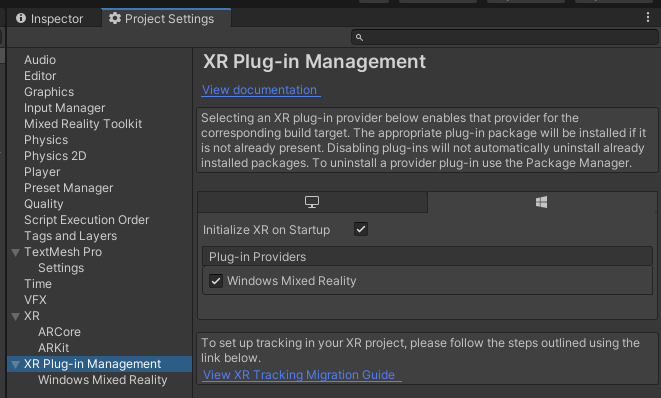
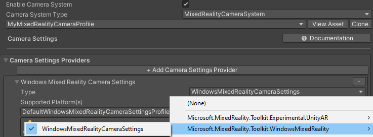
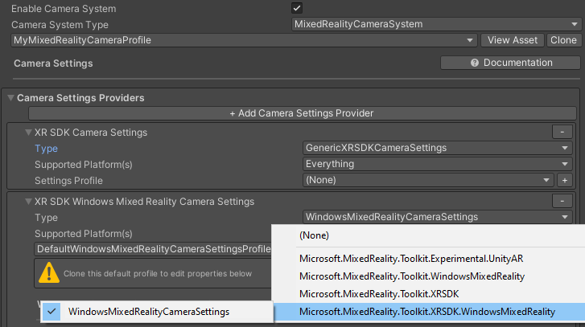
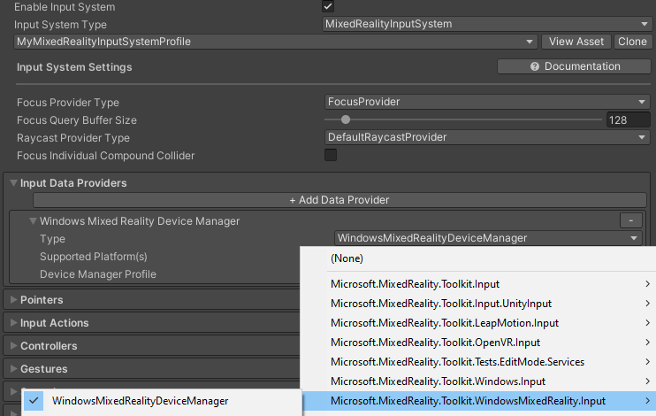
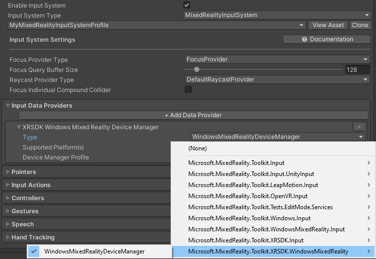
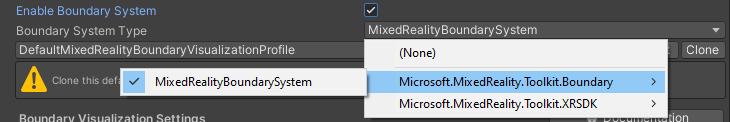
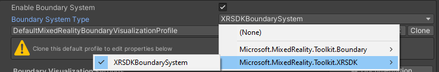
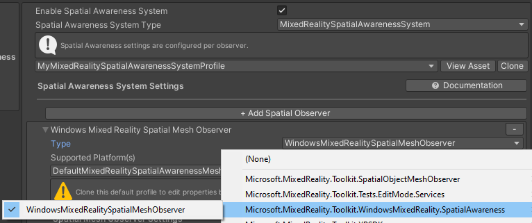
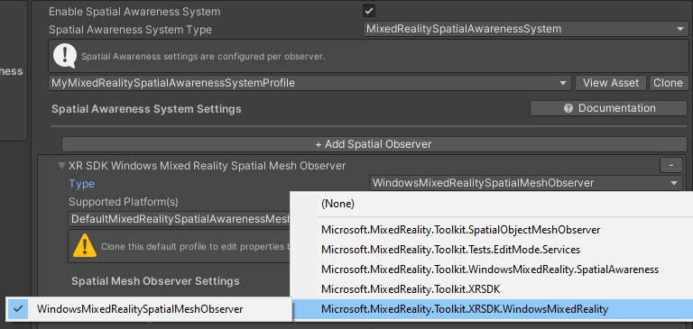

# Getting started with MRTK and XR SDK

XR SDK is Unity's [new XR pipeline in Unity 2019.3 and beyond](https://blogs.unity3d.com/2020/01/24/unity-xr-platform-updates/). In Unity 2019, it provides an alternative to the existing XR pipeline. In Unity 2020, it will become the only XR pipeline in Unity.

## Prerequisites

To get started with the Mixed Reality Toolkit, follow [the provided steps](GettingStartedWithTheMRTK.md) to add MRTK to a project.

## Add XR SDK to a Unity project

Windows Mixed Reality and Oculus are supported on XR SDK.

### Required in Unity

#### Windows Mixed Reality

1. Go into Unity's Package Manager and install the Windows XR Plugin package, which adds support for Windows Mixed Reality on XR SDK. This will pull down a few dependency packages as well. Ensure the following all successfully installed:
   1. XR Plugin Management
   1. Windows XR Plugin
   1. XR Legacy Input Helpers
1. Go to Edit > Project Settings.
1. Click on the XR Plug-in Management tab in the Project Settings window.
1. Go to the Universal Windows Platform settings and ensure Windows Mixed Reality is checked under Plug-in Providers.
1. Ensure that Initialize XR on Startup is checked.
1. (**_Optional_**) Click on the Windows Mixed Reality tab under XR Plug-in Management and create a custom settings profile to change the defaults. If the list of settings are already there, no profile needs to be created.

### Required in MRTK

Choose the "DefaultXRSDKConfigurationProfile" as the active profile or clone it to make customizations. This profile is set up with MRTK's XR SDK systems and providers, where needed.

To migrate an existing profile to XR SDK, the following services and data providers should be updated:

#### Camera

From [`WindowsMixedReality.WindowsMixedRealityCameraSettings`](xref:Microsoft.MixedReality.Toolkit.WindowsMixedReality.WindowsMixedRealityCameraSettings)

to [`XRSDK.WindowsMixedReality.WindowsMixedRealityCameraSettings`](xref:Microsoft.MixedReality.Toolkit.XRSDK.WindowsMixedReality.WindowsMixedRealityCameraSettings) **and** [`GenericXRSDKCameraSettings`](xref:Microsoft.MixedReality.Toolkit.XRSDK.GenericXRSDKCameraSettings)

#### Input

From [`WindowsMixedReality.Input.WindowsMixedRealityDeviceManager`](xref:Microsoft.MixedReality.Toolkit.WindowsMixedReality.Input.WindowsMixedRealityDeviceManager)

to [`XRSDK.WindowsMixedReality.WindowsMixedRealityDeviceManager`](xref:Microsoft.MixedReality.Toolkit.XRSDK.WindowsMixedReality.WindowsMixedRealityDeviceManager)

#### Boundary

From [`MixedRealityBoundarySystem`](xref:Microsoft.MixedReality.Toolkit.Boundary.MixedRealityBoundarySystem)

to  [`XRSDKBoundarySystem`](xref:Microsoft.MixedReality.Toolkit.XRSDK.XRSDKBoundarySystem)

#### Spatial awareness

From [`WindowsMixedReality.SpatialAwareness.WindowsMixedRealitySpatialMeshObserver`](xref:Microsoft.MixedReality.Toolkit.WindowsMixedReality.SpatialAwareness.WindowsMixedRealitySpatialMeshObserver)

to [`XRSDK.WindowsMixedReality.WindowsMixedRealitySpatialMeshObserver`](xref:Microsoft.MixedReality.Toolkit.XRSDK.WindowsMixedReality.WindowsMixedRealitySpatialMeshObserver)

#### Controller mappings

If using custom controller mapping profiles, open one of them and run the Mixed Reality Toolkit -> Utilities -> Update -> Controller Mapping Profiles menu item to ensure the new XR SDK controller types are defined.

## See also

* [Getting started with AR development in Unity](https://docs.unity3d.com/Manual/AROverview.html)
* [Getting started with VR development in Unity](https://docs.unity3d.com/Manual/VROverview.html)
