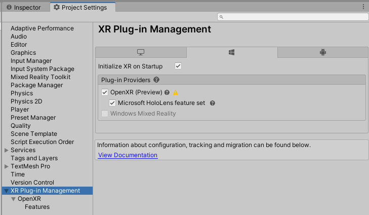
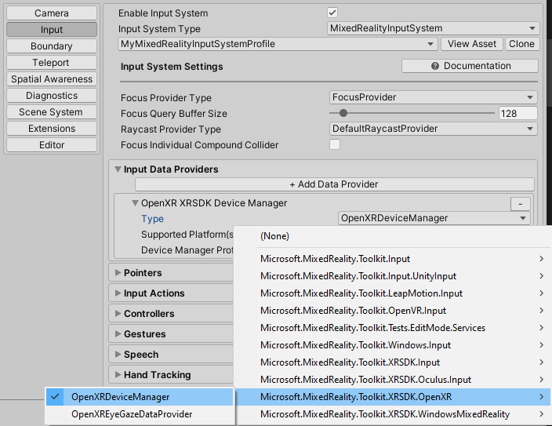

# Getting started with MRTK and XR SDK

XR SDK is Unity's [new XR pipeline in Unity 2019.3 and beyond](https://blogs.unity3d.com/2020/01/24/unity-xr-platform-updates/). In Unity 2019, it provides an alternative to the existing XR pipeline. In Unity 2020, it will become the only XR pipeline in Unity.

## Prerequisites

To get started with the Mixed Reality Toolkit, follow [the provided steps](Installation.md) to add MRTK to a project.

## Configuring Unity for the XR SDK pipeline

The XR SDK pipeline currently supports 3 platforms: Windows Mixed Reality, Oculus, and OpenXR. The sections below will cover the steps needed to configure XR SDK for each platform.

### Windows Mixed Reality

1. Go into Unity's Package Manager and install the Windows XR Plugin package, which adds support for Windows Mixed Reality on XR SDK. This will pull down a few dependency packages as well. Ensure that the following all successfully installed:
   1. XR Plugin Management
   1. Windows XR Plugin
   1. XR Legacy Input Helpers
1. Go to Edit > Project Settings.
1. Click on the XR Plug-in Management tab in the Project Settings window.
1. Go to the Universal Windows Platform settings and ensure Windows Mixed Reality is checked under Plug-in Providers.
1. Ensure that Initialize XR on Startup is checked.
1. (**_Required for in-editor HoloLens Remoting, otherwise optional_**) Go to the Standalone settings and ensure Windows Mixed Reality is checked under Plug-in Providers. Also ensure that Initialize XR on Startup is checked.
1. (**_Optional_**) Click on the Windows Mixed Reality tab under XR Plug-in Management and create a custom settings profile to change the defaults. If the list of settings are already there, no profile needs to be created.

### Oculus

1. Follow the [How to configure Oculus Quest in MRTK using the XR SDK pipeline](CrossPlatform/OculusQuestMRTK.md) guide to the end. The guide outlines the steps needed to configure both Unity and MRTK to use the XR SDK pipeline for the Oculus Quest.

### OpenXR (Preview)

> [!IMPORTANT]
> OpenXR in Unity is only supported on Unity 2020.2 and higher.
>
> Currently, it also only supports x64 and ARM64 builds.

1. Follow the [Using the Mixed Reality OpenXR Plugin for Unity](https://aka.ms/openxr-unity-install) guide, including the steps for configuring XR Plugin Management and Optimization to install the OpenXR plug-in to your project. Ensure that the following have successfully installed:
   1. XR Plugin Management
   1. OpenXR Plugin
   1. Mixed Reality OpenXR Plugin
1. Go to Edit > Project Settings.
1. Click on the XR Plug-in Management tab in the Project Settings window.
1. Ensure that Initialize XR on Startup is checked.
1. (**_Optional_**) If targeting HoloLens 2, make sure you're on the UWP platform and select Microsoft HoloLens Feature Set

> [!NOTE]
> If you have a pre-existing project that is using MRTK from UPM, make sure that the following line is in the **link.xml** file located in the MixedRealityToolkit.Generated folder.

`<assembly fullname = "Microsoft.MixedReality.Toolkit.Providers.OpenXR" preserve="all"/>`

> [!NOTE]
> For the initial release of MRTK and OpenXR, only the HoloLens 2 articulated hands and Windows Mixed Reality motion controllers are natively supported. Support for additional hardware will be added in upcoming releases.

## Configuring MRTK for the XR SDK pipeline

If using OpenXR, choose "DefaultOpenXRConfigurationProfile" as the active profile or clone it to make customizations.

If using other XR runtimes in the XR Plug-in Management configuration, like Windows Mixed Reality or Oculus, choose "DefaultXRSDKConfigurationProfile" as the active profile or clone it to make customizations.

These profiles are set up with the correct systems and providers, where needed. See [the profiles docs](Profiles/Profiles.md#xr-sdk) for more information on profile and sample support with XR SDK.

To migrate an existing profile to XR SDK, the following services and data providers should be updated:

### Camera

From [`WindowsMixedReality.WindowsMixedRealityCameraSettings`](xref:Microsoft.MixedReality.Toolkit.WindowsMixedReality.WindowsMixedRealityCameraSettings)

to

| OpenXR | Windows Mixed Reality |
|--------|-----------------------|
| [`GenericXRSDKCameraSettings`](xref:Microsoft.MixedReality.Toolkit.XRSDK.GenericXRSDKCameraSettings) | [`XRSDK.WindowsMixedReality.WindowsMixedRealityCameraSettings`](xref:Microsoft.MixedReality.Toolkit.XRSDK.WindowsMixedReality.WindowsMixedRealityCameraSettings) **and** [`GenericXRSDKCameraSettings`](xref:Microsoft.MixedReality.Toolkit.XRSDK.GenericXRSDKCameraSettings) |

### Input

From [`WindowsMixedReality.Input.WindowsMixedRealityDeviceManager`](xref:Microsoft.MixedReality.Toolkit.WindowsMixedReality.Input.WindowsMixedRealityDeviceManager)

to

| OpenXR | Windows Mixed Reality |
|--------|-----------------------|
| [`OpenXRDeviceManager`](xref:Microsoft.MixedReality.Toolkit.XRSDK.OpenXR.OpenXRDeviceManager) | [`XRSDK.WindowsMixedReality.WindowsMixedRealityDeviceManager`](xref:Microsoft.MixedReality.Toolkit.XRSDK.WindowsMixedReality.WindowsMixedRealityDeviceManager) |

__OpenXR__:

__Windows Mixed Reality__:

### Boundary

From [`MixedRealityBoundarySystem`](xref:Microsoft.MixedReality.Toolkit.Boundary.MixedRealityBoundarySystem)

to

| OpenXR | Windows Mixed Reality |
|--------|-----------------------|
| [`XRSDKBoundarySystem`](xref:Microsoft.MixedReality.Toolkit.XRSDK.XRSDKBoundarySystem) | [`XRSDKBoundarySystem`](xref:Microsoft.MixedReality.Toolkit.XRSDK.XRSDKBoundarySystem) |

### Spatial awareness

From [`WindowsMixedReality.SpatialAwareness.WindowsMixedRealitySpatialMeshObserver`](xref:Microsoft.MixedReality.Toolkit.WindowsMixedReality.SpatialAwareness.WindowsMixedRealitySpatialMeshObserver)

to

| OpenXR | Windows Mixed Reality |
|--------|-----------------------|
| In progress | [`XRSDK.WindowsMixedReality.WindowsMixedRealitySpatialMeshObserver`](xref:Microsoft.MixedReality.Toolkit.XRSDK.WindowsMixedReality.WindowsMixedRealitySpatialMeshObserver) |

### Controller mappings

If using custom controller mapping profiles, open one of them and run the Mixed Reality Toolkit -> Utilities -> Update -> Controller Mapping Profiles menu item to ensure the new XR SDK controller types are defined.

## See also

* [Getting started with AR development in Unity](https://docs.unity3d.com/Manual/AROverview.html)
* [Getting started with VR development in Unity](https://docs.unity3d.com/Manual/VROverview.html)
