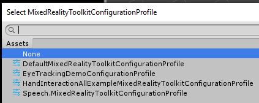

# Getting started with the Mixed Reality Toolkit

The Mixed Reality Toolkit (MRTK) is a new platform for building your Mixed Reality experiences for Virtual Reality (VR) and Augmented Reality (AR), aimed at accelerating your content production by removing any of the common complexities that complicate projects in a true multi-platform / multi-vr solution.
The MRTK solves this by providing a common logical platform to build your dream, together with a rich set of services and SDK components for building your project.

## Prerequisites

To get started with the Mixed Reality Toolkit you will need:

* [Visual Studio 2017](http://dev.windows.com/downloads)
* [Unity 2018.3+](https://unity3d.com/get-unity/download/archive)
* [Latest MRTK release](https://github.com/Microsoft/MixedRealityToolkit-Unity/releases)

## Get the latest MRTK Unity packages
1. Go to the  [MRTK release page](https://github.com/Microsoft/MixedRealityToolkit-Unity/releases).
2. Under Assets, download both Microsoft.MixedRealityToolkit.Unity.Examples.unitypackage and Microsoft.MixedRealityToolkit.Unity.Foundation.unitypackage
> The Mixed Reality Toolkit is available via [multiple delivery mechanisms](DownloadingTheMRTK.md) and in the future will also be available via the Unity package manager once Unity makes that option available.

## Open and run the HandInteractionExample scene in editor
1. Create a new Unity project. We used 2018.3.9f1 for this tutorial, though any Unity 2018.3.X release should work.

2. Import the Microsoft.MixedRealityToolkit.Unity.Foundation package you've downloaded by going into "Asset -> Import Package -> Custom Package", selecting the .unitypackage file, ensuring all items to import are checked, and then selecting "Import".

3. Import Microsoft.MixedRealityToolkit.Unity.Examples.unitypackage following the same steps as above.

6. Open the HandInteractionExamples scene under `Assets\MixedRealityToolkit.Examples\Demos\HandTracking\Scenes\HandInteractionExamples`

7. You will get a prompt asking you to import "TMP Essentials". 

8. Select "Import TMP essentials" button. "TMP Essentials" refers to TextMeshPro plugin, which some of the MRTK examples use for improved text rendering.

9. Close the TMPPro dialog. After this you need to reload Unity, so close unity and re-open unity, then open your project and go back to the scene

Finally, press the play button to start the scene and explore the scene! You can use simulated hands to interact in editor. Press WASD keys to fly around the scene. Press and hold right mouse to look around. Press and hold space to turn on right hand. Try pressing buttons using either the far hand ray or near interaction by moving the hand. 

There's quite a bit to explore in this scene, have fun! Learn more about the components in the scene [in the hand interaction examples guide](README_HandInteractionExamples.md). Read through [input simulation docs](InputSimulation/InputSimulationService.md) to learn how to simulate hand input in editor. 

Congratulations, you just used your first MRTK scene. Now onto creating your own stuff...

## Add MRTK to a new scene or new project

### 1. Create a new project, or start a new scene in your current project

> *Note* when creating a new project with Unity 2018, Unity gives you several templates to choose from.  Currently the **MRTK does not yet support the Scriptable Render Pipeline**, so the LWSRP, HDSRP and VRSRP projects are not compatible with MRTK projects.

### 2. Import MRTK Packages
1. Import the Microsoft.MixedRealityToolkit.Unity.Foundation package you've downloaded by going into "Asset -> Import Package -> Custom Package", selecting the .unitypackage file, ensuring all items to import are checked, and then selecting "Import".

2. Import the Microsoft.MixedRealityToolkit.Unity.Examples.unitypackage following the same steps as above.

> The examples package is optional but contains useful demonstration scenes for current MRTK features.

> Note that some prefabs and assets require TextMesh Pro, meaning you have to have the TextMesh Pro package installed and the assets in your project (Window -> TextMeshPro -> Import TMP Essential Resources). **After you import TMP Essentials Resources, you need to restart Unity to see changes**.

### 3. Configure your first Mixed Reality Toolkit scene

The toolkit has been designed so that there is just one object that is mandatory in your scene.  This is there to provide the core configuration and runtime for the Mixed Reality Toolkit.

Configuring your scene is extremely simple by simply selecting the following from the Editor menu:
> Mixed Reality Toolkit -> Add to Scene and Configure

You will see a prompt like this:

Click "OK". You will then be prompted to choose an MRTK Configuration profile. Select "DefaultMixedRealityToolkitConfigurationProfile".

Once this completes, you will see the following in your Scene hierarchy:

Which contains the following:

* Mixed Reality Toolkit - The toolkit itself, providing the central configuration entry point for the entire framework.
* MixedRealityPlayspace - The parent object for the headset, which ensures the headset / controllers and other required systems are managed correctly in the scene.
* The Main Camera is moved as a child to the Playspace - Which allows the playspace to manage the camera in conjunction with the SDK's

> **Note** While working in your scene, **DON'T move the Main Camera** (or the playspace) from the scene origin (0,0,0).  This is controlled by the MRTK and the active SDK.
> If you need to move the players start point, then **move the scene content and NOT the camera**!

### 5. Hit play
Press the play button to start the scene. Press WASD keys to fly around the scene. Press and hold right mouse to look around. Press and hold space to turn on right hand. Try pressing buttons using either the far hand ray or near interaction by moving the hand. 

You are now ready to start building your Mixed Reality Solution, just start adding content and get building. Here are suggested next steps.

## Get building your project

Now your project is up and running, you can start building your Mixed Reality project.  

For more information on the rest of the toolkit, please check the following guides:

* Learn about the UX controls available in MRTK in [building blocks for UI and interactions](#building-blocks-for-ui-and-interactions).
* Explore the [hand interaction examples scene](README_HandInteractionExamples.md). Instructions to get started are above.
* Read through [input simulation guide](InputSimulation/InputSimulationService.md) to learn how to simulate hand input in editor.
* Learn how to work with the MRTK Configuration profile in the [mixed reality configuration guide](MixedRealityConfigurationGuide.md)

## Building blocks for UI and Interactions
|   [Button](README_Button.md) |  [Bounding Box](README_BoundingBox.md) |  [Manipulation Handler](README_ManipulationHandler.md) |
|:--- | :--- | :--- |
| A button control which supports various input methods including HoloLens2's articulated hand | Standard UI for manipulating objects in 3D space | Script for manipulating objects with one or two hands |
|   [Slate](README_Slate.md) |  [System Keyboard](README_SystemKeyboard.md) |  [Interactable](README_Interactable.md) |
| 2D style plane which supports scrolling with articulated hand input | Example script of using the system keyboard in Unity  | A script for making objects interactable with visual states and theme support |
|   [Solver](README_Solver.md) |  [Object Collection](README_ObjectCollection.md) |  [Tooltip](README_Tooltip.md) |
| Various object positioning behaviors such as tag-along, body-lock, constant view size and surface magnetism | Script for lay out an array of objects in a three-dimensional shape | Annotation UI with flexible anchor/pivot system which can be used for labeling motion controllers and object. |
|   [App Bar](README_AppBar.md) |  [Pointers](README_Pointers.md) |  [Fingertip Visualization](README_FingertipVisualization.md) |
| UI for Bounding Box's manual activation | Learn about various types of pointers | Visual affordance on the fingertip which improves the confidence for the direct interaction |

## MRTK Example Scene
You can find various types of interactions and UI controls in the [hand interaction examples scene](README_HandInteractionExamples.md).

# Upgrading from the HoloToolkit (HTK/MRTK v1)

There is not a direct upgrade path from the HoloToolkit to Mixed Reality Toolkit v2 due to the rebuilt framework.  However, it is possible to import the MRTK into your HoloToolkit project and start work migrating your implementation if you wish.

* [HoloToolkit to Mixed Reality Toolkit Porting Guide](HTKToMRTKPortingGuide.md)

