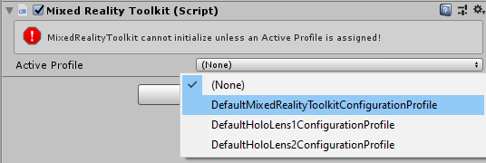

# Getting Started with MRTK

The Mixed Reality Toolkit (MRTK) is a cross-platform toolkit for building Mixed Reality experiences for Virtual Reality (VR) and Augmented Reality (AR).

## Prerequisites

To get started with the Mixed Reality Toolkit you will need:

* [Visual Studio 2019](https://visualstudio.microsoft.com/downloads/)
* [Unity 2018.4.x, 2019.1.x or 2019.2.x](https://unity3d.com/get-unity/download/archive)

  MRTK supports both IL2CPP and .NET scripting backends on Unity 2018

* [Windows SDK 18362+](https://developer.microsoft.com/en-US/windows/downloads/windows-10-sdk).

  This is necessary if you are building a UWP app for WMR, HoloLens 1, or HoloLens 2. This is not necessary
  when building for OpenVR.

## Add MRTK to your Unity Project

**Required**

1. [Get the latest MRTK Unity packages](#get-the-latest-mrtk-unity-packages)
1. [Import MRTK packages into your Unity project](#import-mrtk-packages-into-your-unity-project)
1. [Switch your Unity project to the target platform](#switch-your-unity-project-to-the-target-platform)
1. [Add MRTK to a new scene or new project](#add-mrtk-to-a-new-scene-or-new-project)

**Optional**

- [Getting started tutorials](#get-the-latest-mrtk-unity-packages)
- [Learn about the core building blocks of MRTK](#learn-about-the-core-building-blocks-of-mrtk)
- [Run the HandInteractionExamples scene in the Unity Editor](#run-the-handinteractionexamples-scene-in-the-unity-editor)

### Get the latest MRTK Unity packages

1. Go to the <a href="https://github.com/Microsoft/MixedRealityToolkit-Unity/releases" target="_blank">MRTK release page</a>.
1. Under Assets, download
    - **Microsoft.MixedRealityToolkit.Unity.Foundation.unitypackage**
    - (**_Optional_**) Microsoft.MixedRealityToolkit.Unity.Extensions.unitypackage
    - (**_Optional_**) Microsoft.MixedRealityToolkit.Unity.Tools.unitypackage
    - (**_Optional_**) Microsoft.MixedRealityToolkit.Unity.Examples.unitypackage
    - (**_Optional_**, **_Experimental_**) Microsoft.MixedRealityToolkit.Unity.Providers.UnityAR.unitypackage

The Mixed Reality Toolkit is now available for download on NuGet.org, for details see [MRTK NuGet Packages](MRTKNuGetPackage.md).

#### Package contents

**Foundation**

The Microsoft.MixedRealityToolkit.Unity.Foundation package includes the core components required to create a mixed reality application.

| Folder | Component | Description |
| --- | --- | --- |
| MixedRealityToolkit | | Interface and type definitions, base classes, standard shader. |
| MixedRealityToolkit.Providers | | |
| | [ObjectMeshObserver](SpatialAwareness/SpatialObjectMeshObserver.md) | Spatial awareness observer using a 3D model as the data. |
| | OpenVR | Support for OpenVR devices. |
| | WindowsMixedReality | Support for Windows Mixed Reality devices, including Microsoft HoloLens and immersive headsets. |
| | WindowsVoiceInput | Support for speech and dicatation on Microsoft Windows platforms. |
| MixedRealityToolkit.SDK | | |
| | Experimental | Experimental features, including shaders, user interface controls and individual system managers. |
| | Features | Functionality that builds upon the Foundation package. |
| | Profiles | Default profiles for the Microsoft Mixed Reality Toolkit systems and services. |
| | StandardAssets | Common assets; models, textures, materials, etc. |
| MixedRealityToolkit.Services | | |
| | [BoundarySystem](Boundary/BoundarySystemGettingStarted.md) | System implementing VR boundary support. |
| | [CameraSystem](CameraSystem/CameraSystemOverview.md) | System implementing camera configuration and management. |
| | [DiagnosticsSystem](Diagnostics/DiagnosticsSystemGettingStarted.md) | System implementing in application diagnostics, for example a visual profiler. |
| | [InputAnimation](InputSimulation/InputAnimationRecording.md) | Support for recording head movement and hand tracking data. |
| | [InputSimulation](InputSimulation/InputSimulationService.md) | Support for in-editor simulation of hand and eye input. |
| | [InputSystem](Input/Overview.md) | System providing support for accessing and handling user input. |
| | [SceneSystem](SceneSystem/SceneSystemGettingStarted.md) | System providing multi-scene application support. |
| | [SpatialAwarenessSystem](SpatialAwareness/SpatialAwarenessGettingStarted.md) | System providing support for awareness of the user's environment. |
| | [TeleportSystem](TeleportSystem/Overview.md) | System providing support for telporting (moving about the experience in jumps). |

**Extensions**

The optional Microsoft.MixedRealityToolkit.Unity.Extensions package includes additional services that extend the functionality of the Microsoft Mixed Reality Toolkit.

> [!Note]
> The extensions package requires Microsoft.MixedRealityToolkit.Unity.Foundation.

| Folder | Component | Description |
| --- | --- | --- |
| MixedRealityToolkit.Extensions | |
| | LostTrackingService | Service that simplifies handing of tracking loss on Microsoft HoloLens devices. |
| | [SceneTransitionService](Extensions/SceneTransitionService/SceneTransitionServiceOverview.md) | Service that simplifies adding smooth scene transitions. |

**Tools**

The optional Microsoft.MixedRealityToolkit.Unity.Tools package includes helpful tools that enhance the mixed reality development experience using the Microsoft Mixed Reality Toolkit.
These tools are located in the **Mixed Reality Toolkit > Utilities** menu in the Unity Editor.

> [!Note]
> The tools package requires Microsoft.MixedRealityToolkit.Unity.Foundation.

| Folder | Component | Description |
| --- | --- | --- |
| MixedRealityToolkit.Tools | |
| | [DependencyWindow](Tools/DependencyWindow.md) | Tool that creates a dependency graph of assets in a project. |
| | [ExtensionServiceCreator](Tools/ExtensionServiceCreationWizard.md) | Wizard to assist in creating extension services. |
| | [OptimizeWindow](Tools/OptimizeWindow.md) | Utility to help automate configuring a mixed reality project for the best performance in Unity. |
| | ReserializeAssetsUtility | Provides support for reserializing specific Unity files. |
| | [RuntimeTools/Tools/ControllerMappingTool](Tools/ControllerMappingTool.md) | Utility enabling developers to quickly determine Unity mappings for hardware controllers. |
| | ScreenshotUtility | Enables capturing application images in the Unity editor. |
| | TextureCombinerWindow | Utility to combine graphics textures. |

**Examples**

The optional Microsoft.MixedRealityToolkit.Unity.Examples package includes demonstration projects that illustrate the features of the Microsoft Mixed Reality Toolkit.

> [!Note]
> The examples package requires Microsoft.MixedRealityToolkit.Unity.Foundation.

| Folder | Component | Description |
| --- | --- | --- |
| MixedRealityToolkit.Examples | | |
| | Demos | Simple scenes illustrating one or two related features. |
| | Experimental | Demo scenes illustrating experimental features. |
| | Inspectors | Unity Editor inspectors used by demo scenes. |
| | StandardAssets | Common assets shared by multiple demo scenes. |

**Providers.UnityAR**

> [!Note]
> The UnityAR package requires Microsoft.MixedRealityToolkit.Unity.Foundation.

| Folder | Component | Description |
| --- | --- | --- |
| MixedRealityToolkit.Staging | | |
| | [UnityAR](CameraSystem/UnityArCameraSettings.md) | Camera settings provider enabling MRTK use with mobile AR devices. |

### Import MRTK packages into your Unity project

1. Create a new Unity project, or open an existing project. When creating a project, make sure to select "3D" as the template type.
1. Import the **Microsoft.MixedRealityToolkit.Unity.Foundation.unitypackage** you downloaded by going into "Asset -> Import Package -> Custom Package", selecting the .unitypackage file, ensure all items to import are checked, and then selecting "Import".
1. (**_Optional_**) Import the **Microsoft.MixedRealityToolkit.Unity.Examples.unitypackage** following the same steps as above. The examples package is optional and contains useful demonstration scenes for current MRTK features.
1. (**_Optional_**) Import the **Microsoft.MixedRealityToolkit.Unity.Tools.unitypackage** following the same steps as for the foundation package. These tools package is optional and contains useful tools, such as the ExtensionServiceCreator, that enhance the MRTK developer experience.
1. (**_Optional_**) Import the **Microsoft.MixedRealityToolkit.Unity.Extensions.unitypackage** following the same steps as for the foundation package. The extensions package provides a set of useful optional components for the MRTK.
1. (**_Optional_**) Import the **Microsoft.MixedRealityToolkit.Unity.Providers.UnityAR.unitypackage** following the same steps as for the foundation package. This package provides support for mobile AR (phone, tablet) devices in the MRTK.

> [!Note]
> Importing Microsoft.MixedRealityToolkit.Unity.Providers.UnityAR.unitypackage requires additional steps to be performed. For more information, please see the [UnityAR camera settings provider](CameraSystem/UnityArCameraSettings.md) article.

After importing the Foundation package, you may see a prompt similar to the following:

MRTK is attempting to set up your project for building Mixed Reality solutions by doing the following:

* Enable XR Settings for your current platform (enabling the XR checkbox).
* Force Text Serialization / Visible Meta files (recommended for Unity projects using source control).

Accepting these options is completely optional, but recommended.

Some prefabs and assets require TextMesh Pro, meaning you have to have the TextMesh Pro package installed and the assets in your project (Window -> TextMeshPro -> Import TMP Essential Resources). **After you import TMP Essentials Resources, you need to restart Unity to see changes**.

### Switch your Unity project to the target platform

With the packages imported, the next step is to select the correct platform for the application.

To create a **HoloLens application**, switch to Universal Windows Platform:

1. Open menu : File > Build Settings
1. Select **Universal Windows Platform** in the **Platform** list
1. Click on the **Switch Platform** button

>[!NOTE]
> The Mixed Reality Toolkit will prompt to apply recommended changes to the project when the platform is selected. Whenever the platform is switched, the appropriate settings will be checked and prompted, if necessary.

### Add MRTK to a new scene or new project

1. Create a new Unity project, or start a new scene in your current project. 

2. Make sure you have imported the MRTK packages (we recommend both Foundation and Examples, though Examples is not required) following [the steps above](#import-mrtk-packages-into-your-unity-project).

3. From the menu bar, select Mixed Reality Toolkit -> Add to Scene and Configure

4. In the Inspector, you will see a prompt like this:

Click "OK".

5. Select "DefaultMixedRealityToolkitConfigurationProfile" from the list.

For more information on profiles, please see the [profiles](Profiles/Profiles.md) article.

> [!NOTE] 
> If you are getting started on the HoloLens or HoloLens 2, you should choose the "DefaultHoloLens1ConfigurationProfile" or DefaultHoloLens2ConfigurationProfile" instead.
> See the [profiles](Profiles/Profiles.md#hololens-2-profile) for more information on the differences between DefaultMixedRealityToolkitConfigurationProfile and DefaultHoloLens2ConfigurationProfile.

You will then see the following in your Scene hierarchy:

Which contains the following:

* **Mixed Reality Toolkit** - The toolkit itself, providing the central configuration entry point for the entire framework.
* **MixedRealityPlayspace** - The parent object for the headset, which ensures the headset / controllers and other required systems are managed correctly in the scene.
* The Main Camera is moved as a child to the Playspace - Which allows the playspace to manage the camera in conjunction with the SDKs

>[!NOTE]
> While working in your scene, **DO NOT move the Main Camera** (or the **MixedRealityPlayspace**) from the scene origin (0,0,0).  This is controlled by the MRTK and the active SDK. If you need to move the players start point, then **move the scene content and NOT the camera**!

6. Hit play and test out hand simulation by pressing the **space bar**.

You are now ready to build and deploy to device! Follow the steps instructions at [Build and Deploy MRTK](BuildAndDeploy.md).

### Getting started tutorials

If you are new to MRTK, or MR development, we recommend you check out the [Getting started tutorials](https://docs.microsoft.com/en-us/windows/mixed-reality/mrlearning-base) which uses MRTK v2. 

### Learn about the core building blocks of MRTK

Check out [MRTK 101: How to use Mixed Reality Toolkit Unity for Basic Interactions (HoloLens 2, HoloLens, Windows Mixed Reality, Open VR)](https://docs.microsoft.com/en-us/windows/mixed-reality/mrtk-101) to learn about core building blocks.

### Run the HandInteractionExamples scene in the Unity Editor

The [hand interaction examples scene](README_HandInteractionExamples.md) article is a great place to learn more about the UX controls and interactions in MRTK. 

To try the hand interaction scene, do the following steps.

1. Open the **HandInteractionExamples** scene under `Assets\MixedRealityToolkit.Examples\Demos\HandTracking\Scenes\HandInteractionExamples`

2. You may get a prompt asking you to import "TMP Essentials".

If you get such a prompt, select "Import TMP essentials" button. "TMP Essentials" refers to Text Mesh Pro plugin, which some of the MRTK examples use for improved text rendering. (See [Text in Unity](https://docs.microsoft.com/en-us/windows/mixed-reality/text-in-unity) for more detailed information)

3. Close the TMP dialog. After this you need to reload the scene. You can do this by double clicking the scene in the project tab.

4. Press the play button.

## Using the In-Editor Hand Input Simulation to test a scene

The in-editor input simulation allows you to test virtual object behavior given a specific type of input such as [hands](InputSimulation/InputSimulationService.md#hand-simulation) or [eyes](EyeTracking/EyeTracking_BasicSetup.md#simulating-eye-tracking-in-the-unity-editor).

How to move around in the scene: 
- Use **W/A/S/D** keys to move the camera forward/left/back/right.
- Use **Q/E** to move the camera vertically.
- Press and hold the **right mouse button** to rotate the camera.

How to simulate hand input:
- Press and hold the **space bar** to enable the right hand. 
- While holding the space bar, move your mouse to move the hand.
- Use the mouse **scroll wheel** to adjust the depth of the hand.
- Click the **left mouse button** to simulate pinch gesture.
- Use **T/Y** keys to make the hand persistent in the view.
- Hold **CTRL** key and move the mouse to rotate the hand.

Have fun exploring the scene! You can learn more about the UI controls [in the hand interaction examples guide](README_HandInteractionExamples.md). Also, read through [input simulation docs](InputSimulation/InputSimulationService.md) to learn more about in-editor hand input simulation in MRTK.

Congratulations, you just used your first MRTK scene. Now onto creating your own experiences...

## Next steps

Here are some suggested next steps:

* Check out [MRTK 101: How to use Mixed Reality Toolkit Unity for Basic Interactions](https://docs.microsoft.com/en-us/windows/mixed-reality/mrtk-101) to learn about how to achieve common spatial interactions such as grab, move, scale, and rotate.
* Learn about the UX controls available in MRTK in [UI and interaction building blocks](../README.md#ui-and-interaction-building-blocks).
* Try [MRTK Examples Hub](README_ExampleHub.md) (pre-built app packages are included in the release page for your convenience)
* Learn how to work with the MRTK Configuration profile in the [mixed reality configuration guide](MixedRealityConfigurationGuide.md).
* Learn about the [MRTK's Architecture](../Documentation/Architecture/Overview.md)
* Learn about the [MRTK's Input System](../Documentation/Input/Overview.md)
* Learn about the [MRTK's Tools](../README.md#tools) that will empower your mixed reality design and development.
* Read through [input simulation guide](InputSimulation/InputSimulationService.md) to learn how to simulate hand input in editor.

## Upgrading from the HoloToolkit (HTK/MRTK v1)

There is not a direct upgrade path from the HoloToolkit to Mixed Reality Toolkit v2 due to the rebuilt framework. However, it is possible to import the MRTK into your HoloToolkit project and migrate your implementation. For more information please see the [HoloToolkit to Mixed Reality Toolkit Porting Guide](HTKToMRTKPortingGuide.md)
