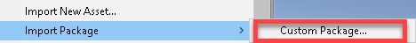
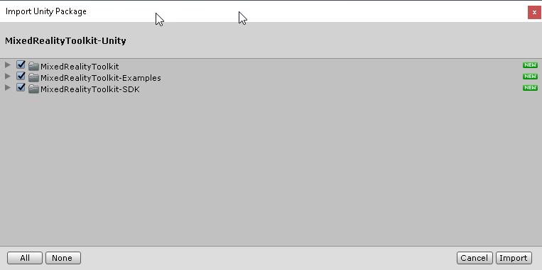
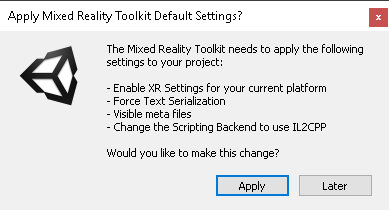
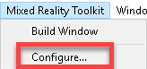
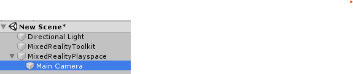
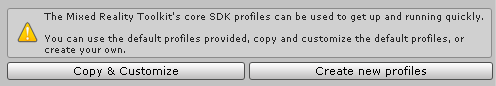
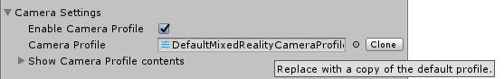
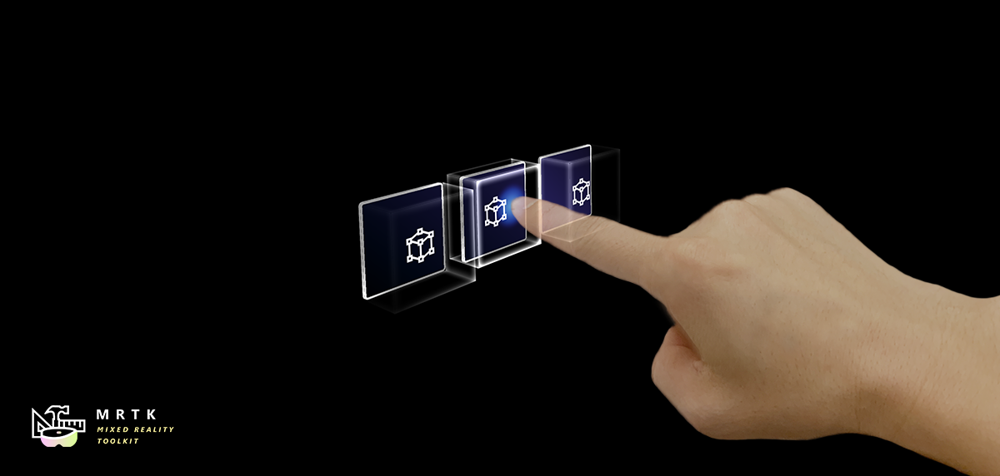

# Getting started with the Mixed Reality Toolkit

The Mixed Reality Toolkit (MRTK) is a new platform for building your Mixed Reality experiences for Virtual Reality (VR) and Augmented Reality (AR), aimed at accelerating your content production by removing any of the common complexities that complicate projects in a true multi-platform / multi-vr solution.
The MRTK solves this by providing a common logical platform to build your dream, together with a rich set of services and SDK components for building your project.  Al these components are geared towards the new MRTK platform that abstracts out all the different ways that each platform delivers its experience.

## Prerequisites

To get started with the Mixed Reality Toolkit you will need:

* [Visual Studio 2017](http://dev.windows.com/downloads)
* [Unity 2018.3+](https://unity3d.com/get-unity/download/archive)
* [Latest MRTK release](https://github.com/Microsoft/MixedRealityToolkit-Unity/releases)
* [Windows SDK 18362+](https://www.microsoft.com/en-us/software-download/windowsinsiderpreviewSDK)

## Upgrading from the HoloToolkit (HTK/MRTK v1)

There is not a direct upgrade path from the HoloToolkit to Mixed Reality Toolkit v2 due to the rebuilt framework.  However, it is possible to import the MRTK into your HoloToolkit project and start work migrating your implementation if you wish.

* [HoloToolkit to Mixed Reality Toolkit Porting Guide](HTKToMRTKPortingGuide.md)

## Starting your new MRTK v2 project

We have done an incredible amount of work to ensure the new project experience is as streamlined as possible.  To this end, we endeavoured to get you up and running as fast as possible.

To get your first project up and running, the steps are as follows:

### 1. Create your new project (or start a new scene in your current project)

> *Note* when creating a new project with Unity 2018, Unity gives you several templates to choose from.  Currently the **MRTK does not yet support the Scriptable Render Pipeline**, so the LWSRP, HDSRP and VRSRP projects are not compatible with MRTK projects.  Please stay tuned to the MRTK GitHub site for future announcements on SRP support.

### 2. [Import the Mixed Reality Toolkit asset](https://github.com/Microsoft/MixedRealityToolkit-Unity/releases)

> The Mixed Reality Toolkit is available via [multiple delivery mechanisms](DownloadingTheMRTK.md) and in the future will also be available via the Unity package manager once Unity makes that option available.

Get the asset and import it in to your Unity project using  "Asset -> Import Package -> Custom Package" from the Unity Editor menu.

Accept all the content and continue.

> The SDK is optional but highly recommended for new users.  Once you have a feel for how the toolkit works, you can remove these safely if you are not using them.

> The MRTK also provides a [separate "Examples" asset](https://github.com/Microsoft/MixedRealityToolkit-Unity/releases), which currently contains demonstration scenes for current MRTK features.  In the future this will also contain educational "Example" scenes to aid with learning implementation tricks with the toolkit.

Note that some prefabs and assets require TextMesh Pro, meaning you have to have the TextMesh Pro package installed and the assets in your project (Window -> TextMeshPro -> Import TMP Essential Resources).

### 3. Accept the Setup prompt (optional)

Once imported, the MRTK will attempt to setup your project automatically for building Mixed Reality solutions, namely setting:

* Enable XR Settings for your current platform (enabling the XR checkbox)
> Note, you need to do this for each platform you wish to deploy on
* Force Text Serialization / Visible Meta files (recommended for Unity projects using source control)
* Change the Scripting back-end to use IL2CPP (as Unity is deprecating the .NET scripting back-end)

> The only option which is mandatory (and not listed above) is to set Unity to use the .NET 4 scripting runtime by default, as the MRTK uses advanced coding functions only available in .NET4+.  
> From Unity 2018.3 and above, this will be the default for new Unity Projects.

This prompt will automatically set the above options for you and restart Unity (for the .NET update) ready to start building your MRTK project.

Accepting these options is completely optional (except .NET 4), if you click **Later**, the MRTK will not ask you again and leave you to it.  You can then choose to set these options manually later as you see fit.

### 4. Configure your first Mixed Reality Toolkit scene

The toolkit has been designed so that there is just one object that is mandatory in your scene.  This is there to provide the core configuration and runtime for the Mixed Reality Toolkit (one of the key advantages in the new framework).

Configuring your scene is extremely simple by simply selecting the following from the Editor menu:
> Mixed Reality Toolkit -> Add to Scene and Configure

Once this completes, you will see the following in your Scene hierarchy:

> The MRTK will also select the configured profile, [click here for more details on this configuration screens](#configuring)

Which contains the following:

* Mixed Reality Toolkit - The toolkit itself, providing the central configuration entry point for the entire framework.
* MixedRealityPlayspace - The parent object for the headset, which ensures the headset / controllers and other required systems are managed correctly in the scene.
* The Main Camera is moved as a child to the Playspace - Which allows the playspace to manage the camera in conjunction with the SDK's
* UIRaycastCamera added as a child to the Main Camera - To enable seamless UI interactions through the toolkit

> **Note** While working in your scene, **DON'T move the Main Camera** (or the playspace) from the scene origin (0,0,0).  This is controlled by the MRTK and the active SDK.
> If you need to move the players start point, then **move the scene content and NOT the camera**!

### 5. Hit play

You are now ready to start building your Mixed Reality Solution, just start adding content and get building.
Switch to other platforms (ensure they have XR enabled in their player settings) and your project will still run as expected without change.

<a name="configuring"/>

## Configuring your project

The Mixed Reality Toolkit configuration is all centralized on one place and attached to the MixedRealityToolkit object in your active scene.

Clicking on this profile will show the configuration screens for the Mixed Reality Toolkit:

From here you can navigate to all the configuration profiles for the MRTK, including:

> The "Default" profiles provided by the Mixed Reality Toolkit are locked by default, so when you view these in the inspector they will appear greyed out.  This is to ensure you always have a common default for any project.  We recommend you create your own profiles (see below) when you need to customize the configuration for your project.

* Main Mixed Reality Toolkit Configuration
* Camera Settings
* Input System Settings
* Boundary Visualization Settings
* Teleporting Settings
* Spatial Awareness Settings
* Diagnostics Settings
* Additional Services Settings
* Input Actions Settings
* Input Actions Rules
* Pointer Configuration
* Gestures Configuration
* Speech Commands
* Controller Mapping Configuration
* Controller Visualization Settings

As you can see there are lots of options available and more will come available as we progress through the beta.

When you start a new project, we provide a default set of configurations with every option turned on, styled for a fully cross platform project.  These defaults are "Locked" to ensure you always have a common start point for your project and we encourage you to start defining your own settings as your project evolves.  For this we provide options to either:

* Copy the defaults in to a new profile for you to start customizing it for your project
* Start afresh with a brand-new profile.

When profiles are created by the MRTK, they are then placed in the following folder:

> "Assets\MixedRealityToolkit-Generated\CustomProfiles"

At each step in the configuration, you can choose to remove and create a new profile, or simply copy the existing settings and continue to customize:

### **[For more information on customizing the Configuration Profiles](MixedRealityConfigurationGuide.md)**
Please check out the [Mixed Reality Configuration Guide](MixedRealityConfigurationGuide.md)

## Get building your project

Now your project is up and running, you can start building your Mixed Reality project.  

For more information on the rest of the toolkit, please check the following guides:

* [Mixed Reality Configuration Guide](MixedRealityConfigurationGuide.md)
* [Getting to know the Mixed Reality Toolkit Input System]() (Coming Soon)
* [Customizing your controllers in the MRTK]() (Coming Soon)
* [A walkthrough the UX components of the MRTK SDK]() (Coming Soon)
* [Using Solvers to bind your objects together]() (Coming Soon)
* [Creating interactions between the player and your project]() (Coming Soon)
* [Configuration Profile Usage Guide]() (Coming Soon)
* [Guide to building Registered Services]() (Coming Soon)
* [Guide to Pointers documentation]() (Coming Soon)

## Building blocks for UI and Interactions
|   [Button](README_Button.md) |  [Bounding Box](README_BoundingBox.md) |  [Manipulation Handler](README_ManipulationHandler.md) |
|:--- | :--- | :--- |
| A button control which supports various input methods including HoloLens2's articulated hand | Standard UI for manipulating objects in 3D space | Script for manipulating objects with one or two hands |
|   [Slate](README_Slate.md) |  [System Keyboard](README_SystemKeyboard.md) |  [Interactable](README_Interactable.md) |
| 2D style plane which supports scrolling with articulated hand input | Example script of using the system keyboard in Unity  | A script for making objects interactable with visual states and theme support |
|   [Solver](README_Solver.md) |  [Object Collection](README_ObjectCollection.md) |  [Tooltip](README_Tooltip.md) |
| Various object positioning behaviors such as tag-along, body-lock, constant view size and surface magnetism | Script for lay out an array of objects in a three-dimensional shape | Annotation UI with flexible anchor/pivot system which can be used for labeling motion controllers and object. |
|   [App Bar](README_AppBar.md) |  [Pointers](README_Pointers.md) |  [Fingertip Visualization](README_FingertipVisualization.md) |
| UI for Bounding Box's manual activation | Learn about various types of pointers | Visual affordance on the fingertip which improves the confidence for the direct interaction |

## Example Scene
You can find various types of interactions and UI controls in this example scene.

