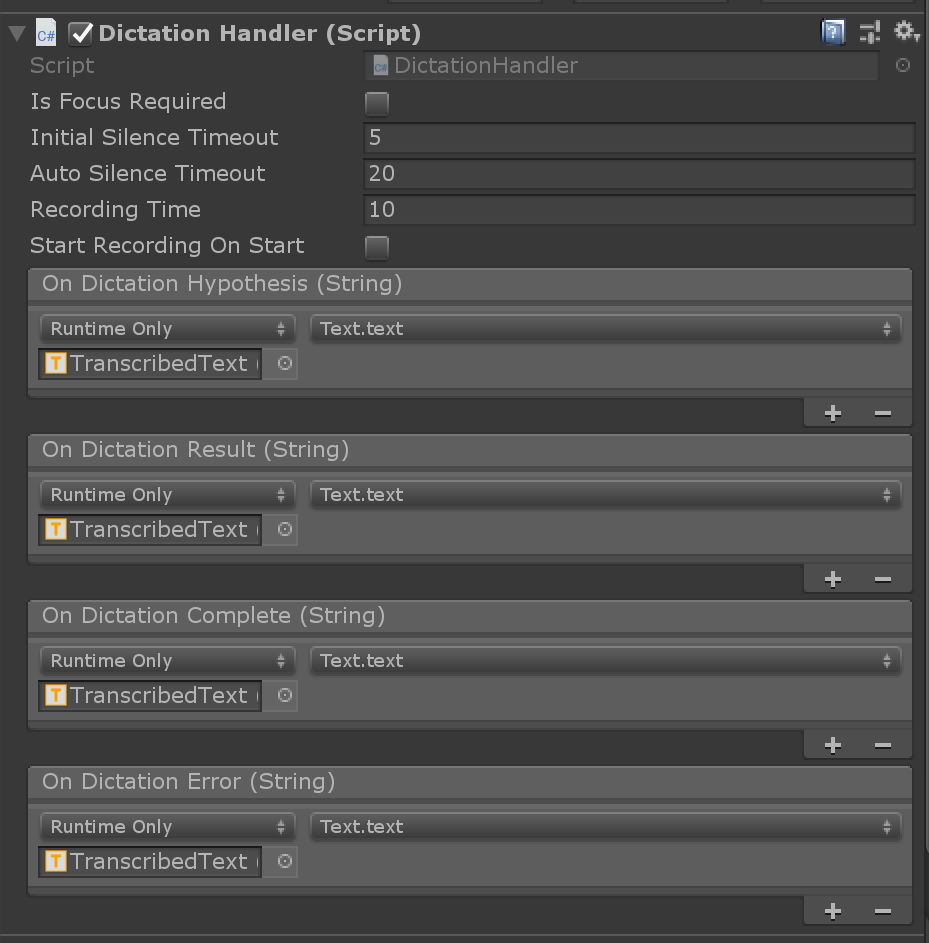
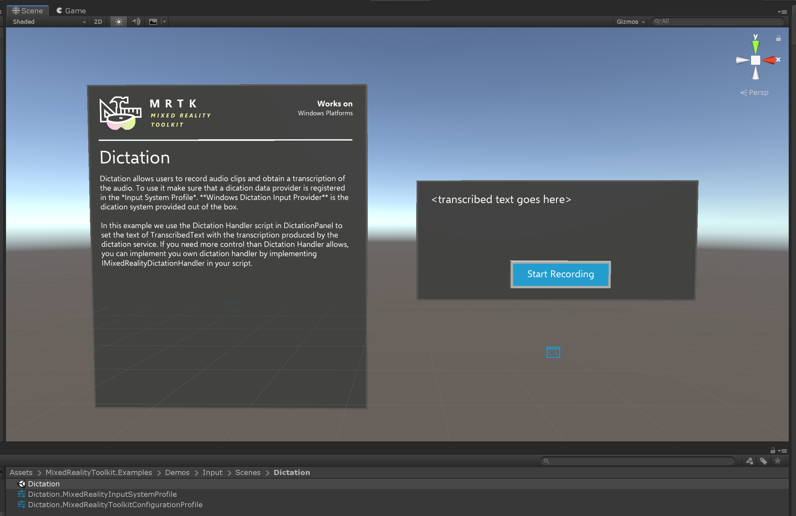

# Dictation

Dictation allows users to record audio clips and obtain a transcription. To use it make sure that a dictation system is registered in the *Input System Profile*. **Windows Dictation Input Provider** is the dication system provided out of the box but alternative dictation systems can be created implementing [`IMixedRealityDictationSystem`](xref:Microsoft.MixedReality.Toolkit.Input.IMixedRealityDictationSystem).

Once you have a dictation service set up, you can use the [`DictationHandler`](xref:Microsoft.MixedReality.Toolkit.Input.DictationHandler) script to start and stop recording sessions and obtain the transcription results via UnityEvents.

- **Dictation Hypothesis** is raised as the user speaks with early, rough transcriptions of the audio captured so far.
- **Dictation Result** is raised at the end of each sentence (i.e. when the user pauses) with the final transcription of the audio captured so far.
- **Dictation Complete** is raised at the end of the recording session with the full, final transcription of the audio.
- **Dictation Error** is raised to inform of errors in the dictation service. The transcription in this case contains a description of the error.

## Example Scene
**Dictation** scene in `MixedRealityToolkit.Examples\Demos\Input\Scenes\Dictation` shows the `DictationHandler` script in use. If you need more control, you can either extend this script or create your own implementing [`IMixedRealityDictationHandler`](xref:Microsoft.MixedReality.Toolkit.Input.IMixedRealityDictationHandler) to receive dictation events directly.

