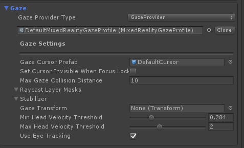

# Gaze

[Gaze](https://docs.microsoft.com/windows/mixed-reality/gaze) is a form of input that interacts
with the world based on where the user is looking. Gaze exists in two different flavors

## Head gaze

This type of gaze is based on the direction that the head/camera is looking at. Head gaze is active
on systems that don't support eye gaze, or in cases where the hardware may support eye gaze, but
the right set of [permissions and setup](../EyeTracking/EyeTracking_BasicSetup.md#eye-tracking-requirements-checklist)
has not been performed.

Head gaze is usually associated with HoloLens 1 style interactions involving looking at object by
placing it in the center of the Holographic Frame and then performing the air tap gesture.

## Eye gaze

This type of gaze is based on where the user's eyes are looking. Eye gaze is only present
on systems that support eye tracking. See the
[eye tracking documentation](../EyeTracking/EyeTracking_Main.md) for more details on how
to use eye gaze.

## GazeProvider

Gaze functionality (both head and eye) is provided by the
[GazeProvider](xref:Microsoft.MixedReality.Toolkit.Input.GazeProvider). This provider can be configured
in the *Pointer* section of the input system profile:



Like other sources of input, the gaze provider interacts with objects in the scene
through use of a pointer [(see this document for information on pointers)](../Architecture/InputSystem/ControllersPointersAndFocus.md).
In the case of the gaze provider, its pointer is implemented via `InternalGazePointer`
and is not configured through a profile.

It is possible to replace the stock GazeProvider with an alternate implementation by changing
*Gaze Provider Type* to reference a different class that implements
[IMixedRealityGazeProvider](xref:Microsoft.MixedReality.Toolkit.Input.IMixedRealityGazeProvider)
and [IMixedRealityEyeGazeProvider](xref:Microsoft.MixedReality.Toolkit.Input.IMixedRealityEyeGazeProvider).
It's generally recommended to use the stock GazeProvider (and filing issues in when finding
bugs) as re-implementing the GazeProvider is non-trivial.

### Alternative platform-provided gaze poses

By default, the MRTK GazeProvider uses the center of the camera's frame as the gaze origin. Some platforms, like Windows Mixed Reality on HoloLens 2, provide an alternatively defined gaze pose. This is managed via the `Use Head Gaze Override` setting in the gaze settings. When enabled, the alternative gaze override will be used. When disabled, the default frame center origin will be used. Specifically, for HoloLens 2, the gaze angle will be raised several degrees to account for user comfort in using their head for targeting.

## Usage

### How get the current gaze target

This sample shows how to get the current game object that is targeted by the user gaze.

```c#
void LogCurrentGazeTarget()
{
    if (CoreServices.InputSystem.GazeProvider.GazeTarget)
    {
        Debug.Log("User gaze is currently over game object: "
            + CoreServices.InputSystem.GazeProvider.GazeTarget)
    }
}
```

### How to get the current gaze direction and origin

This sample shows how to get the Vector3 representing the direction of the user gaze
and the origin (the point from which the direction is going).

```c#
void LogGazeDirectionOrigin()
{
    Debug.Log("Gaze is looking in direction: "
        + CoreServices.InputSystem.GazeProvider.GazeDirection);

    Debug.Log("Gaze origin is: "
        + CoreServices.InputSystem.GazeProvider.GazeOrigin);
}
```
