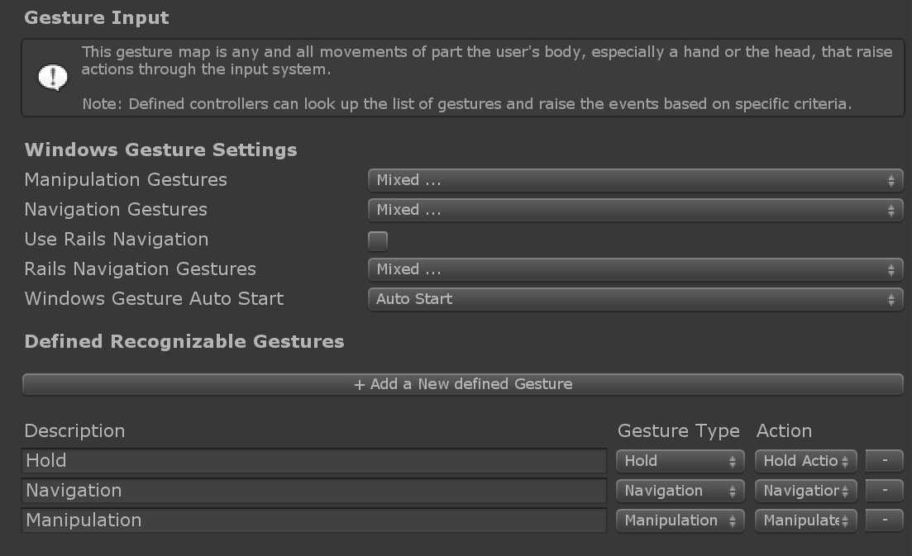

# Gestures

Gestures are input events based on human hands. There are two types of devices that raise gesture input events in MRTK:
- Windows Mixed Reality devices such as Hololens. This describes pinching motions ("Air Tap") and tap-and-hold gestures.

  For more information on Hololens gestures see the [Windows Mixed Reality Gestures documentation](https://docs.microsoft.com/en-us/windows/mixed-reality/gestures).

  [`WindowsMixedRealityDeviceManager`](xref:Microsoft.MixedReality.Toolkit.WindowsMixedReality.Input.WindowsMixedRealityDeviceManager) wraps the [Unity XR.WSA.Input.GestureRecognizer](https://docs.unity3d.com/ScriptReference/XR.WSA.Input.GestureRecognizer.html) to consume Unity's gesture events from Hololens devices.

- Touch screen devices.

  [`UnityTouchController`](xref:Microsoft.MixedReality.Toolkit.Input.UnityInput) wraps the [Unity Touch class](https://docs.unity3d.com/ScriptReference/Touch.html) that supports physical touch screens.

Both of these input sources use the _Gesture Settings_ profile to translate Unity's Touch and Gesture events respectively into MRTK's [Input Actions](InputActions.md). This profile can be found under the _Input System Settings_ profile.

## Gesture Events

Gesture events are received by implementing one of the gesture handler interfaces: [`IMixedRealityGestureHandler`](xref:Microsoft.MixedReality.Toolkit.Input.IMixedRealityGestureHandler)  and [`IMixedRealityGestureHandler<TYPE>`](xref:Microsoft.MixedReality.Toolkit.Input.IMixedRealityGestureHandler`1) (see table of [event handlers](InputEvents.md)).
When implementing the generic version, the *OnGestureCompleted* and *OnGestureUpdated* events can receive typed data of the following types:
- `Vector2` - 2D position gesture. Produced by touch screens to inform of their [`deltaPosition`](https://docs.unity3d.com/ScriptReference/Touch-deltaPosition.html).
- `Vector3` - 3D position gesture. Produced by HoloLens to inform of:
  - [`cumulativeDelta`](https://docs.unity3d.com/ScriptReference/XR.WSA.Input.ManipulationUpdatedEventArgs-cumulativeDelta.html) of a manipulation event
  - [`normalizedOffset`](https://docs.unity3d.com/ScriptReference/XR.WSA.Input.NavigationUpdatedEventArgs-normalizedOffset.html) of a navigation event
- `Quaternion` - 3D rotation gesture. Available to custom input sources but not currently produced by any of the existing ones.
- `MixedRealityPose` - Combined 3D position/rotation gesture. Available to custom input sources but not currently produced by any of the existing ones.