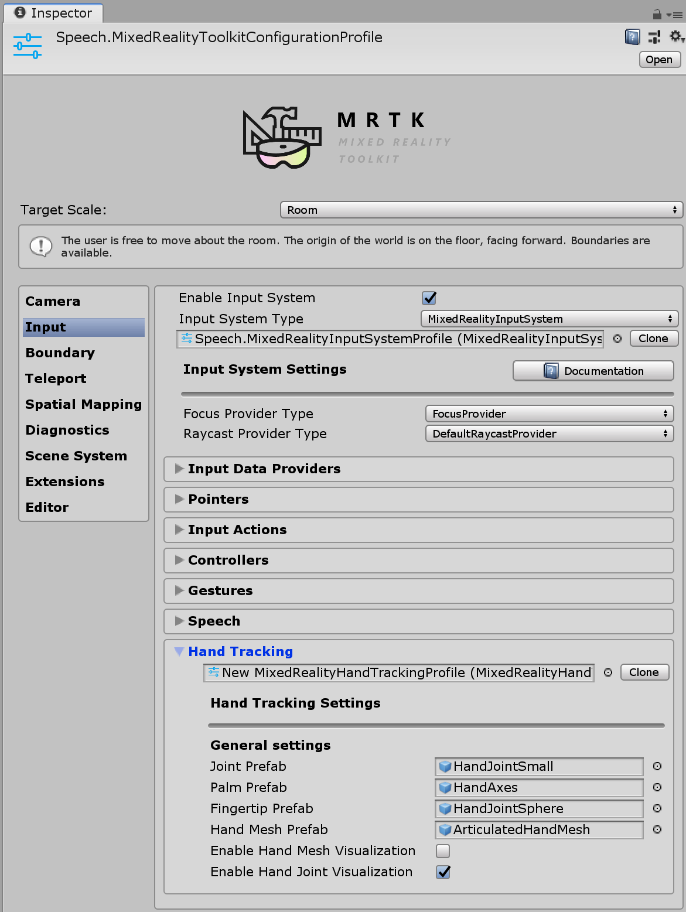
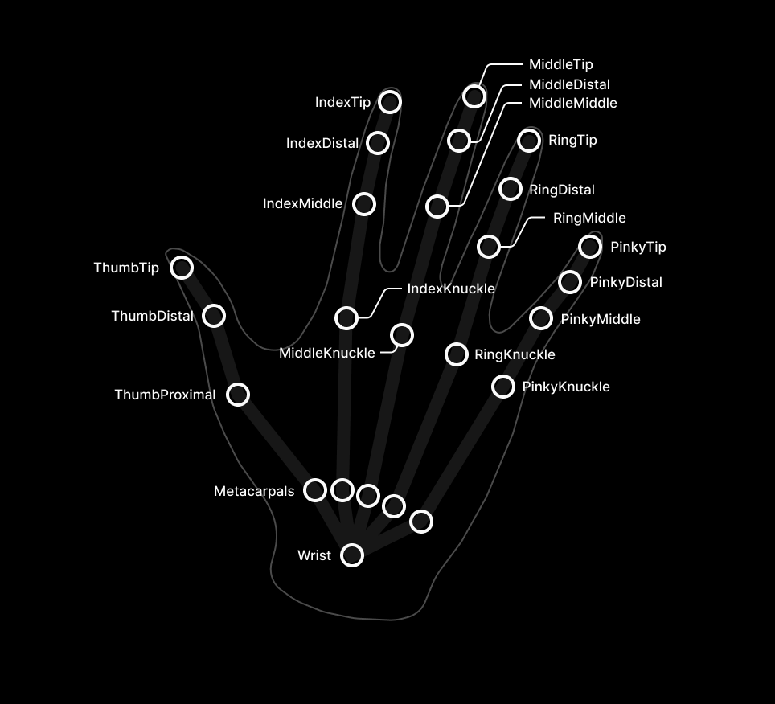
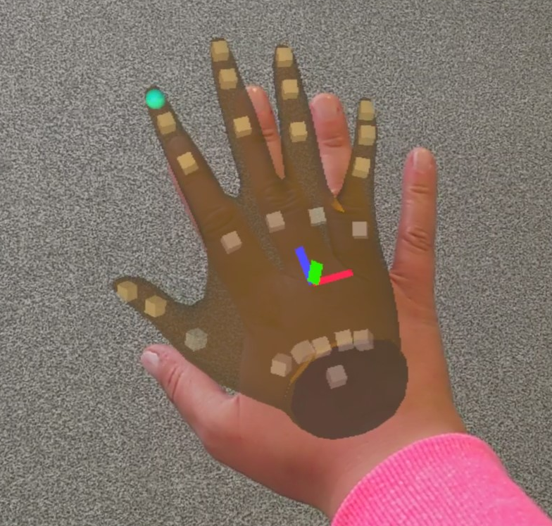

# Hand tracking

## Hand tracking profile

The _Hand Tracking profile_ is found under the _Input System profile_. It contains settings for customizing hand representation.



## Joint prefabs

Joint prefabs are visualized using simple prefabs. The _Palm_ and _Index Finger_ joints are of special importance and have their own prefab, while all other joints share the same prefab.

By default the hand joint prefabs are simple geometric primitives. These can be replaced if desired. If no prefab is specified at all, empty [GameObjects](href:https://docs.unity3d.com/ScriptReference/GameObject.html) are created instead.

> [!WARNING]
> Avoid using complex scripts or expensive rendering in joint prefabs, since joint objects are transformed on every frame and can have significant performance cost!




## Hand mesh prefab

The hand mesh is used if fully defined mesh data is provided by the hand tracking device. The mesh renderable in the prefab is replaced by data from the device, so a dummy mesh such as a cube is sufficient. The material of the prefab is used for the hand mesh.



Hand mesh display can have a noticeable performance impact, for this reason it can be disabled entirely by unchecking **Enable Hand Mesh Visualization** option.

## Hand visualization settings

The hand mesh and hand joint visualizations can be turned off or on via the *Hand Mesh Visualization Modes*
setting and *Hand Joint Visualization Modes* respectively. These settings are application-mode specific,
meaning it is possible to turn on some features while in editor (to see joints with in-editor simulation, for
example) while having the same features turned off when deployed to device (in player builds).

Note that it's generally recommended to have hand joint visualization turned on in editor (so that in-editor
simulation will show where the hand joints are), and to have both hand joint visualization and hand mesh
visualization turned off in player (because they incur a performance hit).

## Scripting

Position and rotation can be requested from the input system for each individual hand joint as a [`MixedRealityPose`](xref:Microsoft.MixedReality.Toolkit.Utilities.MixedRealityPose).

Alternatively the system allows access to [GameObjects](https://docs.unity3d.com/ScriptReference/GameObject.html) that follow the joints. This can be useful if another GameObject should track a joint continuously.

Available joints are listed in the [`TrackedHandJoint`](xref:Microsoft.MixedReality.Toolkit.Utilities.TrackedHandJoint) enum.

> [!NOTE]
> Joint object are destroyed when hand tracking is lost! Make sure that any scripts using the joint object handle the `null` case gracefully to avoid errors!

### Accessing a given hand controller

A specific hand controller is often available, e.g. when handling input events. In this case the joint data can be requested directly from the device, using the [`IMixedRealityHand`](xref:Microsoft.MixedReality.Toolkit.Input.IMixedRealityHand) interface.

#### Polling joint pose from controller

The [`TryGetJoint`](xref:Microsoft.MixedReality.Toolkit.Input.IMixedRealityHand.TryGetJoint*) function returns `false` if the requested joint is not available for some reason. In that case the resulting pose will be [`MixedRealityPose.ZeroIdentity`](xref:Microsoft.MixedReality.Toolkit.Utilities.MixedRealityPose.ZeroIdentity).

```c#
public void OnSourceDetected(SourceStateEventData eventData)
{
  var hand = eventData.Controller as IMixedRealityHand;
  if (hand != null)
  {
    if (hand.TryGetJoint(TrackedHandJoint.IndexTip, out MixedRealityPose jointPose)
    {
      // ...
    }
  }
}
```

#### Joint transform from hand visualizer

Joint objects can be requested from the [controller visualizer](xref:Microsoft.MixedReality.Toolkit.Input.IMixedRealityController.Visualizer).

```c#
public void OnSourceDetected(SourceStateEventData eventData)
{
  var handVisualizer = eventData.Controller.Visualizer as IMixedRealityHandVisualizer;
  if (handVisualizer != null)
  {
    if (handVisualizer.TryGetJointTransform(TrackedHandJoint.IndexTip, out Transform jointTransform)
    {
      // ...
    }
  }
}
```

### Simplified joint data access

If no specific controller is given then utility classes are provided for convenient access to hand joint data. These functions request joint data from the first available hand device currently tracked.

#### Polling joint pose from HandJointUtils

[`HandJointUtils`](xref:Microsoft.MixedReality.Toolkit.Input.HandJointUtils) is a static class that queries the first active hand device.

```c#
if (HandJointUtils.TryGetJointPose(TrackedHandJoint.IndexTip, Handedness.Right, out MixedRealityPose pose))
{
    // ...
}
```

#### Joint transform from hand joint service

[`IMixedRealityHandJointService`](xref:Microsoft.MixedReality.Toolkit.Input.IMixedRealityHandJointService) keeps a persistent set of [GameObjects](https://docs.unity3d.com/ScriptReference/GameObject.html) for tracking joints.

```c#
var handJointService = CoreServices.GetInputSystemDataProvider<IMixedRealityHandJointService>();
if (handJointService != null)
{
    Transform jointTransform = handJointService.RequestJointTransform(TrackedHandJoint.IndexTip, Handedness.Right);
    // ...
}
```

### Hand tracking events

The input system provides events as well, if polling data from controllers directly is not desirable.

#### Joint events

[`IMixedRealityHandJointHandler`](xref:Microsoft.MixedReality.Toolkit.Input.IMixedRealityHandJointHandler) handles updates of joint positions.

```c#
public class MyHandJointEventHandler : IMixedRealityHandJointHandler
{
    public Handedness myHandedness;

    void IMixedRealityHandJointHandler.OnHandJointsUpdated(InputEventData<IDictionary<TrackedHandJoint, MixedRealityPose>> eventData)
    {
        if (eventData.Handedness == myHandedness)
        {
            if (eventData.InputData.TryGetValue(TrackedHandJoint.IndexTip, out MixedRealityPose pose))
            {
                // ...
            }
        }
    }
}
```

#### Mesh events

[`IMixedRealityHandMeshHandler`](xref:Microsoft.MixedReality.Toolkit.Input.IMixedRealityHandMeshHandler) handles changes of the articulated hand mesh.

Note that hand meshes are not enabled by default.

```c#
public class MyHandMeshEventHandler : IMixedRealityHandMeshHandler
{
    public Handedness myHandedness;
    public Mesh myMesh;

    public void OnHandMeshUpdated(InputEventData<HandMeshInfo> eventData)
    {
        if (eventData.Handedness == myHandedness)
        {
            myMesh.vertices = eventData.InputData.vertices;
            myMesh.normals = eventData.InputData.normals;
            myMesh.triangles = eventData.InputData.triangles;

            if (eventData.InputData.uvs != null && eventData.InputData.uvs.Length > 0)
            {
                myMesh.uv = eventData.InputData.uvs;
            }

            // ...
        }
    }
}
```

## Known issues

### .NET Native

There is currently a known issue with Master builds using the .NET backend. In .NET Native, `IInspectable` pointers cannot be marshaled from native to managed code using `Marshal.GetObjectForIUnknown`. The MRTK uses this to obtain the `SpatialCoordinateSystem` in order to receive hand and eye data from the platform.

We've provided DLL source as a workaround for this issue, in [the native Mixed Reality Toolkit repo](https://github.com/microsoft/MixedRealityToolkit/tree/master/DotNetNativeWorkaround). Please follow the instructions in the README there and copy the resulting binaries into a Plugins folder in your Unity assets. After that, the WindowsMixedRealityUtilities script provided in the MRTK will resolve the workaround for you.

If you want to create your own DLL or include this workaround in an existing one, the core of the workaround is:

```c++
extern "C" __declspec(dllexport) void __stdcall MarshalIInspectable(IUnknown* nativePtr, IUnknown** inspectable)
{
    *inspectable = nativePtr;
}
```

And its use in your C# Unity code:

```c#
[DllImport("DotNetNativeWorkaround.dll", EntryPoint = "MarshalIInspectable")]
private static extern void GetSpatialCoordinateSystem(IntPtr nativePtr, out SpatialCoordinateSystem coordinateSystem);

private static SpatialCoordinateSystem GetSpatialCoordinateSystem(IntPtr nativePtr)
{
    try
    {
        GetSpatialCoordinateSystem(nativePtr, out SpatialCoordinateSystem coordinateSystem);
        return coordinateSystem;
    }
    catch
    {
        UnityEngine.Debug.LogError("Call to the DotNetNativeWorkaround plug-in failed. The plug-in is required for correct behavior when using .NET Native compilation");
        return Marshal.GetObjectForIUnknown(nativePtr) as SpatialCoordinateSystem;
    }
}
```
